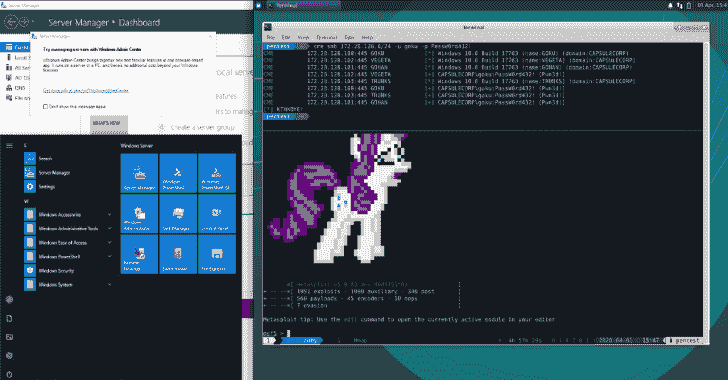

# Capsulecorp Pentest:用于进行内部网络渗透测试的虚拟环境

> 原文：<https://kalilinuxtutorials.com/capsulecorp-pentest/>

[](https://1.bp.blogspot.com/-gwaemKz7F0o/XxRH6QbdBAI/AAAAAAAAG9M/YKLtdsN4-YAZUKIDGF6IWo2Df_whOYEowCLcBGAsYHQ/s1600/Capsulecorp%2BPentest%25281%2529.png)

是一个由流浪者和 ansible 管理的小型虚拟网络。它包含五个虚拟机，包括一个运行 xubuntu 的 Linux 攻击系统和 4 个配置了各种易受攻击服务的 Windows 2019 服务器。

这个项目可以用来学习网络渗透测试作为一个独立的环境，但最终是为了补充我的书[网络渗透测试的艺术](https://bit.ly/38N9S9e)

**为什么这很酷？**

建立一个虚拟网络来学习渗透测试可能是乏味的，并且耗费时间/资源。capsulecorp 环境中的一切都已经为您完成了。一旦你在你的机器上安装了 Vagrant、Ansible 和 VirtualBox，你只需要运行几个`vagrant`命令，就可以拥有一个全功能的 Active Directory 域，你可以用它来进行黑客攻击/学习/测试等。

**当前功能**

*   具有一个 DC 和 3 个服务器成员的 Active directory 域
    *   域控制器:`**goku.capsulecorp.local**`
    *   服务器 01: `**vegeta.capsulecorp.local**`
    *   服务器 02: `**gohan.capsulecorp.local**`
    *   服务器 03: `**trunks.capsulecorp.local**`
    *   Wrkstn 01: `**tien.capsulecorp.local**`
*   `**vegeta**`上易受攻击的 Jenkins 服务器
*   `**trunks**`上易受攻击的 Apache Tomcat 服务器
*   `**gohan**`上易受攻击的 MSSQL 服务器
*   `**tien**`上易受攻击的 MS17-010
*   运行 XRDP 的 Xubuntu pentest 系统。
    *   Metasploit
    *   CrackMapExec
    *   Nmap
    *   补救 RDP 客户端
    *   延髓头端腹内侧核群
    *   Python/Pip/Pipenv
    *   冲击

**要求**

为了使用 Capsulecorp Pentest 网络，您必须具备以下条件:

*   VirtualBox(虚拟方块)
    *   [https://www.virtualbox.org/wiki/Downloads](https://www.virtualbox.org/wiki/Downloads)
*   无赖
    *   [https://www.vagrantup.com/downloads.html](https://www.vagrantup.com/downloads.html)
*   Ansible
    *   [https://docs . ansi ble . com/ansi ble/latest/installation _ guide/index . html](https://docs.ansible.com/ansible/latest/installation_guide/index.html)

**OSX 配置**

为了管理 Windows 主机，你必须在 ansible 虚拟环境中安装带有 pip 的`pywinrm`

source ~/ansi ble/bin/activate
pip install pywinrm
deactivate

**安装**

关于详细的安装步骤，请查看 [MacOS 安装指南](https://github.com/R3dy/capsulecorp-pentest/wiki/MacOS-Setup-Guide)

**配置 Windows 主机**

你应该做的第一件事是启动并提供 Goku 域控制器。这个系统可能需要最长的时间来启动，因为 dcpromo 的东西只需要一段时间。

*   启动虚拟机

**流浪起来的悟空**

*   调配虚拟机

**流浪条款悟空**

对 gohan、vageta 和 trunks 重复以上两个命令。

**…警告…**

这部分资源调配预计需要一段时间，因为在 dcpromo 之后，系统需要很长时间才能重新启动。

```
TASK [promotedc : Set a static address to 172.28.128.100] **********************
changed: [goku]

TASK [promotedc : Change hostname to goku] *************************************
ok: [goku]

TASK [promotedc : Install Active Directory Services] ***************************
ok: [goku]

TASK [promotedc : Promote goku to domain controller] ***************************
changed: [goku]

TASK [promotedc : Reboot after promotion] **************************************
```

**配置您的 Pentest 平台**

使用 vagger 启动虚拟机。首先将光盘放入工程目录，例如:`**cd ~/capsulecorp-pentes**`。记下转发到本地主机的 RDP 端口。

**流浪街头**

准备 pentest 机器。

**流浪者条款 pentest**

您可以使用首选的 RDP 客户端连接到 xrdp 监听器，或者通过 SSH 访问您的 penitent 机器。

**流浪宋承宪 pentest**

[**Download**](https://github.com/R3dy/capsulecorp-pentest)