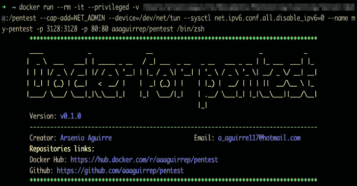

# Pentest:轻松快速地创建 Pentest 环境的工具

> 原文：<https://kalilinuxtutorials.com/pentest/>

用于 **Pentest** 的 Docker 是一个带有更多常用工具的图像，用于轻松快速地创建 Pentest 环境。

**特性**

*   安装操作系统、网络、开发和测试工具。
*   连接到 HTB(黑盒子)vpn 访问 HTB 机器。
*   安装的流行词表:SecLists，dirb，dirbuster，fuzzdb，wfuzz 和 rockyou。
*   代理服务发送流量从任何浏览器和 burp 套件安装在您的本地目录。
*   漏洞数据库已安装。
*   破解密码的工具。
*   安装了 Linux 枚举工具。
*   安装到正在运行的发现服务的工具。
*   安装到目录模糊的工具。
*   没有 root 权限的 linux 进程监视器
*   安装了 Zsh 外壳。

**安装的工具**

**操作系统工具**

*   rdate
*   精力
*   zsh
*   oh-my-zsh
*   确定…的位置，发现…的位置
*   cifs-utils
*   快上来
*   [gotop](https://github.com/cjbassi/gotop)

**网络工具**

*   traceroute
*   远程登录
*   网络工具
*   iputils-ping
*   tcpdump
*   openvpn
*   whois
*   宿主
*   prips
*   挖苦

**开发者工具**

*   饭桶
*   卷曲
*   wget
*   红宝石
*   去
*   大蟒
*   python-pip
*   python3
*   python3-pip
*   服务器端编程语言（Professional Hypertext Preprocessor 的缩写）
*   aws-cli
*   托吉森
*   nodejs

**Pentest 工具**

**端口扫描**

*   [nmap](https://github.com/nmap/nmap)
*   [质量扫描](https://github.com/robertdavidgraham/masscan)
*   [扫描端口](https://github.com/aaaguirrep/scanPorts)由 [@s4vitar](https://github.com/s4vitar) 创建，做了一些改进

**侦察**

*   **子域**
    *   [积聚](https://github.com/OWASP/Amass)
    *   [捉鬼敢死队](https://github.com/OJ/gobuster)
    *   [敲门](https://github.com/guelfoweb/knock)
    *   [MassDNS](https://github.com/blechschmidt/massdns)
    *   [备用域名](https://github.com/infosec-au/altdns)
    *   [spyse](https://github.com/zeropwn/spyse.py)
    *   [子列表 3r](https://github.com/aboul3la/Sublist3r)
    *   [findomain](https://github.com/Edu4rdSHL/findomain)
    *   [子查找器](https://github.com/projectdiscovery/subfinder)
    *   [spider boot](https://github.com/smicallef/spiderfoot)
    *   [haktldextract](https://github.com/hakluke/haktldextract)
*   **子域接管**
    *   [subjack](https://github.com/haccer/subjack)
    *   [SubOver](https://github.com/Ice3man543/SubOver)
    *   [tko-subs](https://github.com/anshumanbh/tko-subs)
*   **DNS 查找**
    *   [hakrevdns](https://github.com/hakluke/hakrevdns)
*   **截图**
    *   [gowitness](https://github.com/sensepost/gowitness)
    *   [水叮当](https://github.com/michenriksen/aquatone)
*   **爬虫**
    *   [哈科勒](https://github.com/hakluke/hakrawler)
    *   [光子](https://github.com/s0md3v/Photon)
    *   [gospider](https://github.com/jaeles-project/gospider)
    *   [高](https://github.com/lc/gau)
    *   [otxurls](https://github.com/lc/otxurls)
    *   [waybackurls](https://github.com/tomnomnom/waybackurls)
*   **搜索目录**
    *   [目录搜索](https://github.com/maurosoria/dirsearch)
*   **模糊器**
    *   [wfuzz](https://github.com/xmendez/wfuzz)
    *   [ffuf](https://github.com/ffuf/ffuf)
*   **网页扫描**
    *   [什么网](https://github.com/urbanadventurer/WhatWeb)
    *   [wafw00z](https://github.com/EnableSecurity/wafw00f)
    *   [nikto](https://github.com/sullo/nikto)
    *   阿尔琼
    *   [http 探测](https://github.com/tomnomnom/httprobe)
    *   [射手](https://github.com/s0md3v/Striker)
    *   [权限检查](https://github.com/hakluke/hakcheckurl)
*   **CMS**
    *   [wpscan](https://github.com/wpscanteam/wpscan)
    *   joomscan
    *   [下垂扫描](https://github.com/droope/droopescan)
    *   [cmseek](https://github.com/Tuhinshubhra/CMSeeK)
*   **搜索 JS**
    *   [LinkFinder](https://github.com/GerbenJavado/LinkFinder)
    *   [格茨](https://github.com/003random/getJS)
    *   [subjs](https://github.com/lc/subjs)

**Wordlist** 的缩写形式

*   [cewl](https://github.com/digininja/CeWL)
*   wordlists:
    *   [wfuzz](https://github.com/xmendez/wfuzz)
    *   [秒列表](https://github.com/danielmiessler/SecLists)
    *   [Fuzzdb](https://github.com/fuzzdb-project/fuzzdb)
    *   [Dirbuster](https://github.com/daviddias/node-dirbuster)
    *   [Dirb](https://github.com/v0re/dirb)
    *   [Rockyou](https://github.com/brannondorsey/naive-hashcat/releases/download/data/rockyou.txt)
    *   [all.txt](https://gist.github.com/jhaddix/f64c97d0863a78454e44c2f7119c2a6a)
*   嘎吱声

**Git 仓库**

*   [gitleaks](https://github.com/zricethezav/gitleaks)
*   [gitrob](https://github.com/michenriksen/gitrob)
*   [gitGraber](https://github.com/hisxo/gitGraber)
*   [github-搜索](https://github.com/gwen001/github-search)
*   [GitTools](https://github.com/internetwache/GitTools)

**OWASP**

*   [sqlcmap](https://github.com/sqlmapproject/sqlmap)的缩写

*   [kxss](https://github.com/tomnomnom/hacks/tree/master/kxss)
*   达尔福克斯
*   [jwt_tool](https://github.com/ticarpi/jwt_tool)

**手机**

*   [apktool](https://ibotpeaches.github.io/Apktool/)

**蛮力**

*   [撬棍](https://github.com/galkan/crowbar)
*   九头蛇
*   [patator](https://github.com/lanjelot/patator)
*   水母

**开裂**

*   [散列](https://github.com/psypanda/hashID)
*   [开膛手约翰](https://github.com/magnumripper/JohnTheRipper)
*   [哈希卡特](https://github.com/hashcat/hashcat)

**操作系统枚举**

*   [htbenum](https://github.com/SolomonSklash/htbenum)
*   [linux 智能枚举](https://github.com/diego-treitos/linux-smart-enumeration)
*   [linenum](https://github.com/rebootuser/LinEnum)
*   [enum4linux](https://github.com/portcullislabs/enum4linux)
*   [ldapdomaindump](https://github.com/dirkjanm/ldapdomaindump)
*   [peas–权限提升精彩脚本套件](https://github.com/carlospolop/privilege-escalation-awesome-scripts-suite)
*   [Windows 漏洞利用建议者——下一代](https://github.com/bitsadmin/wesng)
*   [smbmap](https://github.com/ShawnDEvans/smbmap)
*   [pspy–非特权 Linux 进程窥探](https://github.com/DominicBreuker/pspy)
*   SMB 客户端
*   文件传输协议（File Transfer Protocol 的缩写）

**战功**

*   [searchsploit](https://github.com/offensive-security/exploitdb)
*   [Metasploit](https://github.com/rapid7/metasploit-framework)
*   [MS17-010](https://github.com/worawit/MS17-010)
*   [自动蓝色-MS17-010](https://github.com/3ndG4me/AutoBlue-MS17-010)
*   [PrivExchange](https://github.com/dirkjanm/PrivExchange)

**窗户**

*   [evil-winrm](https://github.com/Hackplayers/evil-winrm)
*   [撞击](https://github.com/SecureAuthCorp/impacket)
*   [破解密码](https://github.com/byt3bl33d3r/CrackMapExec)
*   [霓裳](https://github.com/samratashok/nishang)
*   多汁的土豆
*   [PowerSploit](https://github.com/PowerShellMafia/PowerSploit)
*   [哈希传递](https://github.com/byt3bl33d3r/pth-toolkit)
*   [米米卡兹](https://github.com/gentilkiwi/mimikatz)
*   GPP-解密

**反转外壳**

*   [网猫](https://github.com/diegocr/netcat)
*   [rlwrap](https://github.com/hanslub42/rlwrap)

**其他资源**

*   [pentest-tools](https://github.com/gwen001/pentest-tools) 来自 [@gwen001](https://github.com/gwen001)
*   [qsreplace](https://github.com/tomnomnom/qsreplace) 来自 [@tomnomnom](https://github.com/tomnomnom)

**自定义功能**

*   NmapExtractPorts from[@ S4 vitar](https://github.com/s4vitar)

**其他服务**

*   阿帕奇 2
*   鱿鱼

**用途**

**先决条件**

*   Docker 服务已安装

您可以通过以下两个选项使用 docker 图像:

*   **选项 1–使用 github 库**

git 克隆–深度 1 https://github.com/aaaguirrep/pentest.git
CD 测试
docker 构建测试。
docker run–RM-it–name my-pentest pentest/bin/zsh

*   **选项 2–使用 docker hub 的图像**

使用 docker hub 中的图像: [aaaguirrep/pentest](https://hub.docker.com/r/aaaguirrep/pentest)

docker pull aaaguirrep/pentest
docker run–RM-it–name my-pentest pentest/bin/zsh

**运行容器的注意事项**

使用图像有不同的用例，您应该知道如何正确地运行容器。

1.  使用容器通过 HTB vpn 访问 HTB(黑盒子)机器。`**docker run --rm -it --cap-add=NET_ADMIN --device=/dev/net/tun --sysctl net.ipv6.conf.all.disable_ipv6=0 --name my-pentest aaaguirrep/pentest /bin/zsh**`
2.  将本地目录中的信息共享到容器目录中，并将信息保存在本地目录中。您应该将信息保存在/pentest 目录下。`**docker run --rm -it -v /path/to/local/directory:/pentest --name my-pentest aaaguirrep/pentest /bin/zsh**`
3.  为您的本地环境公开内部容器服务(apache、squid)。在容器内部，通过别名启动 apache2 和 squid 服务。`**apacheUp squidUp**`
4.  通过 umount 命令挂载目录。`**docker run --rm -it --privileged --name my-pentest aaaguirrep/pentest /bin/zsh**`
5.  工具下载在/tools 目录中。

**漂亮的配置**

您可以使用如下漂亮的配置来设置 docker 映像:

**1。别名连接 HTB(黑盒子)VPN**

要使用这两个选项，您应该使用-v 选项将本地目录映射到/pentest 容器目录。

选项 1–使用 github 库的 HTB VPN

在 Dockerfile 中添加步骤“创建快捷方式”中的下一行，构建一个新的映像，并使用-v 选项运行一个新的容器。

运行 echo " alias vpnhtb = \ " openvpn/pentest/path/to/ovpn/file \ " " > >/root/。zshrc

选项 2–使用 docker hub 映像的 HTB VPN

使用后续步骤创建一个新的 Dockerfile，构建一个新的映像，并使用-v 选项运行一个新的容器。

从 aaaguirrep/pentest

#创建快捷方式并从工作站加载 ovpn 文件运行 echo " alias vpnhtb = \ " openvpn/pentest/path/to/ovpn/file \ " ">>/root/。zshrc

**2。在您的本地环境中保存和加载命令历史记录**

当你删除一个容器时，所有的信息都会被删除。下一个配置为您提供了一个选项，用于在本地环境中保存命令历史，并在您运行新容器时加载它。因此，当运行一个新容器时，你不会丢失你的命令历史。

要使用这两个选项，您应该使用-v 选项将本地目录映射到/pentest 容器目录。

**选项 1–使用 github 库的命令历史**

将步骤“创建快捷方式”中的下一行添加到 Dockerfile 中，构建一个新的映像并运行一个新的容器。

#在本地环境中保存和加载命令历史记录
运行 sed-I ' 1i export hist file = "/pentest/。zsh_history"' /root/。zshrc

选项 2–使用 docker hub 映像的命令历史记录

创建一个新的 Dockerfile 文件，构建一个新的映像并运行一个新的容器。

从 aaaguirrep/pentest

#保存并加载本地环境中的命令历史运行 sed-I ' 1i export hist file = "/pentest/。zsh_history"' /root/。zshrc

环境测试

该映像在以下环境中进行了测试:

*   Mac 坞站服务:坞站版本 19.03.5，内部版本 633a0ea
*   Google 云平台上 Linux 实例的 Docker 服务:Docker 版本 19.03.6，build 369ce74a3c

**警告**

*   不要保存容器目录中的信息，因为在删除容器后这些信息将会丢失，您应该在运行容器时使用参数-v 将信息保存在本地环境中。例如:`**docker run --rm -it -v /path/to/local/directory:/pentest --name my-pentest aaaguirrep/pentest /bin/zsh**`上面的命令指定了一个用/pentest 容器目录映射的路径本地目录。您应该将所有信息保存在/pentest 目录下。
*   在受控环境中使用哈希卡特和开膛手约翰，如 CTF。你可以尝试一些问题。

[**Download**](https://github.com/aaaguirrep/pentest)