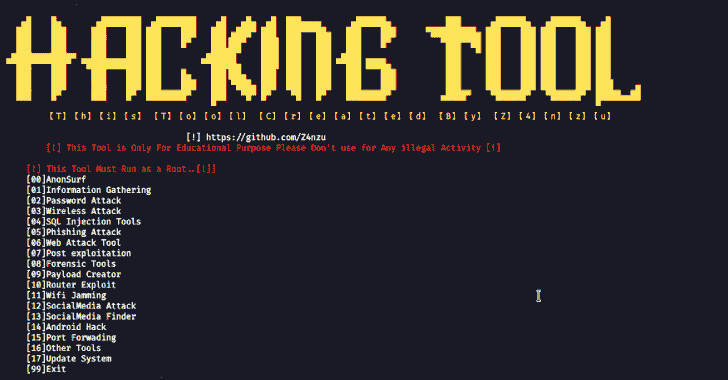
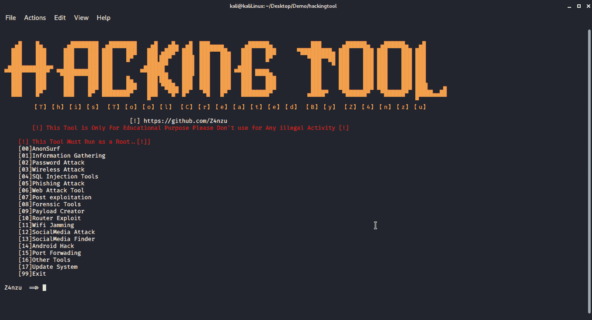
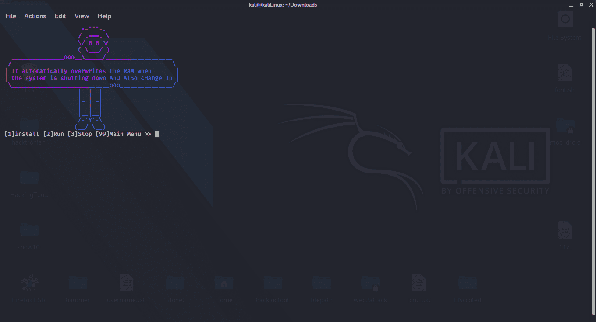
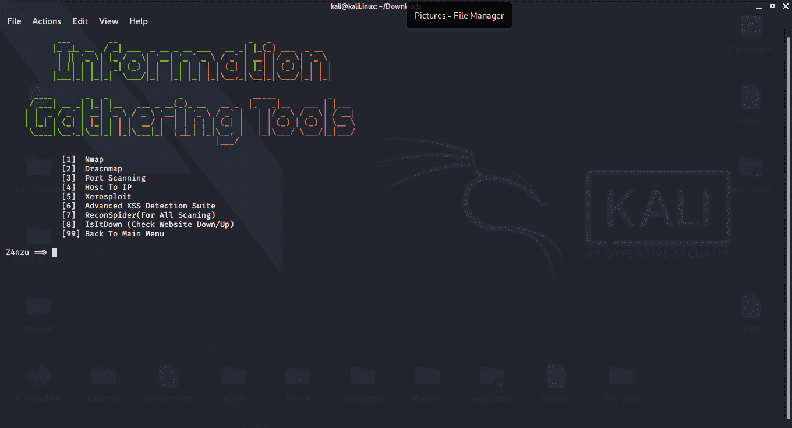
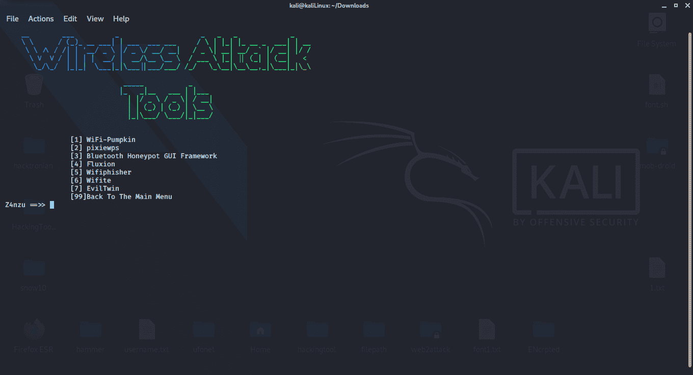

# HackingTool:黑客的多功能黑客工具

> 原文：<https://kalilinuxtutorials.com/hackingtool/>

**HackingTool** 是一款针对黑客的多合一黑客工具。

**更新可用版本 1.1.0**

*   添加了新工具
    *   逆向工程
    *   老鼠工具
    *   网络爬行
    *   有效负载喷射器
*   多音器工具更新
*   在 wifi 干扰中增加了工具

**黑客工具菜单**

*   匿名冲浪
*   情报收集
*   密码攻击
*   无线攻击
*   SQL 注入工具
*   网络钓鱼攻击
*   网络攻击工具
*   后期开发
*   法医工具
*   有效负载创建者
*   路由器漏洞
*   Wifi 干扰
*   XSS 攻击工具
*   逆向工程
*   社交媒体搜索器
*   DDos 攻击工具
*   隐写工具
*   IDN 同形攻击
*   哈希破解工具
*   社交媒体攻击
*   安卓黑客
*   老鼠工具
*   网络爬行
*   有效负载喷射器
*   更新系统

**匿名冲浪**

*   匿名冲浪
*   多音器

**信息收集**

*   Nmap
*   德拉克马普
*   端口扫描
*   主机到 IP
*   干裂土
*   插入-电子邮件部分
*   重新考虑
*   红鹰(全在一次扫描中)
*   记录日志
*   罢工者
*   秘密发现者
*   端口扫描仪
*   破坏者

**密码攻击**

*   Cupp
*   wordlistcreactor
*   小精灵单词生成器
*   凭据重用攻击
*   单词表(包含 14 亿遍)

**无线攻击**

*   WiFi-南瓜
*   像素视图
*   蓝牙蜜罐 GUI 框架
*   流动
*   Wifiphisher
*   威菲特
*   邪恶双胞胎

**SQL 注入工具**

*   sqlmap 工具
*   NoSqlMap
*   该死的小型 SQLi 扫描仪
*   爆炸
*   bli sqy–利用基于时间的盲人-SQL 注入
*   利维坦-大范围大规模审计工具包
*   SQLScan

**社交媒体攻击**

*   Instagram 攻击
*   全社会媒体攻击
*   脸书攻击
*   应用检查器

**安卓攻击**

*   键盘机器人
*   我的短信
*   Lockphish(抓取目标锁定销)
*   捕捉图像
*   劫持会话

**网络钓鱼攻击**

*   Setoolkit
*   社会鱼
*   隐藏的眼睛
*   Evilginx2
*   Shellphish
*   青肿眼眶
*   我看你(使用网络钓鱼攻击获取位置)
*   SayCheese(抓取目标的网络摄像头照片)
*   二维码劫持

**网络攻击**

*   SlowLoris
*   鲣鱼
*   子域查找器
*   CheckURL
*   布拉齐
*   子域接管

**后爆炸**

*   蔬菜——壳里的幽灵
*   Chrome 键盘记录器

**取证工具**

*   散装提取器
*   磁盘克隆和 iso 映像获取
*   AutoSpy
*   Toolsley
*   Wireshark

**有效载荷发生器**

*   法特拉特*
*   野蛮的
*   一针
*   MSFvenom 有效负载创建者
*   毒液外壳代码生成器
*   Spycam
*   暴民机器人

**漏洞利用框架**

*   RouterSploit
*   WebSploit
*   混合
*   web 2 攻击
*   Fastssh

**社交媒体搜索器**

*   通过面部识别系统找到社交媒体
*   通过用户名查找社交媒体
*   谢洛克
*   社会扫描

**隐写术**

*   隐秘术
*   StegnoCracker
*   空白

**Ddos 攻击工具**

*   SlowLoris
*   SYN Flood DDoS 武器
*   乌福内特
*   黄金眼

**XSS 攻击工具**

*   XSS 发现者
*   XSS 有效载荷发生器
*   高级 XSS 检测套件
*   扩展的 XSS 搜索器和查找器
*   XSS 怪胎
*   XSpear
*   xtscon
*   赞克斯

**IDN 同形异义词**

*   EvilURL

**电子邮件验证器**

*   敲门邮件

**哈希破解工具**

*   哈希克星

【Linux 安装

*   该工具必须以 ROOT 用户身份运行！！！

git 克隆 https://github.com/Z4nzu/hackingtool.git
chmod-R 755 hacking tool
CD hacking tool
sudo pip 3 install-R requirement . txt
bash install . sh
sudo hacking tool

完成所有步骤后，只需输入终端**root @ kali Linux:~****hacking tool**