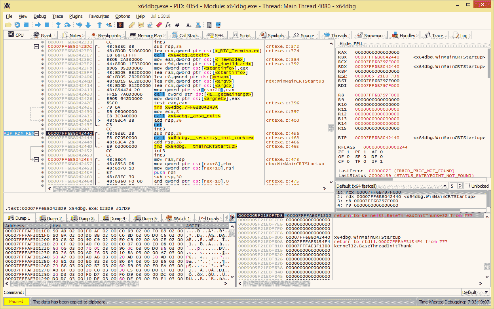
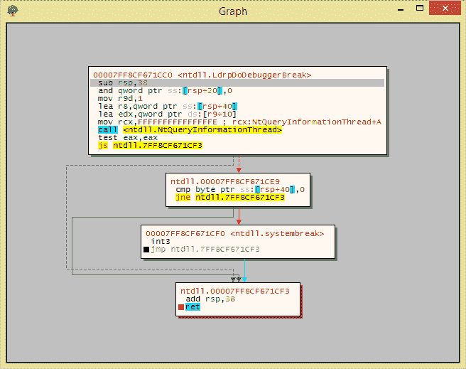

# X64Dbg:一个用于 Windows 的开源 X64/X32 调试器

> -= the last fantasy =-荣誉出品本字幕仅供学习交流，严禁用于商业途径

X64Dbg 是一个用于 Windows 的开源二进制调试器，旨在恶意软件分析和对没有源代码的可执行文件进行逆向工程。

有许多可用的功能和一个全面的[插件系统](http://plugins.x64dbg.com)来添加你自己的。你可以在[博客](https://x64dbg.com/blog)上找到更多信息！

**截图**

**安装&使用**

*   从 [GitHub](https://github.com/x64dbg/x64dbg/releases) 、 [SourceForge](https://sourceforge.net/projects/x64dbg/files/snapshots) 或 [OSDN](https://osdn.net/projects/x64dbg) 下载一个快照，并提取到你的用户有写权限的位置。
*   *可选的*使用`**x96dbg.exe**`来注册一个外壳扩展并添加快捷方式到你的桌面。
*   如果你想调试一个 32 位的可执行文件，你现在可以运行`**x32\x32dbg.exe**`或者 **`x64\x64dbg.exe`** 来调试一个 64 位的可执行文件！如果你不确定，你可以运行`**x96dbg.exe**`，在那里选择你的架构。

你也可以通过几个简单的步骤[自己编译](https://github.com/x64dbg/x64dbg/wiki/Compiling-the-whole-project) x64dbg！

**投稿**

这是一个社区的努力，我们接受拉请求！更多信息见[投稿](https://github.com/x64dbg/x64dbg/blob/development/CONTRIBUTING.md)文档。如果您有任何问题，您可以随时[联系我们](https://x64dbg.com/#contact)或打开一个[问题](https://github.com/x64dbg/x64dbg/issues)。你可以看看[容易的问题](https://github.com/x64dbg/x64dbg/issues?q=is%3Aissue+is%3Aopen+label%3Aeasy)开始。

**学分**

*   调试器核心由 [TitanEngine 社区版](https://github.com/x64dbg/TitanEngine)
*   由 [Zydis](https://zydis.re) 提供动力的拆卸
*   由 [XEDParse](https://github.com/x64dbg/XEDParse) 和 [asmjit](https://github.com/asmjit) 驱动的组件
*   进口重建由[锡拉](https://github.com/NtQuery/Scylla)提供动力
*   JSON 由[扬松](http://www.digip.org/jansson)提供动力
*   由 [lz4](https://bitbucket.org/mrexodia/lz4) 支持的数据库压缩
*   Bug 图标由 [VisualPharm](http://www.visualpharm.com)
*   界面图标由[神游](http://p.yusukekamiyamane.com)
*   网站由[tr4 信息流](http://tr4ceflow.com)

**开发者**

*   [mrexotica](http://mrexodia.github.io)
*   希腊字母表中第十八个字母
*   [tr4 流量](http://blog.tr4ceflow.com)
*   [渣](http://www.fr33project.org)
*   核弹
*   [Herz3h](https://github.com/Herz3h)
*   [圆环 xxx](https://github.com/torusrxxx)

**代码贡献**

你可以在这里找到 GitHub 贡献者的详细列表。

**特别感谢**

*   开发初始 GUI 的适马
*   所有[捐赠者](https://www.bountysource.com/teams/x64dbg/backers)！
*   每个人都在添加问题！
*   我忘记添加到此列表中的人
*   [博客作者](https://x64dbg.com/blog/2016/07/09/Looking-for-writers.html)！
*   [EXETools 社区](http://forum.exetools.com)
*   [Tuts4You 社区](http://forum.tuts4you.com)
*   [重磨器](https://www.jetbrains.com/resharper)
*   [覆盖度](http://www.coverity.com)
*   酸性闪光
*   cyberbob
*   零
*   泰迪·罗杰斯
*   团队 DVT
*   迈克尔
*   北极的
*   艾哈迈德·曼苏尔
*   _ 推动器 _
*   火传说
*   [拷](http://lifeinhex.com)
*   地层
*   [科巴利切克](https://github.com/kobalicek)
*   [athreoz](https://github.com/athre0z)
*   泽马特

如果没有许多人和其他开源项目的帮助，就不可能有 x64dbg 的今天，谢谢！

[**Download**](https://github.com/x64dbg/x64dbg)