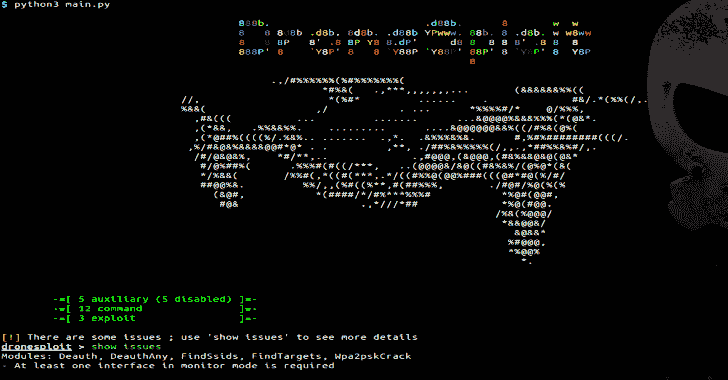
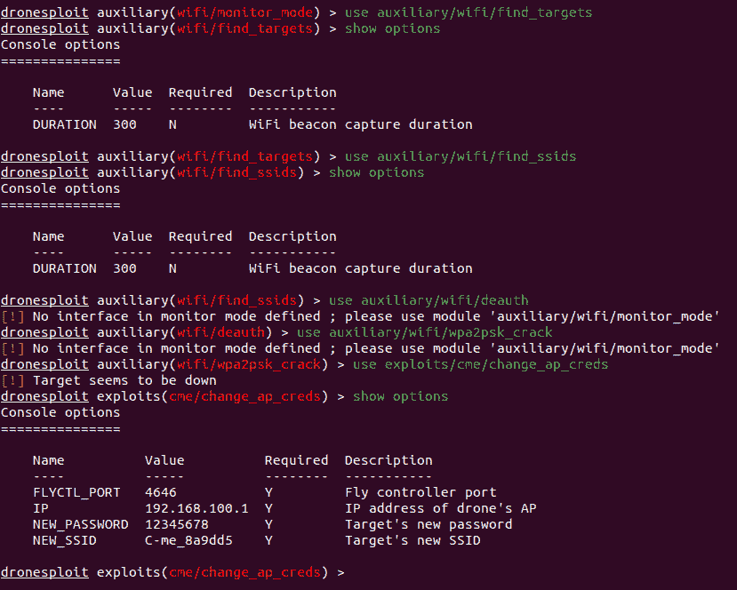
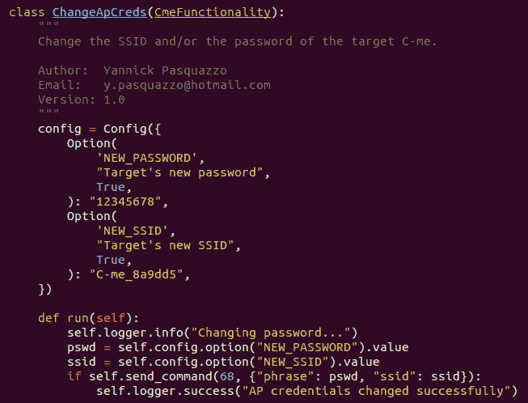

# DroneSploit:无人机测试框架控制台

> 原文：<https://kalilinuxtutorials.com/dronesploit/>

**DroneSploit** CLI 框架基于 [`sploitkit`](https://github.com/dhondta/python-sploitkit) ，旨在收集黑客技术和漏洞，特别关注**无人机黑客**。为了易于使用，该界面的布局看起来像 Metasploit。

[黑帽欧洲阿森纳 2019 介绍会](https://dhondta.github.io/dronesploit/docs/blackhat-eu19-arsenal.pdf)

另见文章:

*   [*黑帽欧洲:新工具提供类似 Metasploit 的框架用于入侵无人机*，每日痛饮](https://portswigger.net/daily-swig/black-hat-europe-new-tool-offers-metasploit-like-framework-for-hacking-into-drones)
*   [*Dronesploit，一个专用于无人机的测试控制台框架*，Hakin9](https://hakin9.org/dronesploit-a-pentesting-console-framework-dedicated-to-drones/)

**设置**

该项目在 [PyPi](https://pypi.python.org/pypi/dronesploit/) 上可用，可以使用 Pip 简单安装:

pip3 安装 dronesploit

**基础知识**

*   **界面**

**模块**

此示例显示了 DroneSploit 模块的示例，该模块旨在更改特定型号无人机的密码或 SSID。

[**Download**](https://github.com/dhondta/dronesploit)