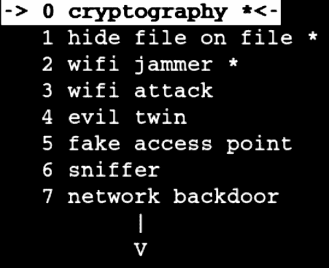

# Bramble:新的黑客开源套件

> 原文：<https://kalilinuxtutorials.com/bramble/>

bramble 软件是为 Bramble 项目设计的。它整合了 pentesting 和 It 安全的许多功能。它易于使用，完全可编辑。

它允许初学者学习黑客技术，并为更有经验的用户提供可定制的即插即用黑客工具，这样他们可以快速添加自己的代码。

这是一个开源项目，你可以为之做出贡献！如果你开发了一些功能，不要害羞，和我们分享一下。我们将共同努力，以便在平台中实现它。

它是如何工作的？

它主要基于 C++。但是你可以用另一种语言轻松地添加一些代码。如果你不喜欢 C++(这将是一个错误，^^ ),这真的没关系，因为我提供了一些模板来帮助你，节省你的时间。

我试着在代码中加入大量的注释，并添加一些在线课程/文章的链接，以便更好地理解代码是如何工作的。最后，我为每个特性写了一个帮助文件，告诉你如何一步一步地使用它。

**目前工作**

*   **密码术**
    *   加密文件
    *   解密文件
*   **隐写术**
    *   在文件中隐藏文件
    *   获取隐藏文件
*   **取证工具**
    *   恢复所有删除的文件
    *   还原特定类型的文件
    *   永久擦除文件/文件夹
*   **Wifi 干扰器/去授权器**
    *   取消用户的网络连接(不需要连接，需要监控模式)
    *   解除用户与网络的连接(需要连接，不需要监控模式)
*   **邪恶的双胞胎**
    *   黑莓手机定制版
*   **钥匙克隆器**
    *   将 usb 存储复制到另一个 usb 闪存盘
    *   将 usb 存储复制到内部存储
    *   仅复制某些类型的文件
*   **获得访问权**
    *   ssh 核心
    *   网络后门
*   **嗅探器**
    *   未加密的密码
    *   网站名称
    *   检测嗅探攻击(通过 arp 中毒)
    *   阅读以前的报告(嗅探、扫描、检测)
*   **工具**
    *   启用/禁用 web 界面
    *   永久擦除文件/文件夹
    *   来自文件的密码生成器
    *   扫描网络
    *   ARP 扫描器
    *   更改 mac 地址
*   **设置**
    *   卸载 usb 设备
    *   显示 ip 位址
    *   切换到浅色/经典菜单

**即将推出:**

*   **Wifi 攻击**
    *   Wps 攻击
*   **假接入点**
    *   嗅
    *   钓鱼？
*   **嗅探器**
    *   密码嗅探器
    *   网站嗅探器
    *   自定义嗅探器

**要求**

到今天为止，这个软件只在 bramble 环境下工作。它可以兼容其他由 kali linux 驱动的设备。

**截图**

[**Download**](https://github.com/marcrowProject/Bramble)