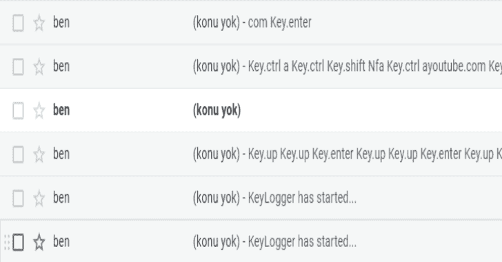
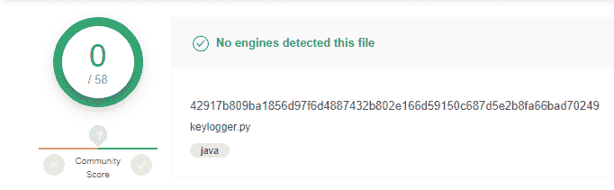

# 键盘记录器:获取键盘、鼠标、屏幕截图、麦克风输入并发送到您的邮箱

> 原文：<https://kalilinuxtutorials.com/keylogger/>

**键盘记录器**获取键盘、鼠标、屏幕截图、麦克风输入并发送到您的邮箱。该项目的目的是测试信息系统的安全性。

**安装**

**pip 安装 pyinput**

**用途**

*   在“keylogger.py”上设置自己的邮件和密码。
*   在目标计算机上运行 keylogger.py
*   每 10 秒钟，您从目标计算机获取数据\
*   如果目标找到代码并打开文件，想知道你的邮件和密码，程序会自动删除。

**使用临时邮件 API**

[https://temp-mail.org/en/api/](https://temp-mail.org/en/api/)

**杀毒测试**

[**Download**](https://github.com/aydinnyunus/Keylogger)