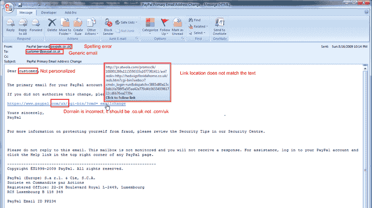

# 什么是电子邮件欺骗？以及如何避免？

> 原文：<https://kalilinuxtutorials.com/email-spoofing/>

你见过看起来很真实但实际上是骗局的电子邮件吗？

这些是给你的伪造邮件！

谈论[电子邮件欺骗](https://gbhackers.com/email-spoofing-tool-open-relay/)，它们是看起来来自一个已知的人的电子邮件，但它们在现实中不是。网络罪犯修改电子邮件的标题，使其看起来像是由真实的人发送的。这是网络钓鱼和垃圾邮件常用的策略之一。

电子邮件欺骗的风险和损害可能是巨大的，尤其是当您将电子邮件用于公司目的时。例如，你拥有一个网上商店，公司，或者只是一个小的脸书商店。

所以你必须意识到电子邮件欺骗的所有威胁。在本文中，我们将讨论如何保护自己免受电子邮件欺骗。

## **如何阻止电子邮件欺骗？**

首先，必须注意到电子邮件传输的通信协议，简单邮件传输协议或 SMTP，不支持电子邮件认证。所以你必须采用其他方法来阻止电子邮件欺骗。

1.  手动检查邮件标题——这是识别欺骗性邮件最简单的方法之一。只需手动检查邮件标题。如果您从网络浏览器打开 Gmail 帐户，请遵循以下步骤:

*   打开您希望查看标题的电子邮件
*   只要看看回复图标旁边，你会看到三个垂直的点，点击它
*   向下滚动，你会看到一个选项“显示原件”
*   最后，复制页面上的文本

2.  您还可以使用邮件标题工具来标识各个标题行。

#### **如果您正在使用 Outlook 应用程序，请遵循以下步骤:**

*   打开您希望查看标题的电子邮件
*   然后看看回复所有图标旁边，你会看到三个水平点，点击它
*   然后选择“查看消息源”选项

3.  你应该时刻关注“返回路径”；它应该与发件人的电子邮件地址相同。

4.  使用发件人策略框架或 SPF-这是一种电子邮件认证机制，指定所有电子邮件服务器都能够代表您的域发送电子邮件。对于 SPF 实现，主机和域都需要识别可以代表它们发送电子邮件的授权机器。为此，我们需要将[多个 SPF 记录](https://blog.mailtrap.io/spf-records-explained/)添加到现有的 DNS 信息中。这是一项复杂的任务，只有经验丰富的网络管理员才有能力完成。收件人必须确认给定的 IP 地址被允许发送[设计的信件](https://moosend.com/blog/email-newsletter-design/)；只有这样，他们才会收到来自那个特定发件人的电子邮件。

## **如何防止邮件欺骗？**

如果你有一个组织有序的收件箱，那么[电子邮件欺骗](https://gbhackers.com/email-spoofing-exploiting-open-relay/)应该不会影响到你。但是我们明白这项工作并不像说的那么简单，你每天可能会收到数百封来自未知来源的电子邮件。每天手动对它们进行分类是一个挑战，所以你可以借助一些电子邮件管理应用程序。他们速度快，易于使用，并会为你做所有的工作。

**结论**

电子邮件欺骗是网络罪犯获取敏感信息最常用的方式之一。但好消息是，有了上面的提示，你可以避开这些邮件，保证邮箱的安全。