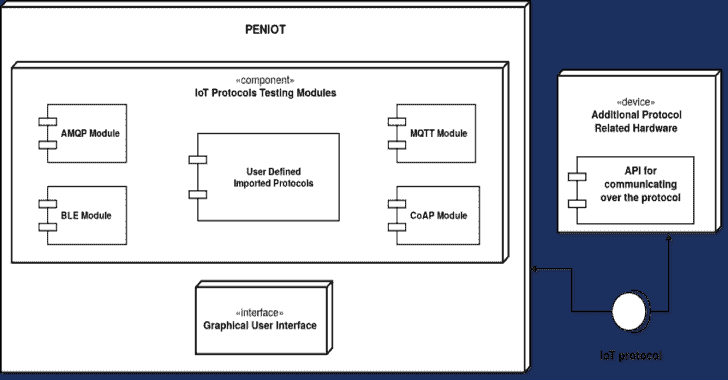

# Peniot:物联网渗透测试工具

> 原文：<https://kalilinuxtutorials.com/peniot/>

**[PENIOT](https://senior.ceng.metu.edu.tr/2019/peniot/)** 是一款针对物联网(IOT)设备的渗透测试工具。它通过针对不同类型的安全攻击来测试/渗透您的设备的互联网连接。换句话说，您的设备可能会受到主动和被动的安全攻击。在确定目标设备和该设备的必要信息(或参数)后，您可以执行主动安全攻击，如更改/消耗系统资源、重放有效的通信单元等。此外，您可以执行被动的安全攻击，如破坏重要信息的机密性或达到流量分析。多亏了 PENIOT，所有这些操作都可以半自动甚至全自动进行。简而言之，PENIOT 是一个针对基于协议的安全攻击的物联网设备的包/框架。

此外，它为您进一步注入新的安全攻击或新的物联网协议提供了一个基线结构。PENIOT 最重要的特性之一是可扩展的。默认情况下，它有几个常见的物联网协议和许多与这些协议相关的安全攻击。但是，它可以通过导出内部使用的组件的基本结构来进一步扩展，以便您可以开发与 PENIOT 的内部结构相协调的攻击。

**为什么需要 PENIOT？**

物联网范式在过去十年经历了巨大的增长，数十亿设备连接到互联网。这些设备中的大多数甚至缺乏基本的安全措施，这是由于它们的容量限制和由于上市时间短而没有考虑安全性的设计。由于物联网的高度连通性，黑客可以通过易受攻击的设备轻松发起对扩展网络具有破坏性影响的攻击。

到目前为止，渗透测试是手工完成的，如果它没有被忽略的话。这一程序使得设备的测试阶段非常缓慢。另一方面，生产物联网设备的公司应始终在可靠性、鲁棒性以及所提供的功能方面测试其设备，因为遭受恶意人员的安全攻击可能会对最终用户造成意想不到的影响。PENIOT 的主要目标是加速安全性测试的过程。它通过自动化耗时的渗透测试阶段，使您能够找出物联网设备上的安全缺陷。

**PENIOT 提供什么？**

首先，PENIOT 提供了新鲜感。这是物联网领域渗透测试工具的首批例子之一。只有一两个专门针对物联网的类似工具，但它们仍处于开发阶段，因此尚未完成。

由于物联网设备的数量急剧增加，物联网设备在我们的日常生活中变得越来越普遍。智能家居、智能自行车、医疗传感器、健身追踪器、智能锁和联网工厂只是物联网产品的几个例子。有鉴于此，我们觉得有必要选择一些最常用的物联网协议默认植入到 PENIOT 中。我们选择以下协议作为 PENIOT 中包含的默认物联网协议。这些物联网协议经过了各种类型的安全攻击测试，如 DoS、Fuzzing、嗅探和重放攻击。

目前支持以下协议:

*   高级消息队列协议( [AMQP](https://www.amqp.org/) )
*   蓝牙低能耗( [BLE](https://www.bluetooth.com/) )
*   约束应用协议( [CoAP](https://coap.technology/) )
*   消息队列遥测传输( [MQTT](http://mqtt.org/) )

此外，它使您能够导出内部主机自己实现的协议和攻击，以实现您自己的协议或攻击。此外，您可以用新实现的攻击来扩展现有的协议。最后，它为您提供了一个易于使用、用户友好的图形用户界面。

**构建指令**

首先，你需要在你的机器上安装 Python 的 **setuptools** 模块。还有，你需要在安装构建之前安装 **python-tk** 和**bluepy**。

简而言之，在运行安装脚本之前，您需要以下内容。

*   setuptools
*   python-tk
*   忧郁的

您可以通过执行以下代码在本地构建项目。

$ git clone git@github.com:极道 8/penot . git
$ CD penot
$ python setup . py install

即使我们试图为您提供最新的安装脚本，也可能会有一些缺失的部分，因为该项目无法维持这么长时间。如果安装有任何问题，请通知我们。

**重要提示**:你需要在你的机器上安装[雷达姆萨](https://gitlab.com/akihe/radamsa)，以便在模糊攻击中产生模糊有效载荷。

**文档**

您可以在**资源/文件**文件夹下找到*设计概述文件*和*最终设计文件*。在**资源/图表**文件夹下附有几个图表。下面是 PENIOT 如何分离模块以及如何设计的最简单的表示。

**测试**

大多数攻击在其攻击脚本下都有自己的样本集成测试。为了运行这些测试，您需要有一个针对目标协议的运行程序。我们试图为您提供每个协议的示例程序，您可以在每个协议的**示例**目录下找到服务器/客户端脚本。

**贡献者**

该项目由以下项目成员提供:

*   Berat Cankar
*   明智的啤酒
*   东方的中士
*   银制餐具

并由**佩林安冈**监督。

**开发者笔记**

首先，感谢您参观我们的项目现场。由于端到端的安全攻击，我们试图向您提供如何通过物联网设备使用的协议渗透和入侵物联网设备的信息。我们的主要目的是用一般的安全攻击来黑掉那些设备。人们可以简单地找到任何协议的特定攻击，但正如我所说，我们的目标是提供通用的和可扩展的渗透框架。

其次，PENIOT 是用 **Python2.7** 开发的。我们的代码可能已经进入了*遗留状态*。但尽管如此，我们还是想把它分享给公众，这样任何人都可以获得洞察力和灵感来开发他们自己的渗透工具，如果这能够发生，我们会很高兴。

第三，如果我们能抽出必要的时间，我们也将尝试把我们的工具移植到 Python3 中。当它发生时，我们也将从这个页面通知它。感谢您的关注。

Developer: @yakuza8 (Berat Cankar)

[**Download**](https://github.com/yakuza8/peniot)