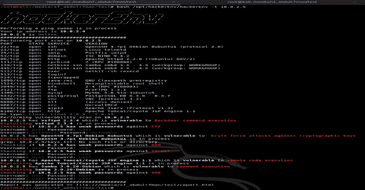
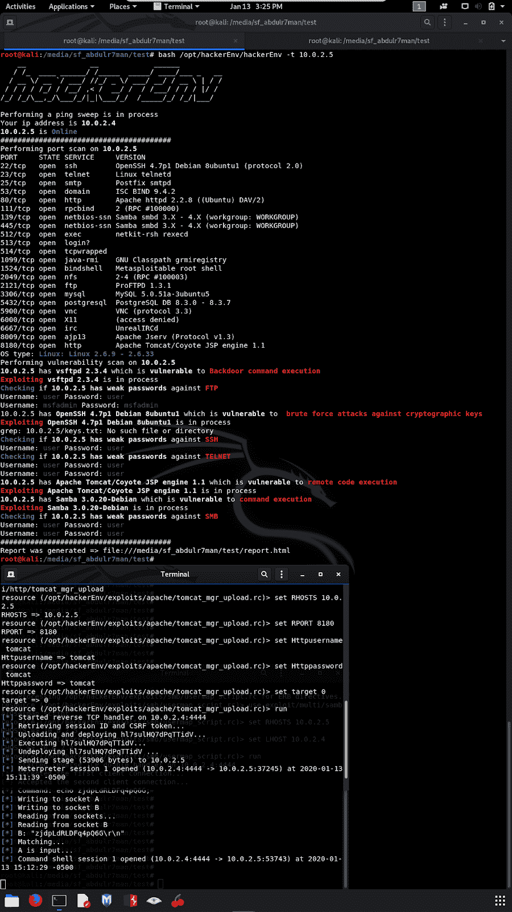
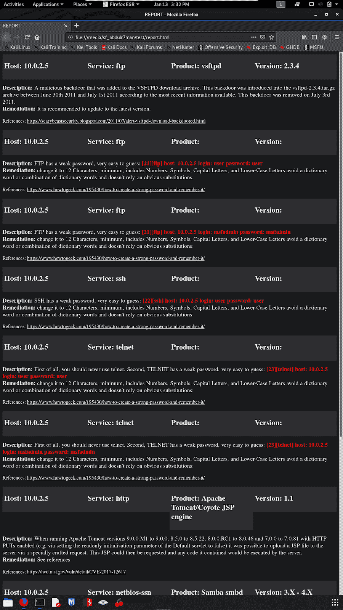
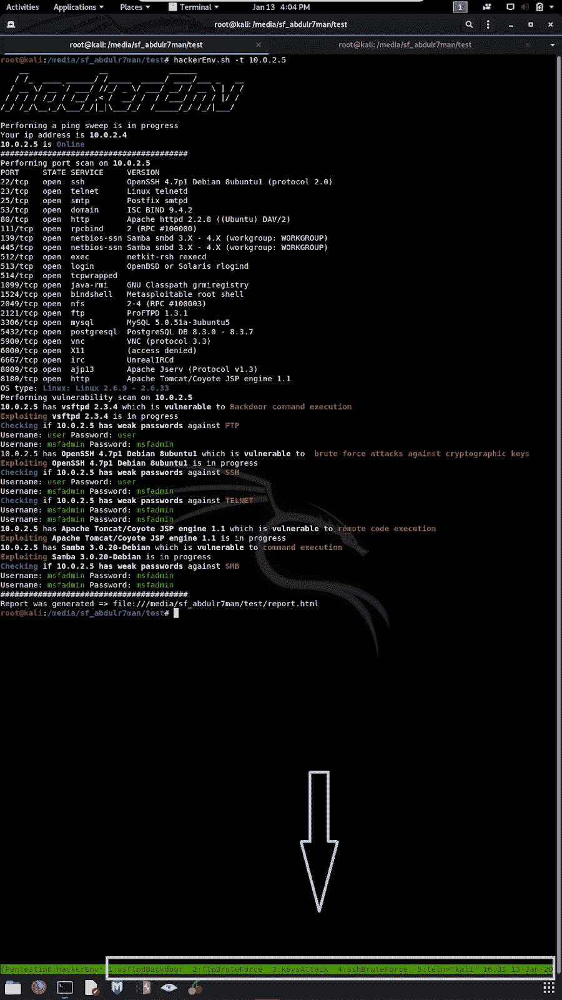

# 黑客环境:扫描 IPs 和扫描端口、漏洞并利用它们

> 原文：<https://kalilinuxtutorials.com/hackerenv/>

**hackerEnv** 是一款自动化工具，可以快速轻松地扫描 IP 和端口、漏洞并加以利用。然后，它会给你一个交互式的 shell 来做进一步的测试。此外，它还生成 HTML 和 docx 报告。它使用其他工具，如 nmap、nikto、metasploit 和 hydra。

在 kali linux 和 Parrot OS 中工作。不要在 Qterminal 中运行它，它可以在 gnome-terminal、terminator 和 tmux 中运行。我一直在添加功能和漏洞利用。此外，很快将有一个 GUI 版本。

这个工具不是由专业人员编写的，“我不知道我在做什么”。通过运行本程序，您同意不在任何公共、公司或未经授权的网络上运行本程序。仅在您获得授权时执行。欢迎来到@R2k4n

**更新卡莉/鹦鹉**

**apt 更新；apt 升级-y**

**下载**

git 克隆 https://github.com/abdulr7mann/hackerEnv.git
CD/opt/hackerEnv
chmod+x hackerEnv

**如果您想在系统的任何地方使用它，使用**创建一个快捷方式

ln-s/opt/hackerEnv/hackerEnv/usr/local/bin/

**用途**

**用法:**
hackerEnv

举例:
hackerEnv-t 10 . 10 . 10 . 10
hackerEnv-t " 10 . 10 . 10 . 10 \ n 20 . 20 . 20 . 20 . 20 "
hackerEnv-t 10 . 10 . 10 . 10-I eth 0
hackerEnv-I eth 0-s 24【T11
hackerEnv–更新更新工具。
hackerEnv 扫描整个网络。
hackerEnv -t 传递特定目标的 IP。
hackerEnv -t 传递多个目标的 IP，例如 hackerEnv-t " 10 . 10 . 10 . 10 \ n 20 . 20 . 20 . 20 "
hackerEnv-I 指定一个接口。
hackerEnv——一个 Pass 攻击者的 IP。
hackerEnv -s 指定子网 24 或 23 等。exclude /
hackerEnv -e，–aggressive Enable aggressive port scan
hackerEnv-oA gene rate 以 HTML 和 DOCX 格式报告

**演示**

https://www.youtube.com/watch?v=-r5iDrLF4xU

**在 Gnome 终端**

**在 tmux**

**报告**

