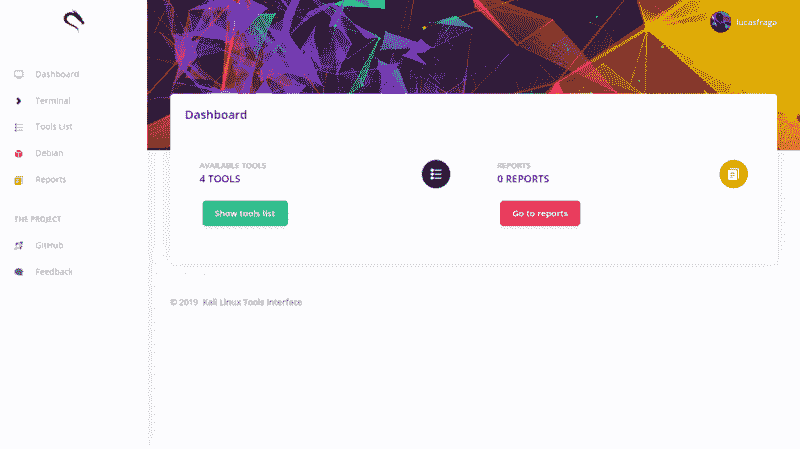
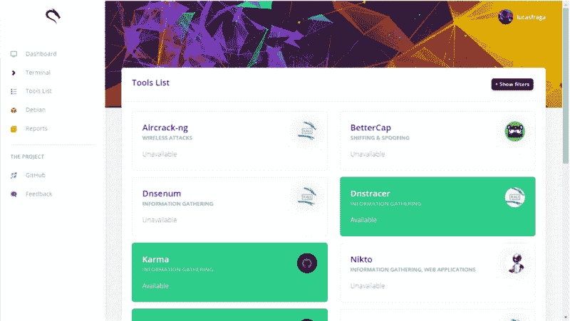
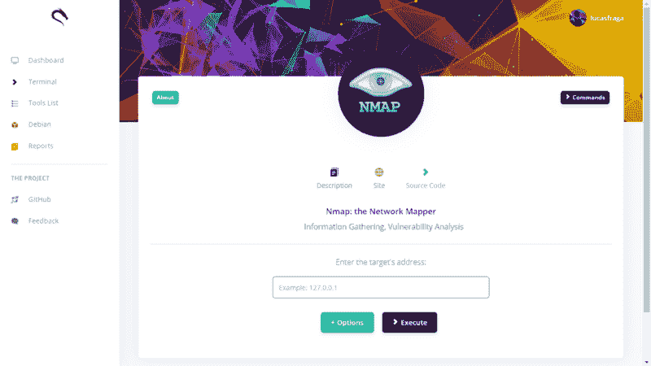

# Kali Linux 工具接口

> 原文：<https://kalilinuxtutorials.com/kali-linux-tools-interface/>

**Kali Linux 工具界面**是通过浏览器使用信息安全工具的图形界面。该项目使用 Kali Linux 工具作为参考，因为它是拥有最大的本地工具包的发行版。

**先决条件**

*   基于 Debian 的发行版(最好是 [Kali Linux](https://www.kali.org/) )
*   安装的信息安全工具
*   Apache / Nginx 服务正在运行
*   SSH 服务正在运行
*   盒子里的壳(如果你想使用终端)
    *   要在一个盒子中安装**外壳，使用以下命令:`**sudo apt-get install shellinabox**`**

**安装**

1.  将内容提取到 web 服务器的文件夹中。
2.  在 MySQL 中创建一个名为`**kali**`的数据库，导入文件`**assets/database.sql**`。
3.  编辑文件`**assets/includes/config.php**`并设置您的设置。
4.  尽情享受吧！

**截图**

*   **仪表板**

*   **工具列表**

*   **选择使用！**

**用**建造

*   [氩气仪表盘](https://demos.creative-tim.com/argon-dashboard/)
*   [自举 4](https://getbootstrap.com)
*   [PHP 7](https://php.net)
*   [PHP 安全通信库](https://github.com/phpseclib/phpseclib)
*   [JQuery](https://jquery.com)

[**Download**](https://github.com/lucasfrag/Kali-Linux-Tools-Interface)