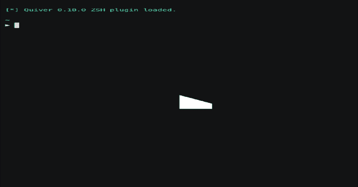

# 箭袋:Kali Linux 的元工具

> 原文：<https://kalilinuxtutorials.com/quiver/>

**颤**是 shell 函数的一个有组织的名称空间，它在您的终端中预填充命令，以便您可以抛弃对笔记的依赖，复制、粘贴、编辑、复制和再次粘贴。箭袋帮助你记住如何使用你的武器库中的每一个工具，而不是将它们隐藏在维护或更新起来很麻烦的脚本后面。相反，您可以使用颤来构建一个可组合的、动态的工作流，用于各种情况。

箭袋并没有涵盖所有的工具，它是我自己管理的收藏，我还在添加和更新。对于许多不同类型的约定和目标，有如此多的工具，所以我只尝试将重点放在维护和当前的工具上。请随意要求在问题列表中包含您喜欢的工具。

**发布 1.0 版**

经过几个月的努力工作，我很高兴向大家介绍 1.0 版本的箭筒！这个版本包含许多对以前版本的改进，如每个名称空间的帮助和安装程序，自动填充变量，如 RHOST，RPORT，LHOST，LPORT，PROJECT，WORDLIST，URL 和全局配置设置，用于自定义设置，如您最喜欢的单词列表菜单。如果你之前一直在使用箭筒，那么 1.0 中的许多变化都是突破性的。请使用`qq-help`熟悉新命令。如果您以前将颤动值存储在。zshrc，现在大部分都可以使用`qq-vars-global`存储为全局变量。

*   [RELEASES.md](https://github.com/stevemcilwain/quiver/blob/master/RELEASES.md)

**特性**

*   在终端中预先填充命令
*   具有制表符自动补全功能的组织有序的命令
*   作为 ZSH /我的 ZSH 外壳插件安装
*   可定制的设置，全局变量
*   OSINT 的侦察阶段命令
*   共同服务的列举
*   Web 枚举、暴力破解和黑客攻击
*   利用编译助手
*   反向外壳处理程序
*   内容服务命令
*   内置日志的飞行笔记，保存命令
*   将 markdown 注释呈现到命令行
*   Kali Linux 系统管理
*   更新通知和安装
*   依赖项的安装程序

**安装**

箭筒需要以下条件:

*   ZSH (apt-get 安装 ZSH)
*   哦-我的-zsh(可选要求但推荐:[https://ohmyz.sh/](https://ohmyz.sh/)
*   卡利 Linux([https://kali.org](https://kali.org))

将 repo 克隆到您的 OMZ 自定义插件文件夹中。

git 克隆 https://github.com/stevemcilwain/quiver.git ~/。我的天啊/自定义/插件/箭筒

**编辑~/。zshrc** 加载插件。

**插件=(git 颤)**

来源。zshrc 来加载插件，这样就完成了。在第一次加载时，颤将安装几个核心包。

**来源~/。zshrc**

**入门**

箭袋将命令组织成以`**qq-**`开头的名称空间，比如`**qq-enum-web**`或者`**qq-recon-domains**`。要查看所有名称空间的概览，只需使用`**qq-help**`。每个名称空间也有自己的帮助命令，比如提供可用命令列表的`**qq-enum-web-help**`。所有命令都支持制表符结束和搜索。

**安装依赖关系**

每个名称空间都是一个 QQ-install 命令，用于安装与该名称空间相关的所有工具。您可以只安装您需要的工具，或者使用`**qq-install-all**`运行所有名称空间的安装程序。

**工作流程**

颤是为了提供一个可组合的，动态的工作流程。它取代了阅读笔记、查找命令、复制、粘贴、用目标值替换值、复制、粘贴、运行等痛苦的原始工作流程。有些严重依赖于完全自动化的脚本或框架，它们运行工作流的所有命令并输出格式良好的数据。虽然这些脚本对于许多用例来说都很棒，但是它们通常很脆弱，隐藏了底层的工具和技术，并且修改起来很麻烦。相反，颤给了你一个快乐的媒介，你可以快速简单地运行命令，输出组织良好，根据目标和上下文组成你的工作流。

[**Download**](https://github.com/stevemcilwain/quiver)