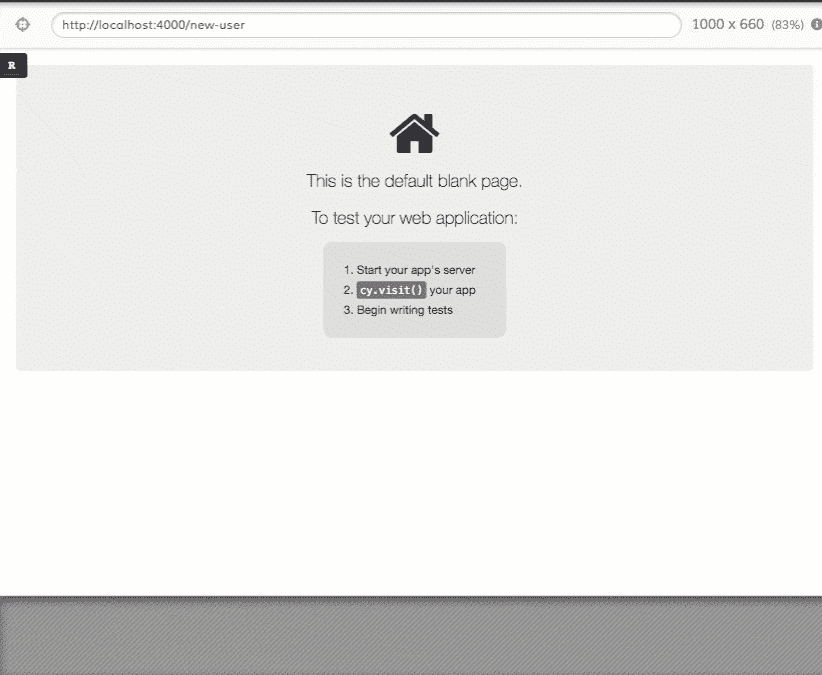
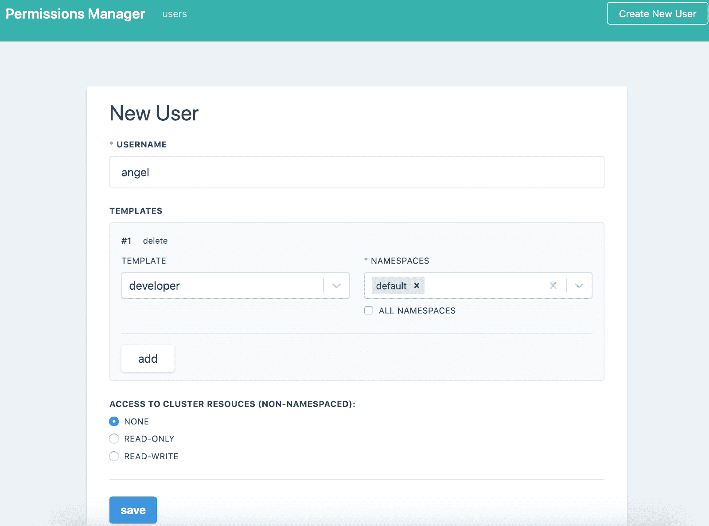
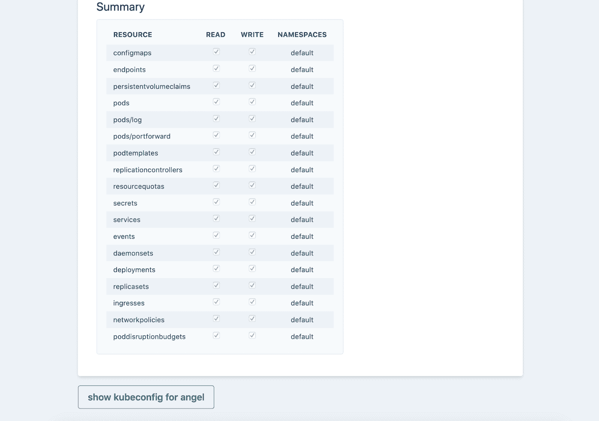
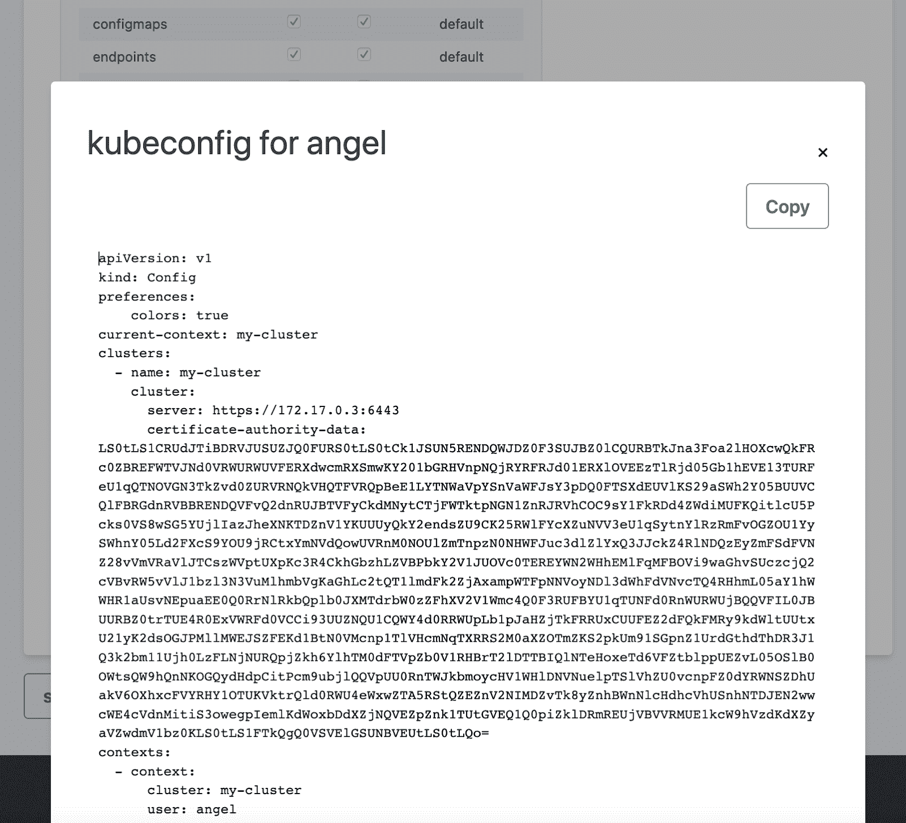
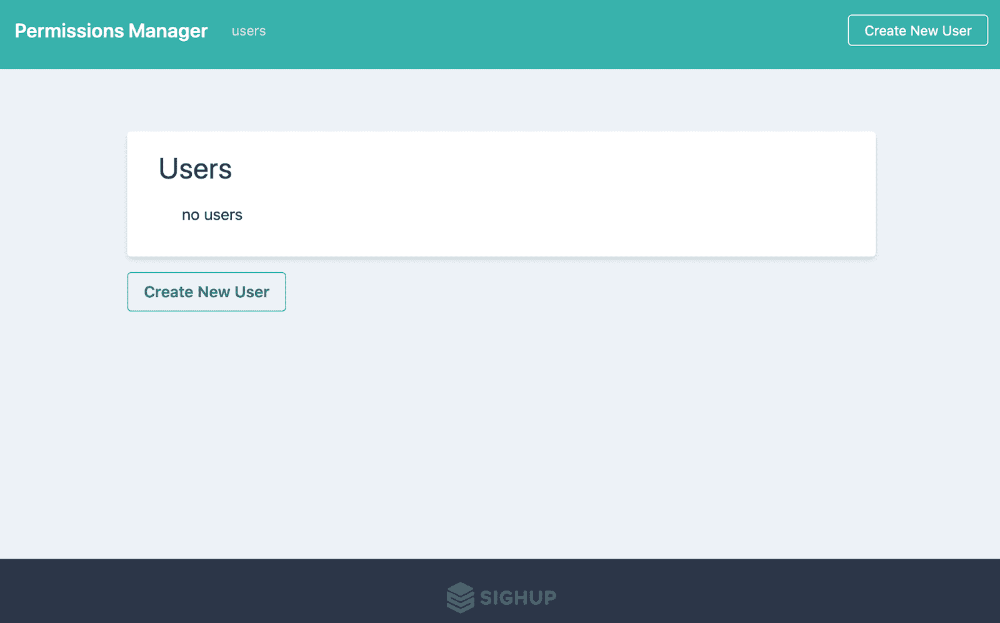

# 许可管理器:RBAC 和用户管理的工具

> 原文：<https://kalilinuxtutorials.com/permission-manager/>

**权限管理器**是由 [SIGHUP](https://sighup.io) 开发的一个应用程序，为 Kubernetes 实现了一个超级简单和用户友好的 **RBAC 管理。如果您正在寻找一种简单而直观的方式来管理 Kubernetes 集群中的用户，这是一个合适的地方。**

使用权限管理器，您可以创建用户，分配名称空间/权限，并通过一个漂亮而简单的 web 用户界面分发 Kubeconfig YAML 文件。

**截图**

*   **第一页**

*   **创建用户**

*   **创建用户-摘要**

*   **用户的 Kubeconfig***

**安装**

要在集群上部署和运行权限管理器，请遵循[安装指南](https://github.com/sighupio/permission-manager/blob/master/docs/installation.md)

**开发设置**

我们喜欢来自❤️.社区的贡献
学习[如何贡献](https://github.com/sighupio/permission-manager/blob/master/docs/how-to-contribute.md)

它是如何工作的？

该应用程序允许我们定义和选择权限标准模板(在一个名称空间内或全局定义谁可以做什么的模板)，并将它们与您可能想要创建的所有用户相关联。

模板系统是对集群角色、角色绑定和集群角色绑定的抽象。

我们计划使用 CRD 和定制的标签吗？当然，它在产品路线图中。

**什么是模板？**

模板是带有前缀的集群角色

`**template-namespaced-resources___**`

例如`**template-namespaced-resources___developer**`

**为什么模板不是 CRD？**

当我们开始这个项目的开发时，模板是一对一的，CRD 的使用看起来有些过分。这显然会在未来改变，以避免污染`**clusterroles**`，并允许我们对权限管理器所拥有的内容进行更精确的封装。

**如何添加新模板？**

从`**template-namespaced-resources___**`开始创建一个集群角色并应用它。

**默认模板**

`**developer**`和`**operation**`默认模板可以通过应用位于 *k8s/k8s-seeds/seed.yml* 的清单来创建

kubectl 应用-f k8s/k8s-种子

**什么是用户？**

用户是一种自定义资源`**permissionmanagerusers.permissionmanager.user**`

[**Download**](https://github.com/sighupio/permission-manager)