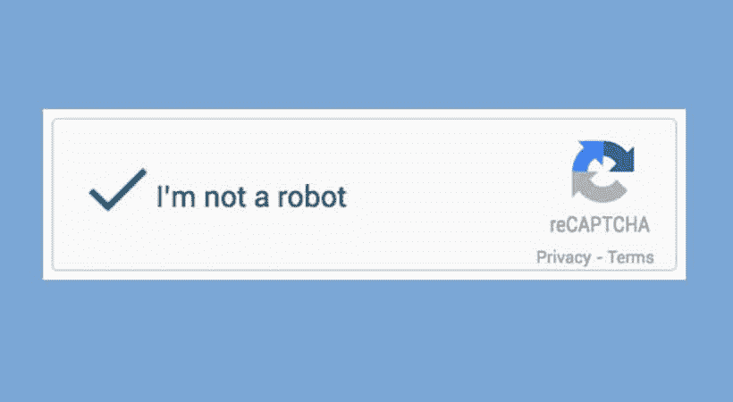

# 验证码及其他:防御坏机器人

> 原文：<https://kalilinuxtutorials.com/captcha-and-beyond-defending-against-bad-bots/>

机器人是一个越来越大的威胁。据估计，现在 20%的网络流量是由不良机器人组成的，它们执行从分布式拒绝服务(DDoS)或“凭证填充”攻击到抓取数据、发布虚假评论、在网站上歪曲广告和访问者指标的各种行为。这些恶意机器人的行为越来越复杂，经常使它们与人类用户难以区分。

例如，机器人可以模仿人类演员的鼠标行为，这意味着它们将模拟真正的用户在访问特定网站时移动鼠标的方式。虽然这些机器人可能正在秘密地(或不那么秘密地)实施针对在线用户帐户或数据挖掘的暴力攻击，以达到竞争目的，但这些机器人因此可以通过表现为日常活动的定期合法访问者来逃过安全网。

**恶意机器人的崛起**

随着在线恶意机器人的增加，安全专业人员一直在寻找阻止这些坏机器人的方法——无论是像 [CAPTCHA](https://www.imperva.com/learn/application-security/what-is-captcha/) 这样的方法还是侵入性较低的工具。

鉴于机器人可能造成的潜在破坏，难怪人们会急于阻止它们。例如，凭据填充网络攻击——在这种攻击中，窃取的帐户凭据，如用户名或电子邮件地址和密码，被用来通过反复试验的暴力方法尝试并侵入不同的服务——可能会导致敏感的客户数据被泄露。

与此同时，DDoS 网络攻击可以通过让僵尸网络流量超载来关闭在线服务。这两者对组织来说都可能是毁灭性的。不良机器人的其他用途，如窃取数据，可能不会立即造成严重后果，但仍然可以以有害的方式使用。

**验证码的好与坏**

幸运的是，有多种机器人检测方法，尽管其中一些方法比其他方法更有效。也许用来区分真实用户和虚假用户的最常见的方法是验证码。CAPTCHA 是“区分计算机和人类的完全自动化公共图灵测试”的缩写，是一种旨在区分机器人和合法、有血有肉的人类用户的工具。

验证码在 20 世纪 90 年代末首次发明，尽管在 2003 年才被命名，但随着机器人变得更加复杂，验证码已经变得更加先进。最常见的验证码类型要求用户识别扭曲、拉长的字母或数字。然而，最近的变化要求用户点击特定区域或识别图像中的对象。简而言之，验证码系统必须比自动化机器人能够模仿人类行为的系统领先一步，以便从真实用户中过滤出虚假用户。

不幸的是，验证码不是最优雅的解决方案，当谈到机器人检测。这是因为它们要求用户回答问题，以便继续他们可能正在做的任何事情，这必然会妨碍用户体验。用户可能愿意在互联网会话期间忍受一次或两次这种情况，但这是一种必须谨慎使用的工具，因此很难用于对潜在不良行为者的连续实时监控。CATCHA 也有其他弱点。在他们将人类与机器人分类的努力中，他们可以要求人类完成一些任务，这些任务甚至对一些人来说也很难理解和完成。某些验证码类型也不支持所有可用的浏览器或某些设备。通过试图阻止坏用户，他们可能最终也会阻止一些好用户。

**可供选择的方法**

幸运的是，还可以部署其他方法。设备指纹试图通过分析用户的操作系统、他们使用的特定 web 浏览器、他们的 IP 地址等因素来识别唯一的设备。设备指纹可以更容易地检查流量，识别恶意设备，并最终在恶意机器人造成任何损害之前发现并阻止它们。

另一种方法由 cookie 挑战组成。如果分类算法识别出潜在的机器人，cookie 质询将通过发送 cookie 来响应 HTTP 请求。通常，web 浏览器会存储并重新发送这个 cookie。然而，大多数机器人不支持 cookies，因此不会响应。这是确定你是否在和一个机器人打交道的好方法。

另一个策略是 JavaScript 挑战。与 cookie 质询类似，JavaScript 质询将使用 JS cookie 来响应 HTTP 请求。大多数网络浏览器执行 JavaScript 指令，但大多数机器人不执行。由于缺乏对 JS 引擎的支持，他们将无法响应，因此将自己标记为可疑。

这些只是可以用来对付潜在的坏机器人的几种方法，在它们成为问题之前将其扼杀在萌芽状态。诸如此类的方法也是有益的，因为它们不会对用户体验产生负面影响。

展望未来，对于那些运营和提供互联网服务和网站的人来说，坏机器人只会成为更大的问题。(因此，他们的用户也是如此。)CAPTCHAs 之类的工具当然有它们的位置，但它们应该是最后一道防线。机器人一直在变得越来越聪明。我们阻止它们的方式也需要这样做——但不影响好用户的体验。