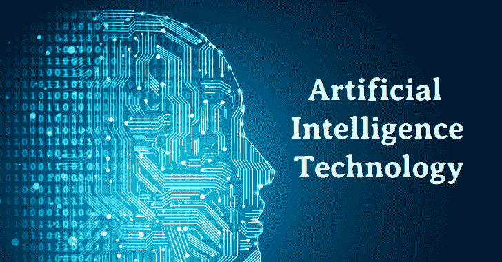

# 人工智能技术跟踪员工以保持社交距离

> 原文：<https://kalilinuxtutorials.com/ai-technology-tracks-employees-to-keep-social-distancing/>

疫情冠状病毒已经对大多数企业造成了不利影响。由于对商品和服务的需求下降，许多组织暂停了业务。但是，一些公司已经开始为他们的员工计划安全返回。工作人员需要戴上口罩，保持社交距离，以避免感染病毒。一些企业正在将人工智能(AI)软件集成到他们的安全系统中。继续阅读，了解人工智能技术如何在工作场所跟踪员工。

## **有助于在工作场所保持社交距离的算法**

秘鲁的一家丙烯酸纤维工厂安装了人工智能和监控摄像头，用于监控工人。这项技术确保每个员工都戴着面罩，并与其他员工保持 6 英尺的距离。

Sudamericana de Fibras 工厂每月生产 3000 吨腈纶。它最近在 5 月整合了一项来自硅谷初创公司卡米奥的新技术。来自卡米奥的人工智能软件分析工厂摄像头记录的视频片段。它识别可能在工厂中传播冠状病毒的危险行为。其中包括员工在走廊一起散步，主管与员工近距离交谈。

Sudamericana de Fibras 的技术顾问 Gianfranco Acre 表示，人力资源部门使用社交距离冲突来建议员工改变他们的性格。但是，这个系统有时看起来具有挑衅性。

随着人工智能塑造在线轮盘赌，实体赌场正在采用人工智能来跟踪员工是否在工作场所保持社交距离。亚马逊开发了一种社交距离技术，适用于仓库和走廊的室内使用。公司可以使用该工具向员工显示实时视频画面。

许多公司不会透露客户的个人信息。但学校和某些企业正计划应用人工智能来保持社交距离。软件开发商希望这项技术能够发挥作用，帮助公司重新开业，而不会危及员工的健康。他们可以添加楼层标记或移动家具，以确保员工之间保持几英尺的距离。

一些技术权利倡导者已经开始批评人工智能技术具有侵犯性。他们认为，企业不需要使用它来确保员工遵守概述的安全措施。电子前沿基金会的活动家 Hayley Tsukayama 表示，公司可以在不增加监控的情况下保证员工的安全。

## **行为调整**

卡米奥使用机器学习已经好几年了。这项技术帮助这家初创公司识别了监控录像中的不同事件和对象，包括动物和自行车。人工智能软件在视频镜头中发现个人，并计算他们之间的距离。它记录了人们之间保持不到六英尺距离的情况。

由于新冠肺炎病毒的爆发，大多数国家的经济已经崩溃。很多公司已经三个月没有运营了。随着冠状病毒成为流行病，企业发现有必要恢复运营。一些公司正在使用复杂的人工智能软件来跟踪员工，以确保他们保持社交距离。如果工人离同事太近，系统会发出警报。