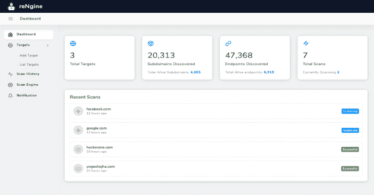
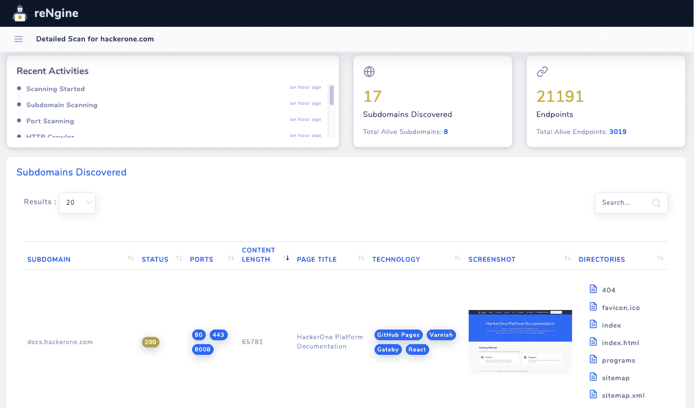
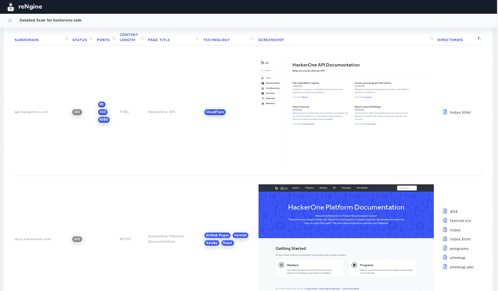
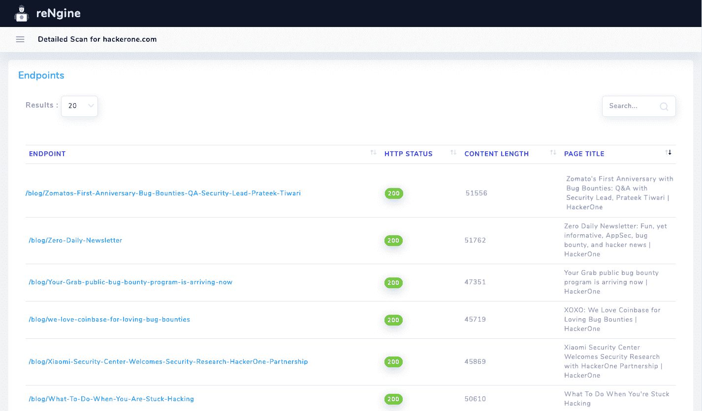
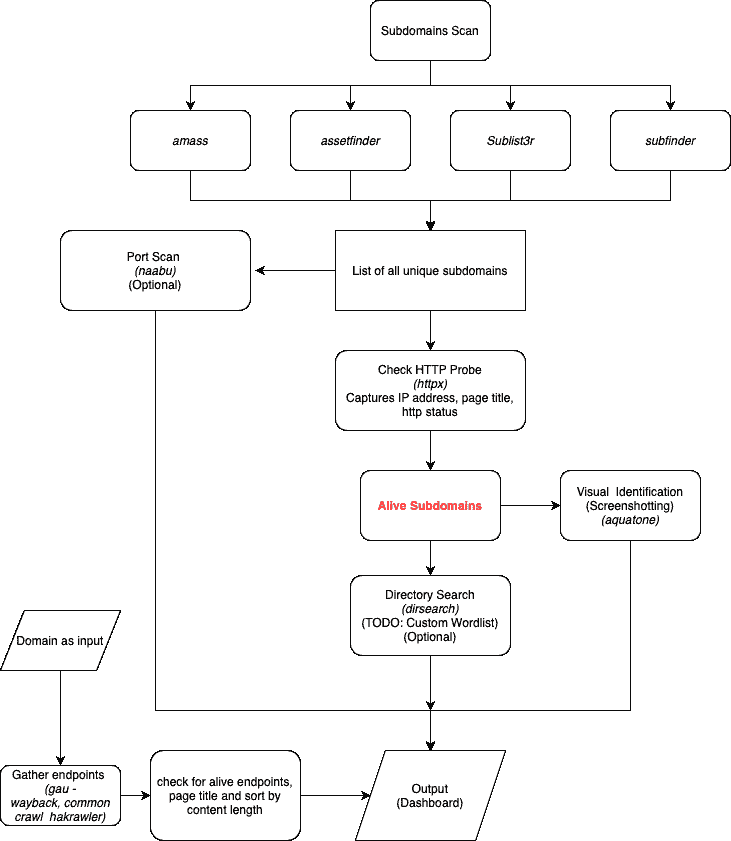

# reNgine:一个用于 Web 应用的自动化 recon 框架

> 原文：<https://kalilinuxtutorials.com/rengine/>

reNgine 是一个自动化侦察框架，用于在 web 应用程序渗透测试期间收集信息。reNgine 拥有可定制的扫描引擎，可用于扫描域、端点或收集信息。

reNgine 的妙处在于它将所有东西都聚集在一个地方。它有一个侦察管道，这是高度可定制的。

当您想要执行侦察、收集端点、目录和文件搜索、抓取屏幕截图以及在一个地方收集所有结果时，reNgine 会非常有用。

假设，如果您有一个域 hackerone.com，reNgine 可以根据您的扫描引擎执行扫描，将所有结果收集在一个地方。reNgine 使这样的用例成为可能，“我想搜索页面标题为“Dashboard”且页面状态为 200 的子域，并且我想快速地看一下截图”。

另一个用例可能是，“我想列出所有使用 PHP 的子域，HTTP 状态是 200！”

在端点部分，reNgine 能够使用`gau`、`hakrawler`等工具收集 URL 端点，这些工具从许多来源收集 URL，如 common crawl、Wayback engine 等。

reNgine 还使“搜索带扩展名的 URL”这样的用例成为可能。php 和 HTTP 状态是 200！”

假设您正在寻找开放重定向，您可以快速搜索`=http`并查找 HTTP status 30X，这将以最小的努力提供开放重定向的高准确性。

**演示**

[https://www.youtube.com/embed/u8_Z2-3-o2M?feature=oembed&enablejsapi=1](https://www.youtube.com/embed/u8_Z2-3-o2M?feature=oembed&enablejsapi=1)

**它不是什么？**

reNgine 不是一个:

*   漏洞扫描器！
*   高精度侦察(不！reNgine 使用其他开源工具来实现这一管道。引擎的准确性和功能也依赖于这些工具)
*   速度导向的侦察框架，立竿见影

**截图**

*   **扫描结果**

*   **聚集的端点**

当然，在这一点上，与其他工具相比，reNgine 并没有提供最好的结果，但 reNgine 无疑付出了最少的努力。此外，我还在不断添加新功能。你可以通过创建一个充满新功能和错误修复的 PR 来帮助我完成这个旅程。在这样做之前，请查看[贡献](https://github.com/yogeshojha/rengine#contributing)部分。

**流量**

**入门**

要启动并运行本地副本，请遵循以下简单的示例步骤。

git 克隆 https://github.com/yogeshojha/rengine.git
CD 引擎

**先决条件**

*   码头工人
    *   从[这里](https://www.docker.com/get-started)安装基于你的操作系统的 docker
*   坞站-合成
    *   docker-compose 的安装说明从[开始，此处为](https://docs.docker.com/compose/install/)

**安装**

假设您已经完成了上述步骤，并且在 rengine 目录中

**坞站-复合 up–build**

构建过程可能需要一些时间。

或者，您也可以使用预构建的 Docker 映像运行项目(启用 2FA 后，您必须[创建一个新的具有`read:packages`范围的个人访问令牌](https://github.com/settings/tokens/new)):

**坞站登录坞站. pkg.github.com
坞站-组合拉
坞站-组合**

设置完成后，您需要设置密码。

**注册账户**

一旦应用程序启动并运行，您需要一个 reNgine 帐户。这可以使用 Django 的`**createsuperuser**`轻松创建。打开新的终端选项卡，并运行以下命令:

**docker exec-it ren gine _ web _ 1 python manage . py 创建超级用户**

您现在可以输入您的用户名和密码。记得保存一个安全的密码。

**用途**

注意:reNgine 执行指纹识别、端口扫描和横幅抓取，这在某些国家可能是非法的。在使用此工具之前，请确保您有权在目标域上执行侦察。

如果安装成功，那么您可以使用以下命令运行 reNgine

**坞站-合成 up -d**

然后可以从 [http://localhost:8000](http://localhost:8000) 访问 web 应用程序

**VPS HTTPS 安装**

如果你正在考虑用 https 在 VPS 上安装，这里有一个由@ J0 _ mart[https://www . jomar . fr/posts/2020/07/en-install-ren engine-with-nginx-and-SSL-auto-renew/](https://www.jomar.fr/posts/2020/07/en-install-rengine-with-nginx-and-ssl-auto-renew/)撰写的很棒的博客

[**Download**](https://github.com/yogeshojha/rengine)