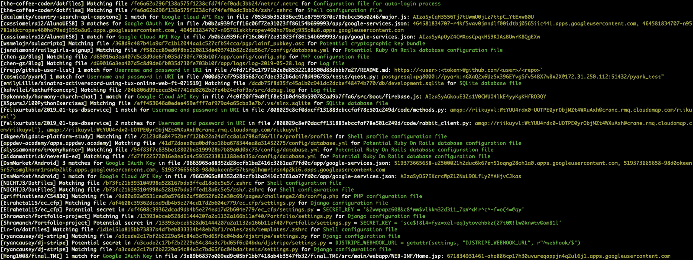

# shhgit:在 GitHub 中查找秘密和敏感文件

> 原文：<https://kalilinuxtutorials.com/shhgit/>

**shhgit** 几乎实时地在 GitHub(包括 Gists)、GitLab 和 BitBucket 中查找机密和敏感文件。

有很多很棒的工具可以帮助你，这取决于你站在哪一边。在敌对的一方，流行的工具如 [gitrob](https://github.com/michenriksen/gitrob) 和 [truggleHog](https://github.com/dxa4481/truffleHog) 专注于挖掘提交历史，从特定的存储库、用户或组织中寻找秘密令牌。在防御方面，GitHub 自己也在通过他们的[令牌扫描](https://help.github.com/en/articles/about-token-scanning)项目积极扫描秘密。他们的目标是实时识别提交代码中的秘密令牌，并通知服务提供商采取行动。所以理论上如果任何 AWS 秘钥被提交给 GitHub，Amazon 都会得到通知并自动撤销它们。

我开发 shhgit 是为了提高人们对这个问题的认识，让这个问题变得更加普遍。希望 GitHub 多做一些事情，防止不良行为者利用整个平台的信息宝库。我不知道他们的[令牌扫描](https://help.github.com/en/articles/about-token-scanning)项目的内部工作原理，但是推迟实时 feed API 直到管道完成，并对提供者提出 SLA，这似乎是朝着正确方向迈出的一步。

通过对签名的一些调整，shhgit 将成为你的 bug bounty 工具箱中一个令人敬畏的新成员。

**安装**

您可以使用[预编译的二进制文件](https://www.github.com/eth0izzle/shhgit/releases)或者允许 Go 从源代码构建:

*   为您的平台安装 [Go](https://golang.org/doc/install) 。
*   将自动下载并构建 shhgit。您可以选择手动克隆这个库并运行 **`GO111MODULE=on CGO_ENABLED=0 go build -v -i -o shhgit`。**
*   参见用法。

或者您可以从 Docker 运行:

*   获取 config.yaml 的副本并插入您的 github 凭证(参见用法)。
*   `**docker run -v $(pwd)/config.yaml:/config.yaml:ro eth0izzle/shhgit**`

**用途**

shhgit 可以通过两种方式工作:通过 GitHub、GitLab 和 BitBucket 公共存储库或者通过处理本地目录中的文件。

默认情况下，shhgit 将运行在以前的‘公共模式’下，需要访问公共的 GitHub API。您需要获得并提供一个访问令牌。无论使用什么令牌，API 都有一个硬速率限制，即每个帐户每小时 5，000 个请求。您提供的帐户唯一令牌越多，处理事件的速度就越快。按照[本指南](https://help.github.com/en/github/authenticating-to-github/creating-a-personal-access-token-for-the-command-line)生成令牌；它不需要任何范围或权限。然后将其放置在`config.yaml` 中的 **`github_access_tokens`下。**请注意，绕过 GitHub 的费率限制是违反 GitHub 条款的。使用多个代币，风险自担**。**

不像其他工具，你不需要用 shhgit 传递任何目标。只需运行`**$ shhgit**`开始观察 GitHub 提交，并找到与包含的 120 个签名匹配的秘密或敏感文件。您还可以放弃签名，在搜索查询中使用 shhgit，例如，查找您可以使用的所有 AWS 键`**shhgit --search-query AWS_ACCESS_KEY_ID=AKIA**`

要在本地模式下运行(并且可能集成到您的 CI 管道中)，您可以传递`**--local**`标志(参见下面的用法)。

**选项**

–clone-repository-time out
克隆存储库所需的最长时间(秒)(默认为 10)
–config-path
从给定目录中搜索 config.yaml。如果未设置，尝试从 shhgit 二进制文件和当前目录
–csv-path
中查找是否要将找到的秘密写入 CSV 文件。留空禁用
–调试
打印调试信息
–熵阈值
在文件中查找高熵字符串。阈值越高=秘密越多，阈值越低=误报越多。设置为 0 禁用熵检查(默认为 5.0)
–local
指定要扫描的本地目录(绝对路径)。仅递归扫描给定的目录。本地运行不需要 Github 令牌。
–最大文件大小
要处理的最大文件大小，以 KB 为单位(默认为 512)
–最大存储库大小
要下载和处理的最大存储库大小，以 KB 为单位)(默认为 5120)
–最小星数
仅克隆星数等于或高于此数的存储库。设置为 0 以忽略星计数(默认为 0)
–路径检查
设置为假以禁用文件名/路径签名检查，即仅匹配正则表达式模式(默认为真)
–实时监视和处理 gist。设置为 false 以禁用(默认为 true)
–search-query
指定搜索字符串以忽略签名并过滤包含此字符串的文件(regex 兼容)
–silent
抑制除错误之外的所有输出
–temp-Directory
存储存储库/匹配项的目录(默认为“% temp % \ shhgit”)
–threads
要使用的并发线程数(逻辑 CPU 的默认数量)

**配置**

`config.yaml`文件有 7 个元素。提供了一个[默认值](https://github.com/eth0izzle/shhgit/blob/master/config.yaml)。

github_access_tokens: #提供至少一个令牌
———令牌一’
———令牌二’
webhook:“#一个帖子 web hook 的 URL。
webhook_payload: " #要发布到 webhook URL 的有效负载
黑名单 _ 扩展名:[] #要忽略的扩展名列表
黑名单 _ 路径:[] #要忽略的路径列表
黑名单 _ 熵 _ 扩展名:[] #熵检查要忽略的附加扩展名
签名:#要检查的签名列表
——part:" #文件名、扩展名、路径或内容
匹配:" #简单文本比较(如果没有正则表达式元素)
正则表达式:" #正则表达式模式(如果不匹配

**签名**

shhgit 有 120 个签名。您可以通过编辑`config.yaml`删除或添加更多内容。

Chef 私钥、潜在的 Linux 影子文件、潜在的 Linux passwd 文件、Docker 配置文件、NPM 配置文件、环境配置文件，包含私钥、AWS 访问密钥 ID 值、AWS 访问密钥 ID、AWS 帐户 ID、AWS 秘密访问密钥、AWS 会话令牌、Artifactory、CodeClimate、脸书访问令牌、Google (GCM)服务帐户、Stripe API 密钥、Google OAuth 密钥、Google Cloud API 密钥
Google OAuth 访问令牌、Picatic API 密钥、Square 访问令牌、Square OAuth 秘密、PayPal/Braintree 访问令牌 亚马逊 MWS Auth Token、Twilo API Key、MailGun API Key、MailChimp API Key、SSH Password、Outlook team、Sauce Token、Slack Token、Slack Webhook、SonarQube Docs API Key、HockeyApp、URI 的用户名和密码、NuGet API Key、潜在加密私钥、日志文件、潜在加密密钥包、潜在加密密钥包
潜在加密密钥包、潜在加密密钥包、Pidgin OTR 私钥、OpenVPN 客户端配置文件、Azure 服务配置模式文件、远程桌面连接文件、Microsoft SQL 数据库文件、 Microsoft SQL server compact 数据库文件、SQLite 数据库文件、SQLite3 数据库文件、Microsoft BitLocker 恢复密钥文件
Microsoft BitLocker 可信平台模块密码文件、Windows BitLocker 全卷加密数据文件、Java keystore 文件、密码安全数据库文件、Ruby On Rails secret token 配置文件、Carrierwave 配置文件、潜在的 Ruby On Rails 数据库配置文件、OmniAuth 配置文件、Django 配置文件
1Password password manager 数据库文件、Apple Keychain 数据库文件、网络流量捕获文件、GnuCash 数据库文件、 Jenkins publish over SSH 插件文件、潜在的 Jenkins 凭证文件、KDE 钱包管理器数据库文件、潜在的 MediaWiki 配置文件、Tunnelblick VPN 配置文件、Sequel Pro MySQL 数据库管理器书签文件、Little Snitch 防火墙配置文件、Day One 日志文件、潜在的 jrnl 日志文件、Chef Knife 配置文件、cPanel 备份 ProFTPd 凭证文件
Robomongo MongoDB 管理器配置文件、FileZilla FTP 配置文件、FileZilla FTP 最近的服务器文件、Ventrilo 服务器配置文件、Terraform 变量配置文件、Shell 配置文件、Shell 配置文件、 Shell 配置文件、私有 SSH 密钥、私有 SSH 密钥、私有 SSH 密钥、私有 SSH 密钥、SSH 配置文件、潜在加密私钥、Shell 命令历史文件
MySQL 客户端命令历史文件、PostgreSQL 客户端命令历史文件、PostgreSQL 密码文件、Ruby IRB 控制台历史文件、Pidgin chat 客户端帐户配置文件、Hexchat/XChat IRC 客户端服务器列表配置文件、Irssi IRC 客户端配置文件、Recon-ng web 侦察框架 API 密钥数据库、DBeaver SQL 数据库管理器配置文件、Mutt e-e S3cmd 配置文件、AWS CLI 凭证文件、SFTP 连接配置文件、T 命令行 Twitter 客户端配置文件、Shell 配置文件
Shell profile 配置文件、Shell 命令别名配置文件、PHP 配置文件、GNOME Keyring 数据库文件、KeePass 密码管理器数据库文件、SQL 转储文件、Apache htpasswd 文件、自动登录过程配置文件、Rubygems 凭证文件、拖船数字海洋管理工具配置、数字海洋 doctl 命令行客户端配置文件、git-credential-store 助手凭证文件、gitHub Hub 命令行客户端配置文件、Git

**投稿**

*   叉起来，宝贝！
*   创建您的特征分支:`**git checkout -b my-new-feature**`
*   提交您的更改:`**git commit -am 'Add some feature'**`
*   推到分支:`**git push origin my-new-feature**`
*   提交拉取请求。

**免责声明**

我对你如何使用这个工具不负任何责任。别像个混蛋一样。

[**Download**](https://github.com/eth0izzle/shhgit)