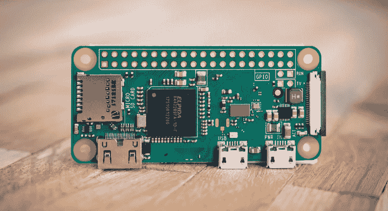

# 网络安全和物联网的互联性

> 原文：<https://kalilinuxtutorials.com/cybersecurity-and-the-interconnectedness-of-the-iot/>

物联网(IoT)在某种程度上已经成为一个时髦词汇。正是通过我们设备的互联性，我们才能够保持彼此的联系。

2018 年，全球大约有 220 亿台物联网设备在使用。随着这些变得越来越复杂，预测显示，到 2030 年，这个数字将攀升至 500 亿。甚至单个芯片也变得如此强大，因为集成电路仅在一个电路上就容纳了数十亿个晶体管。

[电力输送系统设计](https://www.altium.com/solution/power-delivery-system-design)必须满足这些技术的需求，因为即使是最微小的设备也可能被视为物联网的一部分。无线网络有助于进一步连接，但在这种互联性中仍然存在风险。

关于网络安全和物联网的互联性，你应该注意以下几点:

## **相互联系的含义**

鉴于物联网的分散性质，敏感信息和数据可以通过无线或云轻松共享。由于系统是嵌入式的，设备和应用程序都有自己的要求和规范，因此很难采取严格的安全措施。这为身份或设备盗窃、操纵或其他类似现象铺平了道路。

## **评估脆弱区域**

虽然所有类型的设备都可能容易受到攻击，但据称安全摄像头系统是最常被黑客攻击的，其次是智能集线器和其他连接到网络的存储设备，然后是智能电视、打印机和 IP 电话。当今的攻击者拥有复杂的基础设施来远程实施攻击。尽管这些信息似乎表明没有人是安全的，但为了提高安全性，我们可以关注一些关键领域

制造商必须考虑到安全性是其设计中不可或缺的组成部分。行业和政府等其他利益相关者的任务是建立制造商可以效仿的某些标准。这包括在购买这些小工具的所有消费者中正确传播最佳实践、安全更新和数据加密知识。

## **学习防身术**

拥有此类信息的消费者能够在其物联网设备上防御网络安全问题。他们可能不相信这样的攻击会发生在自己身上，但最终，每个人都是脆弱的。随着更多关于如何轻松实现这些的信息，普通消费者可能会看到数据加密、设备认证、代码签名证书和其他合理解决方案中的[价值。正如我们之前所报道的，Peniot 是物联网设备渗透测试](https://www.entrepreneur.com/article/292104)的一个伟大的[工具。这有助于您深入了解可以进行哪些类型的攻击，并看到您自己的小工具上的漏洞和缺陷，以获得更好的安全性。

随着物联网设备越来越复杂，潜在攻击也越来越具有欺骗性。用当今的技术武装自己意味着学习如何使用它们来抵御不必要的网络威胁和攻击。](https://kalilinuxtutorials.com/peniot/)