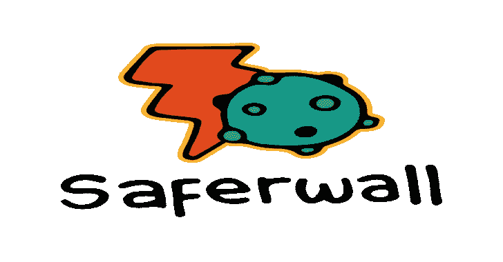
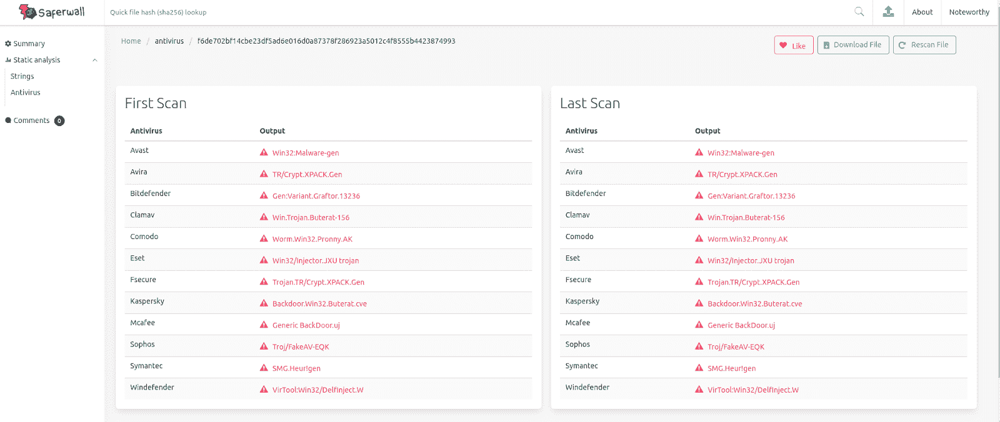
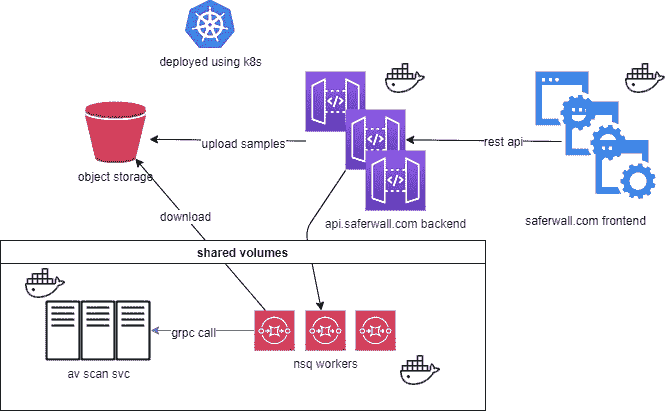

# Saferwall:一个开源恶意软件分析平台

> 原文：<https://kalilinuxtutorials.com/saferwall/>

**Saferwall** 是一个开源的恶意软件分析平台。它旨在实现以下目标:

*   提供一个协作平台，在恶意软件研究人员之间共享样本。
*   充当系统专家，帮助研究人员生成自动化恶意软件分析报告。
*   狩猎平台寻找新的恶意软件。
*   发布前签名的质量保证。

**特性**

*   静态分析:
    *   加密哈希、打包程序标识
    *   字符串提取
    *   可移植可执行文件分析器
*   多个 AV 扫描仪包括主要防病毒供应商:供应商状态供应商 avast fssecurity 通知 Kaspersky bit defender McAfee 称 Sophos 方便 Symantec 和 ESET windows defender

**安装**

safer 将利用 kubernetes 的高可用性、可扩展性及其背后的庞大生态系统。

一切都在 Kubernetes 内部运行。您可以将它部署在云中，也可以让它自托管。

为了使生产级 Kubernetes 集群更容易启动和运行，我们使用了 [kops](https://github.com/kubernetes/kops) 。它会自动配置托管在 AWS、GCE、DigitalOcean 或 OpenStack 以及裸机上的 kubernetes 集群。目前官方只支持 AWS。参考下面的[链接](https://github.com/saferwall/saferwall/blob/master/docs/BUILDING.md)了解如何设置。

**用**建造

*   大部分是 Golang。
*   后端:[回显](https://echo.labstack.com/)
*   前端:[vuej](https://vuejs.org/)+[bulma](https://bulma.io/)
*   消息: [NSQ](https://nsq.io/)
*   数据库: [Couchbase](https://www.couchbase.com/)
*   Logging: [FileBeat](https://www.elastic.co/beats/filebeat) + [ElasticSearch](https://www.elastic.co/) + [Kibanna](https://www.elastic.co/)
*   Minio: [对象存储](https://min.io/)
*   部署:[掌舵](https://helm.sh/) + [库伯内斯](https://kubernetes.io/)

**当前架构/工作流程**

以下是文件扫描过程中发生的基本工作流程:

*   前端通过 REST APIs 与后端对话。
*   后端将样本上传到对象存储。
*   后端将邮件推入扫描队列。
*   消费者获取文件并将其复制到 nfs 共享中，从而避免在每个容器上提取样本。
*   消费者通过 gRPC 调用异步调用扫描服务(如 AV 扫描器),并等待结果。

**致谢**

*   [方盾蔡](https://github.com/fundon)为超赞的 vue-admin 仪表盘。
*   对于他的工具[来说](https://github.com/horsicq/Detect-It-Easy)检测起来很容易。

[**Download**](https://github.com/saferwall/saferwall)