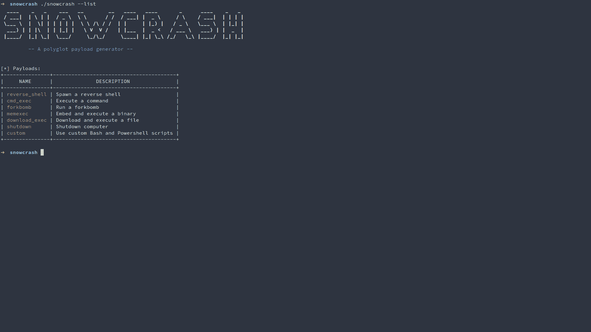

# snow crash——多语言有效载荷生成器

> 原文：<https://kalilinuxtutorials.com/snowcrash/>

**SNOWCRASH** 创建一个可以在 Linux 和 Windows 机器上启动的脚本。用户选择的有效负载(在本例中是 Bash 和 Powershell 代码的组合)被嵌入到一个多语言模板中，该模板是平台无关的。

可用的有效负载很少，包括命令执行、反向 shell 建立、二进制执行等等:>

**基本用法**

*   安装依赖项:`**./install.sh**`
*   列出可用的有效载荷:`**./snowcrash --list**`
*   生成选择的有效载荷:`**./snowcrash --payload memexec --out polyglot_script**`
*   更改多语言脚本的扩展名:`**mv polyglot_script polyglot_script.ps1**`
*   在目标机器上执行多语言脚本

**附加说明**

脚本运行和有效负载执行前的延迟可以指定为一个时间间隔(使用`**--sleep**`标志),格式如下:

**x【s | m | h】**

在哪里

**x =处于空闲状态的时间间隔
s =秒
m =正弦
h =小时**

生成之后，包含有效负载的生成脚本的扩展可以设置为`**.sh**`或`**.ps1**`(取决于我们想要定位的平台)。

使用`**--stdout**`标志可以将生成的有效负载直接写入 STDOUT(而不是写入文件)。

**截图**

[**Download**](https://github.com/wintrmvte/SNOWCRASH)