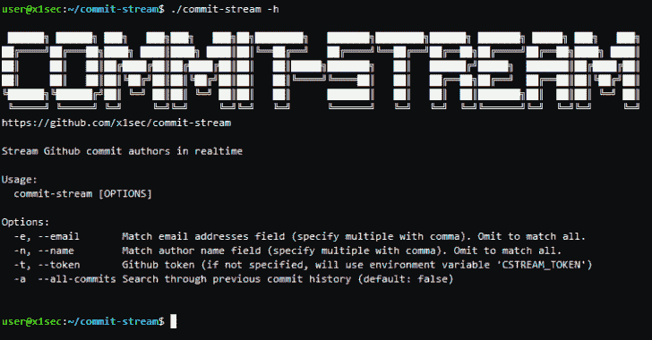

# Commit-Stream:用于查找 Github 库的 OSINT 工具

> 原文：<https://kalilinuxtutorials.com/commit-stream/>

**Commit-Stream** 从 Github event firehose 获取提交日志，实时暴露与 Github 存储库相关的作者详细信息(姓名和电子邮件地址)。

红队/臭虫赏金猎人的情报/侦察用途:

*   发现目标公司哪些员工正在提交代码的存储库(按电子邮件域过滤)
*   识别属于个人的存储库(按作者姓名过滤)
*   与 trufflehog 等其他工具链接，从未覆盖的存储库中提取秘密。

**安装**

*   **二进制**

已编译的用于 Windows、Mac 和 Linux 的 64 位可执行文件可从[这里](https://github.com/x1sec/commit-stream/releases/)获得

*   **去拿**

如果你更喜欢自己动手(并且 Go 设置正确):

**去 github.com/x1sec/commit-stream 吧**

*   **从源构建**

**去获得&去建造**

**用途**

**用法:**
提交-流【选项】

**选项:**
-e，–电子邮件匹配电子邮件地址字段(用逗号指定多个)。省略以匹配全部。
-n，–名称匹配作者姓名字段(用逗号指定多个)。省略以匹配全部。
-t，–TOKEN Github TOKEN(如果未指定，将使用环境变量' CSTREAM _ TOKEN ')
-a–所有提交搜索以前的提交历史记录(默认值:false)
-I–Ignore-priv 忽略 noreply.github.com 私人电子邮件地址(默认值:false)

`It` 需要使用 Github 个人访问令牌。您可以在 Github[设置/开发者设置/个人访问令牌]中导航，然后选择“生成新令牌”来生成令牌。这里不需要选择任何内容，只需输入令牌的名称，然后单击 generate。

一旦创建了令牌，推荐的方法是通过环境变量`CSTREAM_TOKEN`来设置它:

**导出 CSTREAM_TOKEN=xxxxxxxxxx**

或者，调用程序时可以使用`--token`开关，例如:

**。/commit-stream–令牌 xxxxxxxxxx**

当不带任何选项运行`commit-stream`时，它会立即将 CSV 格式的作者详细信息和相关存储库转储到终端。过滤选项可用。

要按电子邮件域过滤:

**。/commit-stream–电子邮件' @company.com'**

要按作者姓名过滤:

**。/commit-stream–name ' John Smith '**

可以用一个`,`字符指定多个关键字。例如

**。/commit-stream–电子邮件' @tesla.com，@ford.com'**

通过指定`**--all-commits**`，可以搜索最多 20 个先前提交的过滤器关键字。这可以增加肯定匹配的可能性。

已设置为私人(`**@users.noreply.github.com**`)的电子邮件地址可通过指定`**--ignore-priv**`来提交。如果长时间运行该工具，这有助于减少收集的数据量。

**注**

Github 提供了防止电子邮件地址被暴露的能力。在 Github 设置中选择**下的`Keep my email addresses private`和`Block command line pushes that expose my email`下的**邮件选项。

由于只使用了一个令牌，该软件不违反 Github 的任何使用条款。也就是说，使用风险自担。作者对其使用不承担任何责任。

**信用:**[@黑港的](https://twitter.com/darkp0rt) [ssshgit](https://github.com/eth0izzle/shhgit)

[**Download**](https://github.com/x1sec/commit-stream)