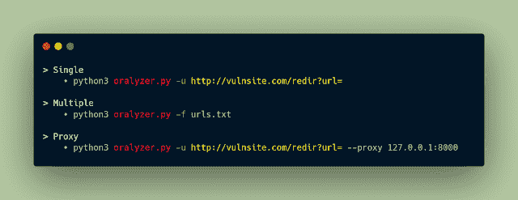

# Oralyzer:识别开放重定向的工具

> 原文：<https://kalilinuxtutorials.com/oralyzer/>

**Oralyzer** ，一个简单的 python 脚本，能够识别网站中的开放重定向漏洞。它通过模糊 url(即作为输入提供的 URL)来做到这一点。

**特性**

Oralyzer 可以识别不同类型的开放重定向漏洞:

*   基于标题
*   基于 Javascript
*   基于元标签

Oralyzer 使用 [waybackurls](https://github.com/tomnomnom/waybackurls) 从 archive.org 获取 URL，然后分离其中包含特定参数的 URL，这些参数更容易受到攻击。

**安装**

Oralyzer 是用 python3.6 构建的，因此前面提到的版本对于它的流畅运行是理想的。

**$ git 克隆 https://github.com/0xNanda/Oralyzer.git
$ pip 3 install-r requirements . txt
$ go 获取 github.com/tomnomnom/waybackurls**

**用途**

[**Download**](https://github.com/0xNanda/Oralyzer)