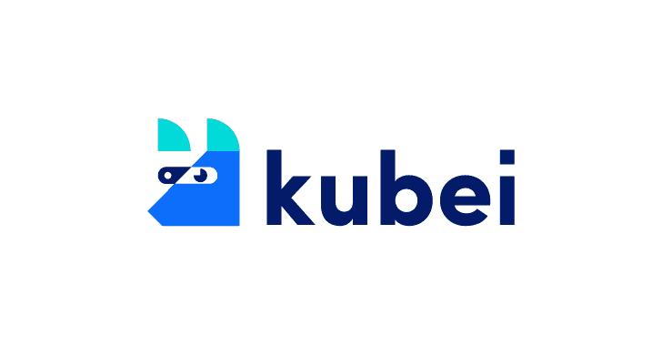
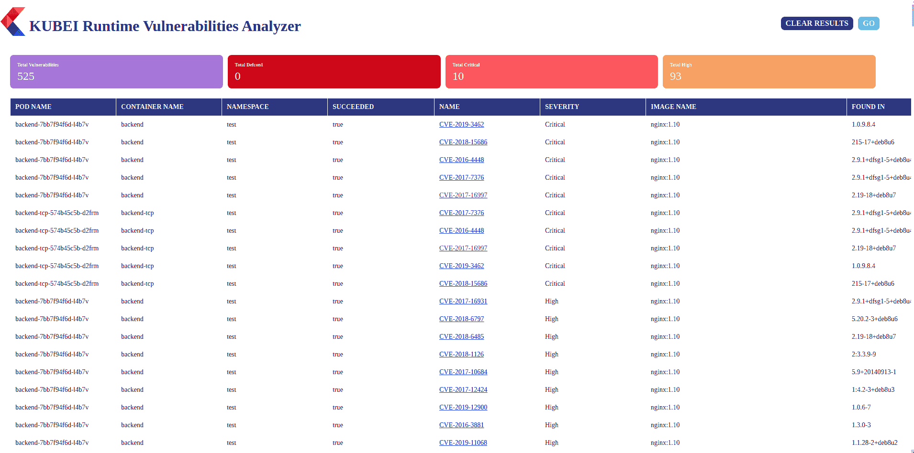

# Kubei:一个灵活的 Kubernetes 运行时扫描器

> 原文：<https://kalilinuxtutorials.com/kubei/>

[](https://1.bp.blogspot.com/-3ODGnFtB0fg/Xywzl5052fI/AAAAAAAAHOo/YAHueMOOOdAIRpFRPwT_y-ARik22RYHWACLcBGAsYHQ/s728/kubei%25281%2529.png)

Kubei 是一个漏洞扫描工具，允许用户对他们的 kubernetes 集群进行准确和即时的风险评估。Kubei 扫描 Kubernetes 集群中使用的所有映像，包括应用程序单元和系统单元的映像。它不扫描整个映像注册表，也不需要与 CI/CD 管道进行初步集成。

它是一个可配置的工具，允许用户定义扫描的范围(目标名称空间)、速度和感兴趣的漏洞级别。

它提供了一个图形用户界面，允许查看者确定应该替换的位置和内容，以减少发现的漏洞。

**先决条件**

*   一个 Kubernetes 集群已经准备好，并且已经为目标集群正确配置了 kubeconfig ( `**~/.kube/config**`)。

**所需权限**

*   在群集范围内读取机密。这是获取用于扫描私有图像库的图像提取机密所必需的。
*   列出群集范围内的窗格。这是计算需要扫描的目标单元所必需的。
*   在群集范围内创建作业。这是创建将在其名称空间中扫描目标 pod 的作业所必需的。

**配置**

文件`**deploy/kubei.yaml**`用于在集群上部署和配置 Kubei。

1.  设置扫描范围。设置`**IGNORE_NAMESPACES**` env 变量来忽略特定的名称空间。设置`**TARGET_NAMESPACE**`扫描特定的名称空间，或者留空扫描所有名称空间。
2.  设置扫描速度。通过运行并行扫描仪加快扫描速度。将`**MAX_PARALLELISM**` env 变量设置为同时扫描的最大数量。
3.  设置严重性级别阈值。严重级别高于或等于`**SEVERITY_THRESHOLD**`阈值的漏洞将被报告。支持的级别有**`Unknown``Negligible``Low``Medium``High``Critical``Defcon1`**。默认为`**Medium**`。
4.  设置删除作业策略。设置`**DELETE_JOB_POLICY**` env 变量，定义是否删除已完成的扫描仪作业。支持的值有:
    *   `**All**`–所有作业将被删除。
    *   `**Successful**`–仅删除成功的作业(默认)。
    *   `**Never**`–作业永远不会被删除。

**用途**

*   运行以下命令在集群上部署 Kubei:`**kubectl apply -f https://raw.githubusercontent.com/Portshift/kubei/master/deploy/kubei.yaml**`
*   运行以下命令来验证 Kubei 已经启动并正在运行:`**kubectl -n kubei get pod -lapp=kubei**`
*   然后，通过以下命令将端口转发到 Kubei web app:`**kubectl -n kubei port-forward $(kubectl -n kubei get pods -lapp=kubei -o jsonpath='{.items[0].metadata.name}') 8080**`
*   在您的浏览器中，导航到[http://localhost:8080/view/](http://localhost:8080/view/)，然后单击“GO”运行扫描。
*   要检查 Kubei 的状态和正在进行的扫描的进度，请运行以下命令:`**kubectl -n kubei logs $(kubectl -n kubei get pods -lapp=kubei -o jsonpath='{.items[0].metadata.name}')**`
*   刷新页面([http://localhost:8080/view/](http://localhost:8080/view/))更新结果。



**使用外部 HTTP/HTTPS 代理运行 Kubei】**

取消注释并配置`deploy/kubei.yaml`中 Clair 和 Kubei 部署的代理环境变量。

**亚马逊 ECR 支持**

创建一个拥有`**AmazonEC2ContainerRegistryFullAccess**`权限的 [AWS IAM 用户](https://docs.aws.amazon.com/IAM/latest/UserGuide/id_users_create.html#id_users_create_console)。

使用用户凭证 **( `AWS_ACCESS_KEY_ID`、`AWS_SECRET_ACCESS_KEY`、`AWS_DEFAULT_REGION` )** 创建以下秘密:

```
cat <<EOF | kubectl apply -f -
apiVersion: v1
kind: Secret
metadata:
  name: ecr-sa
  namespace: kubei
type: Opaque
data:
  AWS_ACCESS_KEY_ID: $(echo -n 'XXXX'| base64 -w0)
  AWS_SECRET_ACCESS_KEY: $(echo -n 'XXXX'| base64 -w0)
  AWS_DEFAULT_REGION: $(echo -n 'XXXX'| base64 -w0)
EOF 
```

**注**:

*   机密名称必须是`**ecr-sa**`
*   保密数据密钥必须设置为 **`AWS_ACCESS_KEY_ID`、`AWS_SECRET_ACCESS_KEY`和`AWS_DEFAULT_REGION`**

**谷歌 GCR 支持**

创建一个拥有`**Artifact Registry Reader**`权限的[谷歌服务账户](https://cloud.google.com/docs/authentication/getting-started#creating_a_service_account)。

使用服务帐户 json 文件创建以下密码

**kube CTL-n kubei create secret generic–from-file = sa . JSON gcr-sa**

**注:**

*   机密名称必须是`**gcr-sa**`
*   `**sa.json**`必须是生成密码时服务账户 json 文件的名称
*   Kubei 正在使用[应用默认凭证](https://developers.google.com/identity/protocols/application-default-credentials)。这些只有在 GCP 运行 Kubei 时才有效。

**限制**

*   支持 Kubernetes 映像清单 V 2，模式 2([https://docs.docker.com/registry/spec/manifest-v2-2/](https://docs.docker.com/registry/spec/manifest-v2-2/))。它将无法扫描早期版本。
*   CVE 数据库将每天更新一次。

[**Download**](https://github.com/Portshift/Kubei)