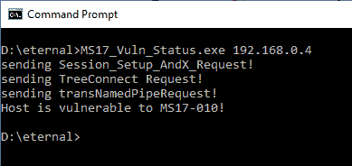
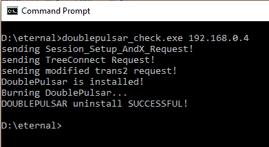
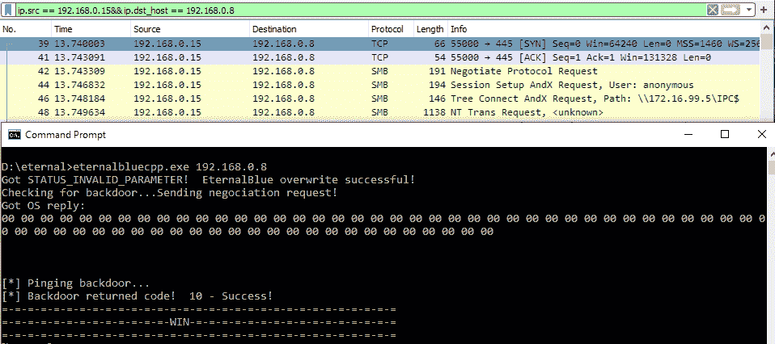
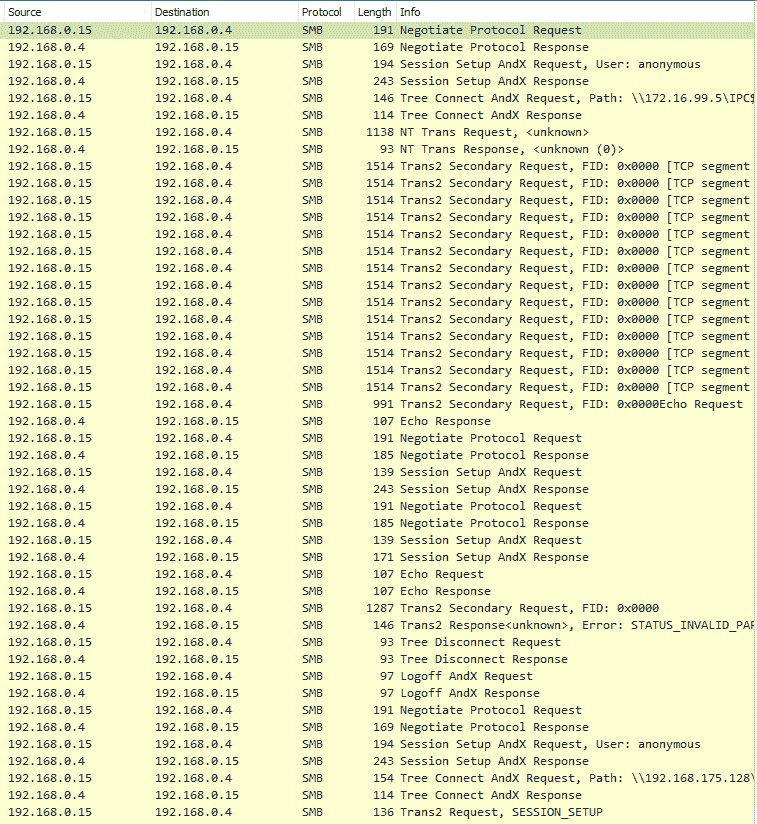
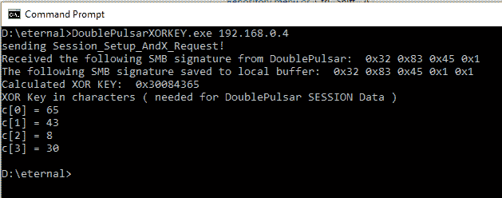

# EternalBlueC:用于 EternalBlue 漏洞检测器、DoublePulsar 检测器和 DoublePulsar 外壳代码和 DLL 上传器的工具

> 原文：<https://kalilinuxtutorials.com/eternalbluec/>

用 C 语言重新制作的 EternalBlueC 套件包括:MS17-010 漏洞利用、EternalBlue/MS17-010 漏洞检测器、DoublePulsar 检测器和 DoublePulsar 上传 DLL &外壳代码

[*]ms17 _ vuln _ status . CPP–该程序发送 4 个 SMB 数据包。1 个协商包和 3 个请求。此程序从 TransNamedPipeRequest(peekmanaedpipe 请求)中读取 NT_STATUS 响应，并确定 NT_STATUS 是否= 0xc 0000205(STATUS _ insuf _ SERVER _ RESOURCES)。如果这是正确的响应，则目标易受 MS17-010 攻击。已在未打补丁的 Windows 7 x64 位上测试。

[*]double pulsar _ check . CPP–该程序发送 4 个 SMB 数据包。1 个协商包和 3 个请求。最后一个请求是 Trans2 会话建立请求。这样，多路复用 id 可以与值 0x51 或 81 进行比较。如果那是回应，那就意味着双脉冲星出现在机器上。之后，你可以发送命令烧毁 DoublePulsar 后门。(注:DoublePulsar 进入休眠状态，不会被移除)。在 Windows 7 x64 位上测试。

[*]eternal blue . CPP–该程序发送多个 SMB 数据包。Negociation、SessionSetup、TreeConnect 和多个 NT trans 和 Trans2 数据包。这些 NT trans 数据包的格式不正确，这使得受害者计算机内存中的漏洞得以利用。更多空白或空 SMB 数据包通过多个套接字发送到受害者的同一个端口。

大多数 EternalBlue 的 base64 有效负载都是通过 socket 1 发送的，在 socket 1 上发送 Negociation、SessionSetup 和 TreeConnect 数据包。然后创建 20 个其他套接字，并将数据发送到这些套接字(套接字 3 到套接字 21)。之后，DoublePulsar 在套接字 3 上被发送到套接字 21。

然后插座被程序关闭，程序引爆受害者电脑上的 EternalBlue & DoublePulsar。然后发送 SMB 断开和 SMB 注销请求，连接关闭。这种利用工作，并在 Windows 7 x64 位测试。

后门完全运行需要大约 5 秒钟，正如互联网上永恒之蓝的报道所报道的那样。可能需要更多的利用尝试。然而，目前有一个错误，TreeID & UserID 没有在数据包中正确设置，这将在以后的版本中得到解决。

[*]doublepulsarxorkeycalculator . CPP–该程序发送 4 个 SMB 数据包。1 个协商包和 3 个请求。最后一个请求是 Trans2 会话建立请求。然后接收 Trans2 SESSION_SETUP 响应，并在(Recvbuff[18] -> Recvbuff[22])提取 SMB 签名。SMB 签名从十六进制字符转换为无符号整数。这个无符号整数通过 DoublePulsar Xor 密钥计算器函数运行，该函数生成一个 Xor 密钥，可用于加密将上传到 DoublePulsar 的外壳代码或 DLL 有效负载。注意:SESSION_SETUP 数据参数必须包含此存储库的有效负载上传部分中计算的 DoublePulsar XOR 密钥的 char 版本。在 Windows 7 x64 位上测试。示例截图:

[未完成][*]double pulsar _ upload . CPP–这个程序发送 4 个 SMB 包。1 个协商包和 3 个请求。最后一个请求是 Trans2 会话设置请求，通过 TRANS2 SMB 响应数据包中返回的签名字段获取 DoublePulsar XOR 密钥。该密钥通过 DoublePulsar XOR 密钥计算器从 DoublePulsar 二进制中提取。然后，程序读取一个 DLL 文件(例如:payload.dll ),并将其与用户域外壳代码(用户域 _ 外壳代码. bin)相结合，并使用我们从 SMB 签名计算的 DoublePulsar XOR 密钥对缓冲区进行 XOR 运算。通过分配内存、复制 Trans2 数据包、编辑 SMB 事务工作所需的值(UserID、ProcessID、TreeID、MultiplexID ),然后将 XORed 数据(shellcode + DLL)复制到末尾并循环通过它，以每次 4096 字节的总数据包长度发送到 DoublePulsar，从而生成数据包。数据包总长度= 4178。4096 代表 XOR 加密数据。这仍是一项进行中的工作。

TODO:可能需要使用结构实现 Trans2 Upload 函数，而不是使用十六进制编辑 Trans2 数据包捕获。

**项目目标**

*   允许编辑 EternalBlue exploit 有效载荷以移除 DoublePulsar，并允许安装自定义有效载荷和外壳代码。
*   转换到其他语言，如 Java 和 C#并实现一个扫描器和攻击 GUI
*   添加永久浪漫支持

**储存库还包含**

*   DoublePulsar 上传 DLL python 脚本& DoublePulsar x64 userland 外壳代码用于 DLL 注入
*   永恒之蓝全在一个二元
*   多拱内核队列 apc 汇编代码& Windows x86/x64 多拱内核通过队列 APC 内核代码从环 0 到环 3
*   worowit 的 EternalBlue x64/x86 内核外壳代码
*   永恒蓝色重放文件