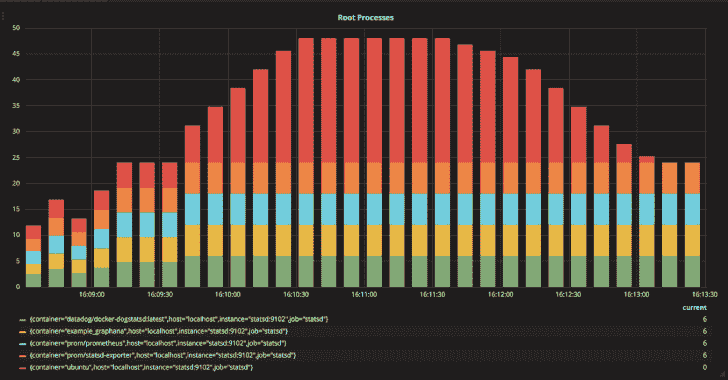
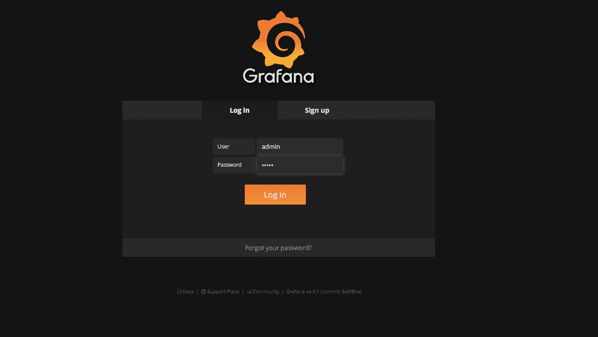

# 容器告密者检查 Docker 引擎下正在运行的进程

> 原文：<https://kalilinuxtutorials.com/cnitch/>

Cnitch 是一个简单的框架和命令行工具，用于监控 Docker 容器以识别任何以 root 身份运行的进程。

为什么这是一件坏事？如果你还没有去过[，我可以 haz 非特权集装箱吗？那么我建议你现在就去那里获取所有的信息。](http://canihaznonprivilegedcontainers.info)

当我开发 cnitch 时，我遇到了我认为是应用程序的一个错误，cnitch 在 Docker 容器中将自己报告为一个根进程。我不确定这是怎么回事，因为 docker 文件明确声明我正在创建一个不以 root 用户身份运行的用户。经过大量的调试和验证后，我决定再次检查 docker 文件，发现了这个:

从阿尔卑斯

运行 adduser-h/home/cnitch-D cnitch cnitch

复制。/cmd/cnitch /home/cnitch/
运行 chmod+x/home/cn itch/cn itch

**#用户 cnitch**

入口点["/home/cnitch/cnitch"]

当我测试应用程序容器以解决 Docker sock 上的权限问题时，我必须注释掉`USER`命令。相当 meta，cnitch 帮助发现了 cnitch 的一个问题，这完全进入了集成测试。

它是如何工作的？

cnitch 使用 API 连接到 Docker 引擎，并查询当前运行的容器，然后检查该容器中运行的进程，并识别任何作为根用户运行的进程。
当找到一个根流程时，该信息被发送到可配置的报告模块，允许您对该信息进行审计或采取行动。

2017/07/29 16:04:27 Starting Cnitch:Monitoring Docker Processes at:TCP://172 . 16 . 255 . 128:2376
2017/07/29 16:04:27 检查根进程的间隔:10s
2017/07/29 16:05:08 检查图片:ubuntu，id:7bd 489560 a 310343 c 399

**报告模块**

目前 cnitch 已经具备向 **StatsD** 和 **StdOut** 报告的能力。报告后端是可扩展的，可以很容易地支持任何后端，例如，构建一个后端来支持日志存储或另一个日志文件聚合工具是一个相当简单的过程。

**站起来**

使用`**cnitch.exception.root_process**`度量将异常作为计数发送到 statsD 端点。这些指标也用 cnitch 实例的`host`名和`**container**`名来标记。

**StdOut**

StdOut 记录器是一个简单的输出记录器，它将报告的异常发送到 StdOut。

**怎么跑？**

无论是在 Docker 容器中运行 cnitch，还是将其作为二进制文件运行，都需要通过使用环境变量 **DOCKER_HOST** 设置服务器的 URL 或套接字的路径来访问 Docker api

**标志**

*   `**--hostname=[hostname]**`用于度量聚合的名称或 ip 地址
*   `**--statsd-server=[hostname:port]**`statsd 采集器的 URI，如果省略，statsd 报告将被禁用
*   `**--check=[duration e.g. 10s (10 seconds), 1m (1 minute)]**`，sniff 将扫描根进程的检查频率

**命令行**

将环境变量 **DOCKER_HOST** 设置为您的 DOCKER 引擎 API，然后使用所需的标志运行 snitch。

**$ cnitch–hostname = my host–statsd-server = 127 . 0 . 0 . 1:8125–check = 10s**

**码头工人**

cnitch 运行在一个非特权容器中，如果您希望使用 Docker sock 访问 API，您需要将 cnitch 用户添加到`**docker**`组中。这可以通过标志`**--group-add**`来实现，将其设置为 docker 用户组的组 id。
例如:

`**--group-add=$(stat -f "%g" /var/run/docker.sock**`

*使用 Docker sock 文件进行 API 访问的示例*

$ docker run-I-t–RM \-v/var/run/docker . sock:/var/run/docker . sock \-group-add = $(stat-f " % g "/var/run/docker . sock)\ \-e " docker _ host:UNIX:///var/run/docker . sock " \ quay . io/nicholasjackson/cnitch[选项]

如果你在 mac 上运行并且使用 Docker 机器，Docker sock 在 VM 内部，这意味着你不能使用`stat`命令来发现组 id。

**例子**

在[中有一个 Docker Compose 栈的例子。/example](https://github.com/nicholasjackson/cnitch/blob/master/example) 文件夹，显示 cnitch 如何将数据导出到 statsd。要运行此示例，请执行以下操作:

**$ cd。/example
$ docker-compose up**

一旦一切都开始运行，在您的网络浏览器中打开`**http://[docker host ip]:3000**`，您应该会看到 Grafana 登录屏幕。

使用以下凭证登录 Grafana:

*   用户:管理员
*   密码:admin

然后选择 cnitch 仪表板。该仪表板显示当前正在运行的根进程。

如果您没有使用`**/var/run/docker.sock**`与 Docker 主机通信，那么您将需要更改文件`**./example/docker-compose.yml**`中的一些设置以匹配您的设置。

**路线图**

实现 Docker Bench 安全脚本的功能[https://github.com/docker/docker-bench-security](https://github.com/docker/docker-bench-security)

*   1.1 确保为容器创建了单独的分区
*   1.2 确保容器主机已经硬化
*   1.3 确保 Docker 是最新的
*   1.4 确保仅允许受信任的用户控制 Docker 守护程序
*   1.5 确保为 Docker 守护程序配置了审核
*   1.6 确保为 Docker 文件和目录配置了审核功能-/var/lib/Docker
*   1.7 确保为 Docker 文件和目录-/etc/Docker 配置了审核
*   1.8 确保为 Docker 文件和目录配置审计–Docker . service
*   1.9 确保为 Docker 文件和目录 docker.socket 配置了审计
*   1.10 确保为 Docker 文件和目录-/etc/default/Docker 配置了审核
*   1.11 确保为 Docker 文件和目录-/etc/Docker/daemon . JSON 配置了审计
*   1.12 确保为 Docker 文件和目录配置了审核功能-/usr/bin/Docker-container d
*   1.13 确保为 Docker 文件和目录配置了审核功能-/usr/bin/Docker-runc

*   2.1 确保网络流量被限制在默认网桥上的容器之间
*   2.2 确保日志记录级别设置为“信息”
*   2.3 确保 Docker 被允许对 iptables 进行更改
*   2.4 确保不使用不安全的注册表
*   2.5 确保不使用 aufs 存储驱动程序
*   2.6 确保 Docker 守护程序的 TLS 身份验证已配置
*   2.7 确保默认 ulimit 配置正确
*   2.8 启用用户命名空间支持
*   2.9 确保默认的 cgroup 用法已被确认
*   2.10 确保基本设备大小在需要之前不会改变
*   2.11 确保 Docker 客户端命令的授权已启用
*   2.12 确保配置了集中和远程日志记录
*   2.13 确保禁用对传统注册中心(v1)的操作
*   2.14 确保启用了实时恢复
*   2.15 确保禁用用户域代理
*   2.16 如果需要，确保应用守护程序范围的自定义 seccomp 配置文件
*   2.17 确保在生产中避免实验特征
*   2.18 确保限制集装箱获得新的特权

*   3.x …

*   4.1 确保已经为容器创建了用户
*   4.2 确保容器使用可信基础映像
*   4.3 确保集装箱中没有安装不必要的包装
*   4.4 确保扫描并重建图像，以包含安全补丁
*   4.5 确保 Docker 的内容信任已启用
*   4.6 确保容器映像中添加了健康检查说明
*   4.7 确保更新说明不在文档中单独使用
*   4.8 确保在映像中删除了 setuid 和 setgid 权限
*   4.9 确保在 Dockerfile 中使用复制而不是添加
*   4.10 确保机密不存储在 docker 文件中
*   4.11 确保仅安装经过验证的软件包

*   [ ] 5.x..
*   [ ] 6.x …
*   [ ] 7.x …

[**Download**](https://github.com/nicholasjackson/cnitch)