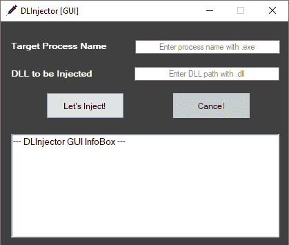
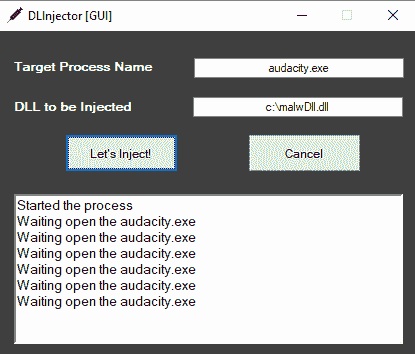

# GUI:更快的进程 DLL 注入器

> 原文：<https://kalilinuxtutorials.com/dlinjector-gui/>

**数据输入器**为图形用户界面。用于过程的更快的动态链接库注入器。它以进程名称为目标来识别目标。该过程不需要开放来定义目标。数据插入器一直等到进程执行。

**用途**

它的用法非常简单。

首先用 exe (chrome.exe，explorer.exe)输入目标进程名。

并输入要注入的 DLL 路径(C:\malwDll.dll)。

**示例注射过程:**

**V1 特色**

*   只注入 DLL。
*   按名称确定目标流程。
*   如果出现错误，显示错误代码。

我想在业余时间开发 DLInjector GUI。如果您也想开发 DLInjector，可以发送一个 pull 请求。

如果你想从命令行使用 DLInjector，查看 [DLInjector-CLI](https://github.com/fatihsnsy/DLInjector-CLI)

[**Download**](https://github.com/fatihsnsy/DLInjector-GUI)