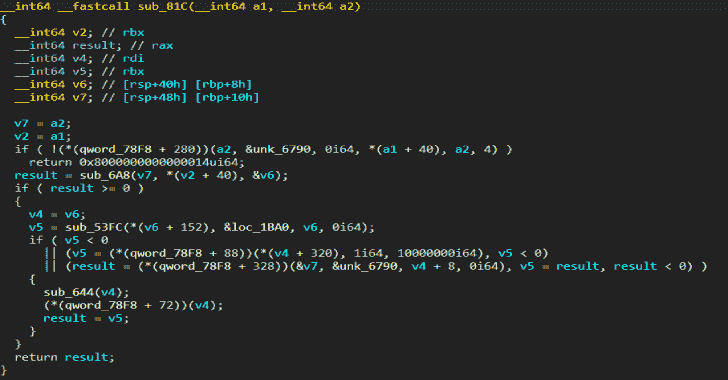
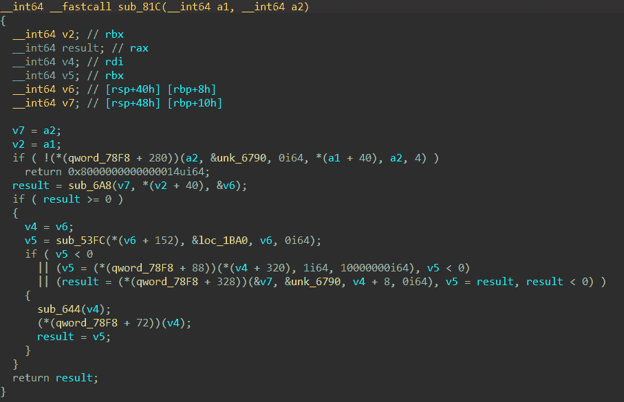
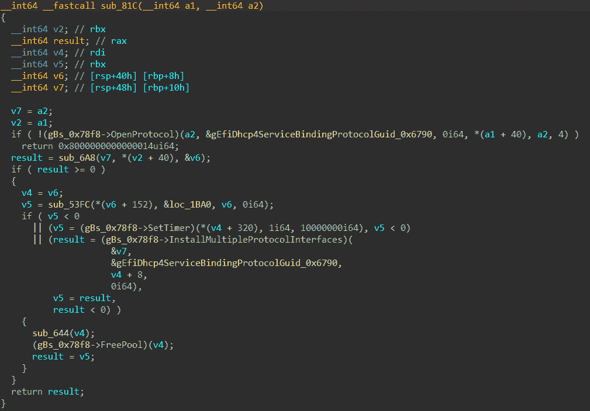
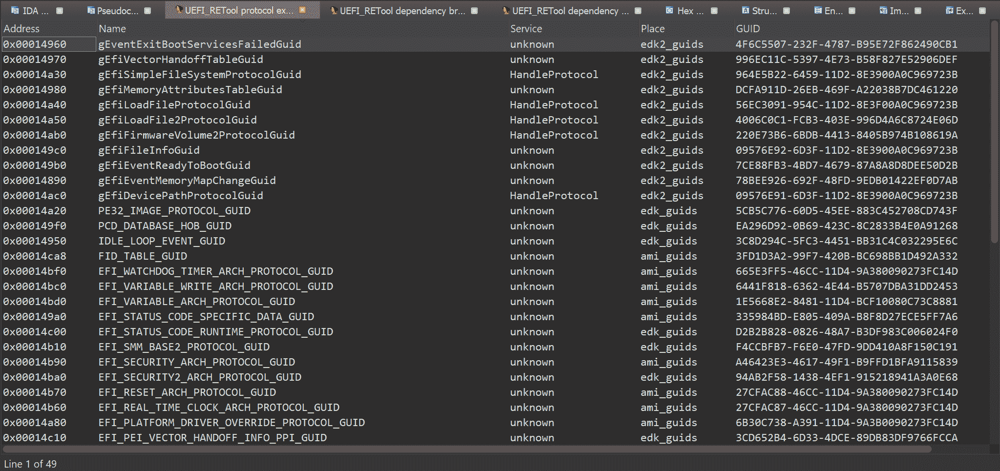
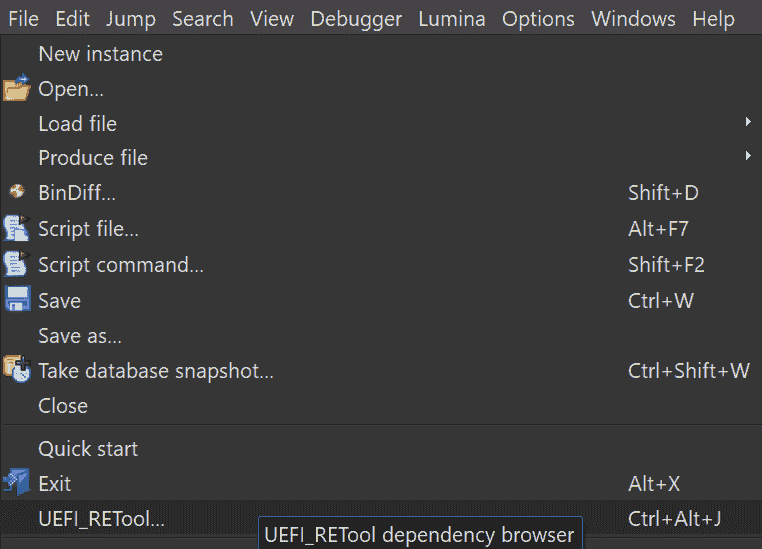
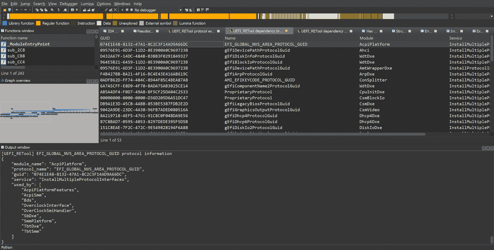
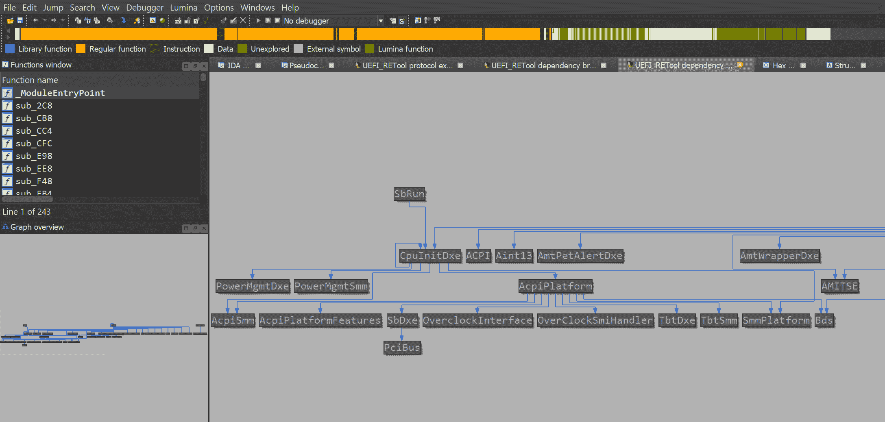

# UEFI _ RETool:UEFI 固件逆向工程工具

> 原文：<https://kalilinuxtutorials.com/uefi_retool/>

**UEFI_RETool** 是 UEFI 固件逆向工程的工具。

**UEFI 固件分析用 [uefi_retool.py](https://github.com/yeggor/UEFI_RETool/blob/master/uefi_retool.py) 脚本**

**用途**

*   将 **`ida_plugin/uefi_analyser.py`脚本和`ida_plugin/uefi_analyser`** 目录复制到 IDA 插件目录
*   编辑`**config.json**`文件
    *   `**PE_DIR**`是一个目录，包含 UEFI 固件的所有可执行映像
    *   `**DUMP_DIR**`是包含固件文件系统中所有组件的目录
    *   `**LOGS_DIR**`是日志的目录
    *   `**IDA_PATH**`和`**IDA64_PATH**`是 IDA Pro 可执行文件的路径
*   运行`**pip install -r requirements.txt**`
*   运行`**python uefi_retool.py**`命令显示帮助信息

**命令**

python uefi _ retool . py

**用法:** uefi_retool.py【选项】命令【ARGS】……

选项:
–帮助显示此消息并退出。

命令:
get-images 从 UEFI 固件中获取可执行映像。
get-info 分析整个 UEFI 固件。获取 UEFI 固件中的专有协议列表。

**获取图像**

python uefi _ retool . py Get-images–help

**用法:** uefi_retool.py get-images【选项】FIRMWARE_PATH
从 UEFI 固件中获取可执行镜像。图像存储在【模块】目录下。

**选项:**
–帮助显示此信息并退出。

**例子**

**python uefi _ retool . py get-images test _ fw/fw-TP-x1-carbon-5th . bin**

**获取信息**

python uefi _ retool . py get-info–help

**用法:** uefi_retool.py get-info【选项】FIRMWARE_PATH
分析整个 UEFI 固件。分析结果保存到。json
文件。

**选项:**
-w，–workers 整数工人数(默认为 8)。
–帮助显示此消息并退出。

**举例:**

python uefi _ retool . py get-info-w 6 test _ fw/fw-TP-x1-carbon-5th . bin

**Get-PP**

python uefi _ retool . py Get-PP–help

**用法:** uefi_retool.py get-pp【选项】FIRMWARE_PATH
获取 UEFI 固件中的专有协议列表。结果被
保存到。json 文件。

**选项:**
-w，–workers 整数工人数(默认为 8)。
–帮助显示此消息并退出。

**举例:**

python uefi _ retool . py get-PP-w 6 test _ fw/fw-TP-x1-carbon-5th . bin

**附加工具**

*   `**tools/update_edk2_guids.py**`是更新来自`edk2`项目的协议 GUIDs 列表的脚本

**IDA 插件**

[用于 UEFI 分析的 IDA 插件](https://github.com/yeggor/UEFI_RETool/tree/master/ida_plugin)

**分析器&协议浏览器**

**用途**

*   将 **`uefi_analyser`和`uefi_analyser.py`复制到您的`%IDA_DIR%/plugins`** 目录中
*   在 IDA 中打开可执行的 UEFI 镜像，进入**`Edit`->->-`UEFI analyser`***(也可以使用组合键`**Ctrl+Alt+U**` )*

**例子**

*   **分析前**

*   **分析后**

*   **协议浏览器窗口**

**依赖浏览器&依赖图**

**用途**

*   使用[uefi _ retool . py](https://github.com/yeggor/UEFI_RETool/blob/master/uefi_retool.py)python uefi _ retool . py get-info FIRMWARE _ PATH 分析固件
*   将 **`<LOGS_DIR>/<FIRMWARE_NAME>-all-info.json`文件加载到 IDA(`File`->`UEFI_RETool...`-**)

*   *或者，您可以使用组合键`**Ctrl+Alt+J**`* )

**例子**

*   **依赖关系浏览器窗口**

*   **依赖图**

