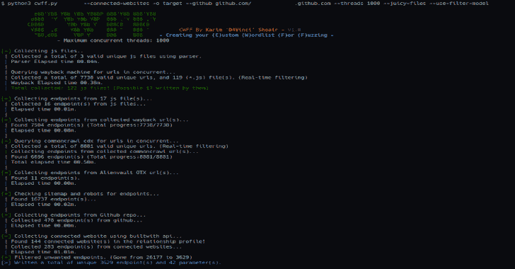

# CWFF:自定义模糊词汇列表

> 原文：<https://kalilinuxtutorials.com/cwff/>

**CWFF** 是一个工具，它使用并发以尽可能高的速度为你创建一个特殊的高质量模糊/内容发现单词表，它的灵感来自[@ tomnom nom](https://github.com/tomnomnom)[的谁，什么，哪里，何时，单词表#NahamCon2020](https://www.youtube.com/watch?v=W4_QCSIujQ4) 。

**用途**

**CWFF**[-h][–threads][–github][–sub domains][–recursive][–js-libraries][–connected-websites][–juicy-files][–use-filter-model][-o]域

**位置参数:**
域目标网站(ofc)

**可选参数:**
-h，–帮助显示此帮助消息并退出
–线程最大并发线程数
–递归地对提取的端点进行递归工作(添加更多端点，但有时不太准确)！
–js-libraries 也从 JS 库中提取端点，而不仅仅是它们编写的 JS！
–连接的网站包括从连接的网站提取的端点
–juicy-files 包括从 sitemap.xml 和 robots.txt 等 juicy 文件提取的端点
–使用-filter-model 过滤结果端点和 filter_model 文件
-o 端点和参数的输出目录。(默认:网站名称)

**描述(重要)**

因此，它基本上使用许多来源收集目标及其子域的端点和参数，我们现在将讨论它们:

*   存档回溯机:它遍历目标网站及其子域的所有记录，并提取提供 200 个状态码的 URL。

很多工具只通过 wayback 的首页来节省时间，但在这里我们只花很少的时间来浏览所有记录，但这也使得当你使用`**--subdomains**`标志时要花很多时间。

*   在回溯阶段收集的 Javascript 文件和通过解析目标页面的`**<script>**`标签收集的文件

CWFF 试图将 JS 库从网站开发者实际编写的 JS 文件中分离出来，这是通过查看 JS 文件名来实现的。默认情况下，CWFF 只从开发人员编写的 JS 文件中提取端点，使用 JS 库(大多没有帮助)激活`**--js-libraries**`标志。

*   普通爬行 CDX 指数和外国人保险库 OTX(开放威胁交换)
*   如果给 CWFF 一个`**--juicy-files**`标志，它也会从 Sitemap.xml 和 robots.txt 这样的文件中提取端点(将来可能会添加更多)
*   如果您给 CWFF 一个使用`**--github**`标志的 github 存储库，它将使用 Github API 从该存储库中提取路径(不需要 API 键)。

只是为了说明，CWFF 将只使用文件和目录路径，所以它不会从文件内部提取端点！

*   通过使用`**--connected-websites**`标志，CWFF 将使用 builtwith website API(需要密钥，但它是免费的)从关系简档中提取连接到目标的网站，然后从这些网站源中提取端点。

> 注意:你可以从[这个页面](https://api.builtwith.com/relationships-api)中得到你的 API 密匙，并在`**API_keys.py**`文件中设置变量。

如果使用了`**--recursive**`标志，从所有这些端点中收集完端点后，CWFF 会递归地从收集到的端点中提取部分。

*   示例:像`**parseq/javadoc/1.1.0/com**`这样的端点将成为所有这些端点:

parseq/javadoc/1.1.0/com
parseq/javadoc/1.1.0/
parseq/javadoc/
parseq/
javadoc/
1.1.0/
com

**注意:**收集的所有端点/参数都经过清理和分类，没有重复，以获得唯一的结果。

**过滤结果**

当然，在所有这些来源和工作之后，在重要的端点中会有许多不想要的/无用的端点，这里过滤开始发挥作用以节省时间和资源。

在 CWFF 中，您可以使用三种方法检测并删除不需要的端点:

*   从给定列表中删除以任何字符串结尾的端点(例如扩展名)。
*   从给定的字符串列表中移除包含任何字符串的端点。
*   最后，也是最大的一个，从给定的列表中删除匹配任何正则表达式的端点。

所有这些过滤器选项都可以通过在`**filter_model.py**`文件中设置变量，然后在启动 CWFF 时使用`**--use-filter-model**`标志来给出。如果您不知道如何设置这个变量，请查看我在文件中留下的注释，这是我最常用的一个，在截图中，它将收集的端点数量从 26，177 减少到 3629。如果你在运行 CWFF 时忘记使用过滤功能，别担心，我会帮你搞定的😄

您可以使用脚本`**filter.py**`来过滤您的端点，如下所示，它会自动加载`**filter_model.py**`文件，而无需重新运行 CWFF:

**python filter . py word list . txt output . txt**

**要求**

*   Python 3.6 以上版本
*   它可以在任何操作系统上运行，但是我只在 Linux Manjaro 上测试过。
*   以下说明

**安装**

python 3-m pip install-r requirements . txt
python 3 cwf . py–help

[**Download**](https://github.com/D4Vinci/CWFF)