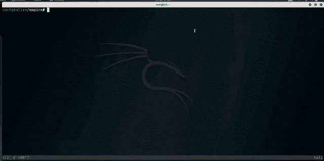

# XECA : PowerShell 有效负载生成器

> 原文： [https://kalilinuxtutorials.com/xeca/](https://kalilinuxtutorials.com/xeca/)

XECA 是一个为攻击性目的创建加密 PowerShell 有效负载的项目。从 DLL 文件创建独立于位置的外壳代码也是可能的。

**安装**

首先确保 rust[安装了](https://www.rust-lang.org/tools/install)，然后使用以下命令构建项目:

**货舱**

它是如何工作的？

*   识别并加密有效载荷。将加密的有效负载加载到 powershell 脚本中，并保存到名为“launch.txt”的文件中
*   解密有效负载的密钥保存在名为“safe.txt”的文件中
*   在远程主机上执行“launch.txt”
    *   该脚本将回调攻击者定义的 web 服务器，以检索解密密钥“safe.txt”
    *   在内存中解密有效载荷
    *   在内存中执行预期的有效负载

**缓解措施**

如果用户必须访问像 PowerShell 这样的程序，考虑用[足够的管理](https://docs.microsoft.com/en-us/powershell/scripting/learn/remoting/jea/overview?view=powershell-7)和 [PowerShell 日志](https://docs.microsoft.com/en-us/powershell/scripting/windows-powershell/wmf/whats-new/script-logging?view=powershell-7)来最小化安全风险。应用控制策略可以通过白名单技术部署，如 [AppLocker](https://docs.microsoft.com/en-us/windows/security/threat-protection/windows-defender-application-control/applocker/applocker-overview) 。

**缓解措施**

如果用户必须有[权限](https://www.kitploit.com/search/label/Access)才能访问 PowerShell 之类的程序，那么考虑用[的“刚好够用”管理](https://docs.microsoft.com/en-us/powershell/scripting/learn/remoting/jea/overview?view=powershell-7)和[的 PowerShell 日志](https://docs.microsoft.com/en-us/powershell/scripting/windows-powershell/wmf/whats-new/script-logging?view=powershell-7)来最小化安全风险。应用程序控制策略可以通过[白名单](https://www.kitploit.com/search/label/Whitelisting)技术部署，如 [Ap pLocker](https://docs.microsoft.com/en-us/windows/security/threat-protection/windows-defender-application-control/applocker/applocker-overview) 。

**致谢**

没有知识和信息的共享，这一工具是不可能实现的。应该感谢以下作者的观点、片段和代码:
[@ monoxgas](https://github.com/monoxgas)
[@ h0 ney badger](https://github.com/H0neyBadger)
[@ Stephen fewer](https://github.com/stephenfewer)
[@ disman TL](https://github.com/dismantl)

**执照**

xeca 根据 [GPLv3](https://www.gnu.org/licenses/gpl-3.0.en.html) 授权，一些子组件可能有单独的许可证。有关详细信息，请参见本项目中它们各自的参考资料。

[**Download**](https://github.com/postrequest/xeca)