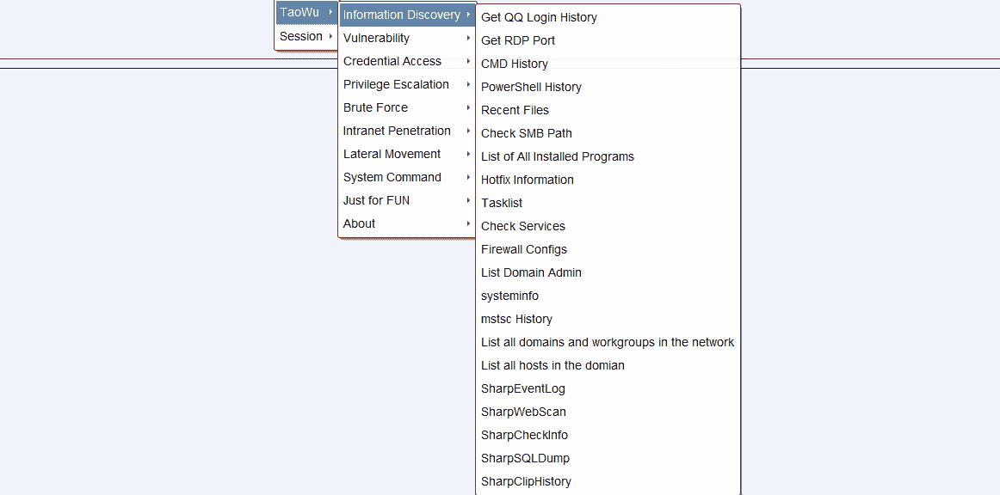
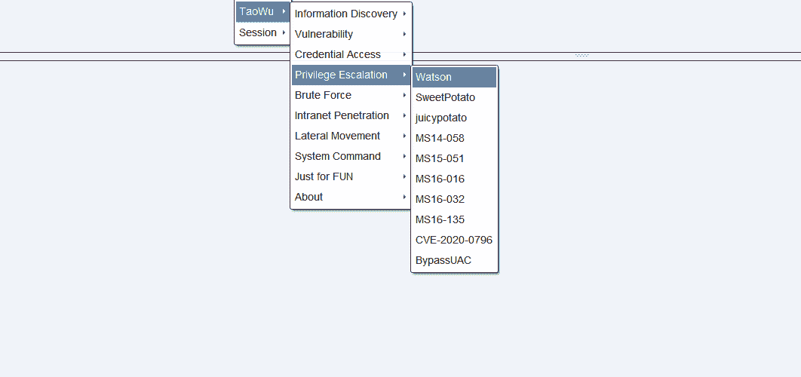
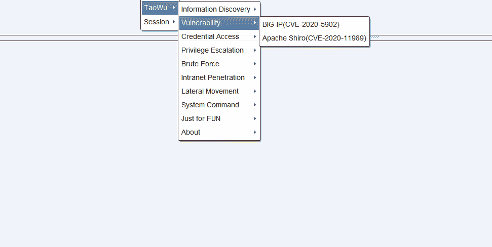
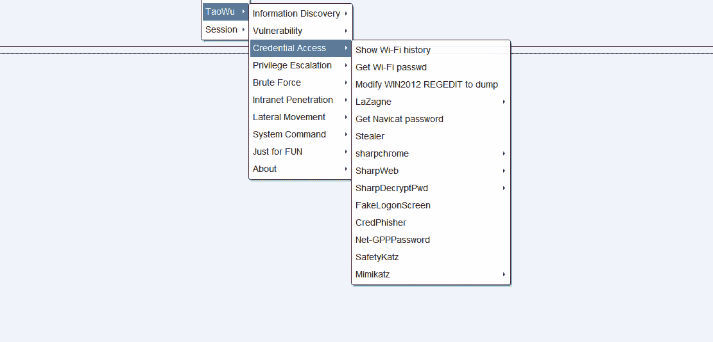
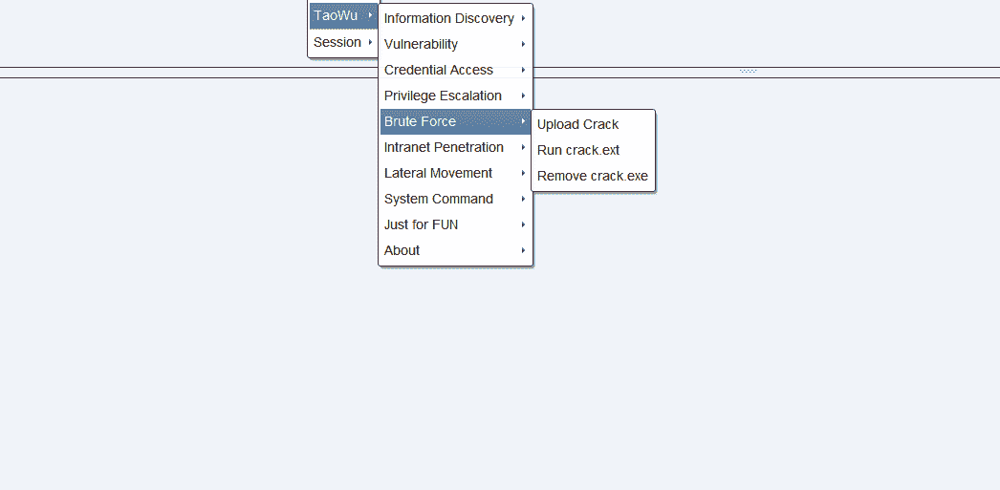
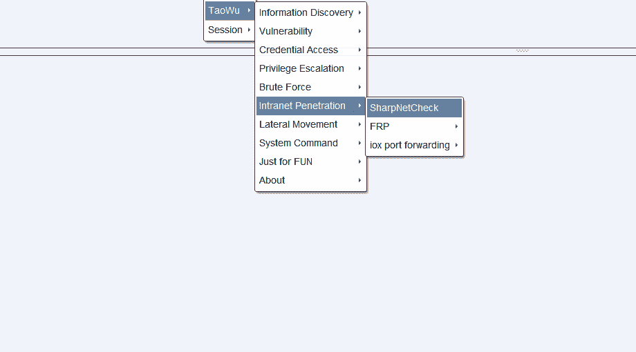
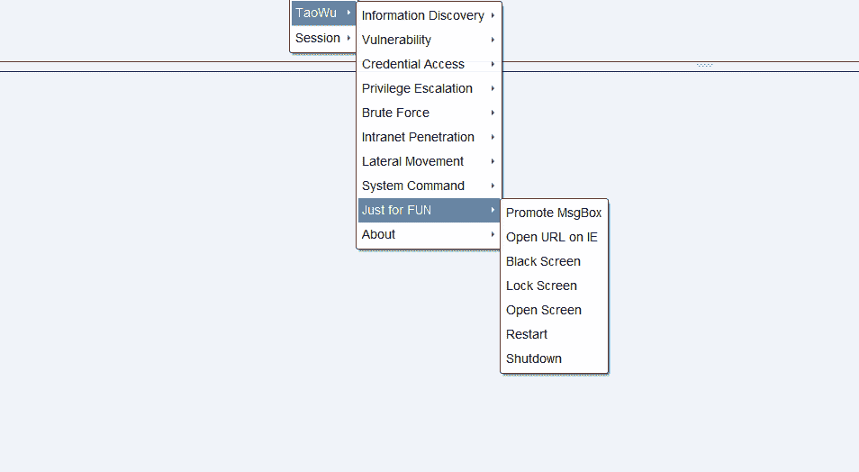
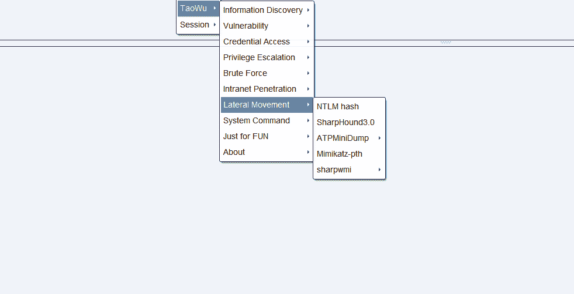

# 吴涛——钴打击工具包 2020

> 原文：<https://kalilinuxtutorials.com/taowu/>

吴涛是一个钴打击工具包。所有的剧本都是在网上搜集的，自己稍加修改。你可以在 GPLv3 下使用它。一切风险自负。

任何公关不胜感激。或者你可以发电子邮件给我联系 taowuopen@protonmail.com 让我们一起让吴涛变得更好。

任何贡献都可以让你在不久的将来获得吴涛的内部版本。

**注:**基于钴击 3.x &钴击 4.x

**特性**

**特别感谢**

*   [https://github.com/DeEpinGh0st/Erebus](https://github.com/DeEpinGh0st/Erebus)
*   [https://github . com/Tim whitez/Cobalt-Strike-aggregator-Scripts](https://github.com/timwhitez/Cobalt-Strike-Aggressor-Scripts)
*   [https://github.com/0x09AL/RdpThief](https://github.com/0x09AL/RdpThief)
*   [https://github.com/uknowsec/sharptoolsaggressor](https://github.com/uknowsec/sharptoolsaggressor)
*   [https://github . com/lengjibo/red team tools/tree/master/windows/Cobalt % 20 strike](https://github.com/lengjibo/RedTeamTools/tree/master/windows/Cobalt%20Strike)

**更改日志**

*   **3.1 (2020.8.7)**
    *   向信息发现添加基本信息和初始信息收集。
    *   将思科 ASA(CVE-2020-3452)、weblogic(CVE-2016-0638、CVE-2016-3510、CVE-2017-3248、CVE-2017-10271、CVE-2018-2628、CVE-2018-2893、CVE-2019-2725)POCs 添加到漏洞。
    *   为权限提升添加炫彩效果。
    *   为麦克风录音和网络摄像头拍摄添加一些有趣的功能。
*   **3.0 (2020.7.14)**
    *   增加“权限提升”“横向移动”功能。
    *   增加“端口转发”功能。
    *   性能改进。

[**Download**](https://github.com/pandasec888/taowu-cobalt-strike/tree/english)