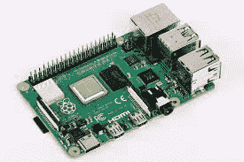

# 无线渗透测试方法:Kali Linux 和 Raspberry Pi 用于安全分析

> 原文：<https://kalilinuxtutorials.com/wireless-penetration-testing-approach-kali-linux-and-raspberry-pi-for-security-analytics/>

截至 2020 年，我们都知道组织内的数据存在安全漏洞。组织使用 LAN 网络或 wifi 网络，允许员工访问并执行他们的任务和操作。为了确保组织敏感数据的安全，安全的 wifi 网络是必要的。术语[无线渗透测试](https://gbhackers.com/wireless-penetration-testing-checklist-a-detailed-cheat-sheet/)随后出现，用于测试 wifi 网络是否安全，是否使用了某些策略和方法。为了深入了解渗透测试方法和 Kali Linux，您可以参加 [Linux 认证培训](https://hkrtrainings.com/linux-certification-training)，这将帮助您培养自己。

主要重点是利用无线网关上的漏洞。选择合适的合作伙伴来执行无线渗透测试非常重要。由于无线渗透测试的任务和目标，它正变得越来越流行。它为我们提供了一份报告，帮助我们了解组织中的数据安全性。它让我们清楚地了解导致安全威胁的数据漏洞，帮助我们确定网络连接是否安全，如果发现任何薄弱环节，就向组织提供分析，并在出现问题之前进行修改。在这篇博客中，我们将了解 Kali 和 Raspberry Pi 以及它们在无线渗透测试中的用法。

# **什么是 Kali Linux，为什么用它？** 

[Kali Linux](https://kalilinuxtutorials.com/) 是一款免费操作系统，旨在执行渗透测试和安全分析。Kali Linux 以前叫做 BackTrack，是一个基于取证和安全的发行版。Kali Linux 是 600 个 [Kali Linux 工具](https://kalilinuxtutorials.com/)的组合，允许在一个地方执行所有不同的操作。

它通常被称为 Kali，是一个为安全评估、威胁、安全漏洞等而设计和开发的渗透测试平台。攻击者和安全专业人员使用 Kali。使用 Kali 是因为它通过提供可伸缩性、支持和稳定性来提供广泛的支持。这些是任何专业人员都希望在操作系统中看到的方面，允许他们对安全网络进行分析、审计、测试、检查和评估。

# **什么是树莓派，为什么要用它？**

Raspberry Pi 通常被认为是 Linux 的下一个版本。Raspberry Pi 被定义为一个低级的信用卡设备或一个可以与显示器集成的计算系统。它通常是一个小型设备，使用 HDMI(高清多媒体接口)电缆插入显示器。Raspberry Pi 是用于渗透测试的最新平台之一。虽然必须购买，但它更便宜，各种各样的人都可以买到。使用 Raspberry Pi 是因为它们体积小，通常被称为微型计算机，具有所有硬件支持的附件，使其在渗透测试中更加灵活和可行。

# **Kali Linux 和 Raspberry Pi 在渗透测试中的使用:**

Kali Linux 和 Raspberry Pi 是执行渗透测试的最佳平台，允许专业人员将组织从安全漏洞、攻击等中拯救出来。Kali Linux 包含了许多工具。这些工具用于执行 wifi 网络的安全分析和评估，以了解和审查网络是否安全。由于 Kali Linux 中包含工具，安全专业人员和研究人员将利用这些工具，这将有助于遵循方法和策略来执行渗透测试。让我们快速回顾一下有助于全面渗透测试的流行工具。

*   **Kismet 无线:**

Kismet wireless 是 Kali Linux 中执行无线渗透测试最常用的工具之一。Kismet Wireless 是一款多平台无线局域网分析器，旨在实现所有安全功能，如网络检测、入侵检测、数据包嗅探等。它的开发兼容支持所有不同无线网络的无线卡，如基于 802.11a、802.11b、802.11g 和 802.11n 标准。

Kismet wireless 推出的功能包括:

*   灵活处理和记录网络日志，通常称为网络日志。
*   为频道跳跃提供了广泛的支持
*   开发了在被动模式下运行的能力和兼容性
*   帮助检测无线客户端和接入点
*   Kismet wireless 有助于检测更大规模的入侵。

*   **空气破裂:**

Aircrack-ng 是一个软件安全套件，它使用一套工具设计和开发，以高度可扩展和兼容的方式执行网络测试。软件工具有助于检测不安全的网络、威胁、数据包嗅探、入侵等。它有助于监控有组织格式的数据包传输，因此被称为有组织数据包分析器。这个软件已经提出了审计设备，每个安全专业人员将遵循和运行他们的分析，以检测网络。让我们也了解一下他们用来执行安全分析的设备。

*   Airdecap-Ng:只有当密钥被解密时，它才有助于解密无线流量。
*   Aircrack-Ng:它有助于解密员工或个人使用的密码。利用统计技术破译 WEP 也是灵活的。
*   Airmon-Ng:这有助于将无线网卡转换为混杂无线网卡。
*   airplay-Ng:它有助于在接入点加速或产生流量。
*   Airmon-Ng:主要用于解密密码，允许捕获不同需求规格的包。

Aircrack-ng 还开发了多种功能，使其成为市场上最好的软件套件。下面列出了一些功能:

1.  提供广泛支持所有不同的标准密码，如 WEP，WPA/WPA2-PSK 密码
2.  有助于数据包嗅探
3.  它被开发成具有创建虚拟隧道的能力。
4.  它设计了密码列表管理功能，允许管理不同的密码。
5.  它有助于更快的 WEP 和 WPA 密码解密。

安全性是每个组织关注的主要方面之一。如果使用安全网络对敏感数据没有安全保护，就会导致安全攻击，让攻击者有很大的机会窃取我们的数据。必须对所有无线网络执行无线渗透测试，以防止组织遭受安全攻击。我希望这篇博客能让你了解无线渗透测试是如何完成的。随着最新技术的进步，保护敏感数据正成为一项乏味的任务，为许多人寻找安全角色的职业道路铺平了道路。了解更多关于 Linux 的知识，这是值得的。

**作者简介:**我是 Preethi，在 HKR 培训中心做内容写作，在处理技术内容写作方面有很好的经验，渴望学习新的东西来专业成长。我擅长在技术要求高的市场上提供内容。你可以在 Linkedin 和 Gmail 联系我。