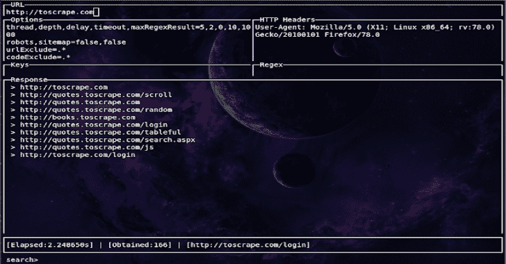

# Evine:交互式 CLI 网络爬虫

> 原文：<https://kalilinuxtutorials.com/evine/>

Evine 是一个用 Golang 编写的简单、快速、交互式的网络爬虫和网络抓取器。Evine 有广泛的用途，例如元数据和数据提取、数据挖掘、侦察和测试。

**安装**

**来自二进制**

预构建的[二进制版本](https://github.com/saeeddhqan/evine/releases)也是可用的。

**来源于**

**去得到 github . com/saeeddhqan/evine**
**" $ go path/bin/evine "-h**

**来自 GitHub**

git 克隆 https://github.com/saeeddhqan/evine.git
CD 艾文
去构建。
mv evine/usr/local/bin
evine–help

**注:** golang 1.13.x 必选。

**命令&用法**

| 好吧，好吧 | 描述 |
| --- | --- |
| `Enter` | 运行 crawler(从 URL 视图) |
| `Enter` | 显示响应(来自键和正则表达式视图) |
| `Tab` | 下一个视图 |
| `Ctrl+Space` | 运行爬虫 |
| `Ctrl+S` | 保存响应 |
| `Ctrl+Z` | 放弃 |
| `Ctrl+R` | 恢复默认值(从选项和标题视图) |
| `Ctrl+Q` | 关闭响应保存视图(从保存视图) |

**艾文-h**

它将显示该工具的帮助:

| 旗 | 描述 | 例子 |
| --- | --- | --- |
| -网址 | 要爬网的 URL | 艾文-URL toscrape.com |
| -URL-排除字符串 | 排除与此正则表达式匹配的 URL(默认)。*") | evine -url-exclude？id= |
| -域排除字符串 | 排除要爬网的作用域。用逗号分隔。默认值=根域 | evine-domain-排除 host1.tld、host2.tld |
| -代码-排除字符串 | 用这些代码排除 HTTP 状态代码。用“&#124;”分隔(默认)。*") | evine-代码-排除 200，201 |
| -延迟整数 | 每个请求之间的睡眠时间(毫秒) | 艾文-延时 300 |
| -深度 | 铲运机深度搜索级别(默认为 1) | 艾文-深度 2 |
| -线程整数 | 用于解析的并发 goroutines 数(默认为 5) | evine-线程 10 |
| -标题 | 每个请求的 HTTP 头(应该用\n 分隔字段)。 | evine -header 键:值\nKEY1:值 1 |
| -代理字符串 | 按方案代理://ip:port | 伊文-代理人[http://1.1.1.1:8080](http://1.1.1.1:8080) |
| -方案字符串 | 为请求设置方案(默认为“https”) | evine -scheme http |
| -超时 int | 超时前等待的秒数(默认为 10) | evine-超时 15 |
| -密钥字符串 | 你想要什么?在此处写入(电子邮件、url、query_urls、all_urls、电话、媒体、css、脚本、cdn、评论、dns、网络、所有或文件扩展名) | evine -keys 网址，pdf，txt |
| -正则表达式字符串 | 在页面内容上搜索正则表达式 | “evine -regex”用户。+' |
| -max-regex int | 正则表达式字段的正则表达式搜索的最大结果(默认值为 1000) | 艾文-马克斯-正则表达式-1 |
| 机器人 | 抓取 robots.txt 中的 URL，并将其用作种子 | 艾文-机器人 |
| -网站地图 | 抓取 sitemap.xml 中的 URL 并将其用作种子 | 艾文网站地图 |
| -往回走 | 抓取 WayBackURLs(web.archive.org)中的 URL，并将其用作种子 | 艾文网站地图 |

**视图**

*   URL:在这个视图中，您应该输入 URL 字符串。
*   选项:此视图用于设置选项。
*   Headers:这个视图用于设置 HTTP 头。
*   Keys:这个视图在抓取网页后使用。它将用于从已被抓取的网页中提取数据(文档、URL 等)。
*   Regex:这个视图对于在已经被抓取的网页中搜索 regex 很有用。在此视图中编写正则表达式，然后按 Enter 键。
*   回应:所有的结果都写在这个视图中
*   Search:该视图用于搜索响应内容中的正则表达式。

[**Download**](https://github.com/saeeddhqan/evine)