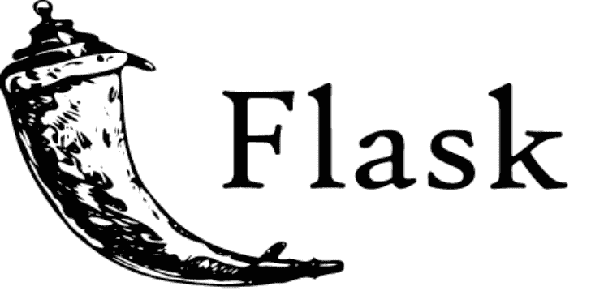

# Flask 会话 Cookie 管理器:Flask 会话 Cookie 解码器/编码器

> 原文：<https://kalilinuxtutorials.com/flask-session-cookie-manager/>

**Flask** 会话 Cookie 解码器/编码器。

**依赖关系**

*   Python 2 或 Python 3
*   其危险性
*   [烧瓶](https://pypi.python.org/pypi/Flask)

**安装**

*   **BlackArch Linux**

**# pacman-S flask-session-cookie-manager { 3，2}**

**去**

*   **ArchLinux**

两个 python3 etn python2:

**$ git 克隆 https://github.com/noraj/flask-session-cookie-manager.git&&CD flask-session-cookie-manager
# make pkg-sic**

**其他发行版**

通过您的软件包管理器找到您的方法，在虚拟环境中使用 pip 或使用 [pyenv](https://github.com/pyenv/pyenv) 。

例如。

**$ git 克隆 https://github.com/noraj/flask-session-cookie-manager.git&&CD flask-session-cookie-manager
$ python-m venv venv
$ source venv/bin/activate
$ python setup . py 安装**

**用途**

在 Python 3 中使用`**flask_session_cookie_manager3.py**`，在 Python 2 中使用`**flask_session_cookie_manager2.py**`。

**用法:**flask _ session _ cookie _ manager { 2，3}。py [-h] {encode，decode}…

**Flask Session Cookie 解码器/编码器**

**位置参数:**
{encode，decode }子命令帮助
编码
解码

**可选参数:**
【h，–help 显示此帮助消息并退出

*   **编码**

**用法:**flask _ session _ cookie _ manager { 2，3}。py encode [-h] -s -t

**可选参数:**
-h，–help 显示此帮助消息并退出
-s，–Secret-key
Secret key
-t，–cookie-structure
会话 cookie 结构

*   **解码**

**用法:**flask _ Session _ cookie _ manager . py decode[-h][-s]-c

**可选参数:**
-h，–help 显示此帮助消息并退出
-s，–Secret-key
Secret key
-c，–cookie-value
会话 cookie 值

**例题**

*   **编码**

$ python{2，3} flask _ session _ cookie _ manager { 2，3 }。py 抓住他们。{ y]tr & sp & 77 RDO ~ u3 @ xah # tal d @ oh ~ yof _ 51h(qv }；-t " { " number ":" 326410031505 "，" username ":" admin " } " eyjudw 1 iziiykkytkrfd 01 et xhoven 0 sinvzxjuyyyyj 1 lijp 7 iibiijoiwvdsdgfxxnd 0 ifx 0。2 个 IRA . ig 5 ksln msdh 4 uhcmsfrpuppb 5 VW

**注意**:会话 cookie 结构必须是有效的 python 字典

**解码**

*   使用密钥:

$ python{2，3} flask _ session _ cookie _ manager { 2，3 }。py decode-c ' eyjudw 1 xicimentiinikkytfd 01 etxhoven 0 sinvzjuywy 1 lijp 7 iibiijoidmdgfxnd 0 ifx 0 .2 个 IRA . ig 5 ksln msdh 4 uhcmsfrpuppb 5 VW‐s。{ y]tr & sp & 77 RDO ~ u3 @ xah # tal d @ oh ~ yof _ 51h(qv }；{ u ' username ":" admin "，" u number ":" 326410031505 " }

*   没有密钥(不太漂亮的输出):

$ python{2，3} flask _ session _ cookie _ manager { 2，3 }。py decode-c ' eyjudw 1 xicimentiinikkytfd 01 etxhoven 0 sinvzjuywy 1 lijp 7 iibiijoidmdgfxnd 0 ifx 0 .来自 2ira . ig 5 ksln msdh 4 uhcmsfrpuppb 5 VW " { " number ":" b ":" mzi 2 ndewmdmxnta 1 " }，" username ":" b ":" yw RTW 4 = " } }

[**Download**](https://github.com/noraj/flask-session-cookie-manager)