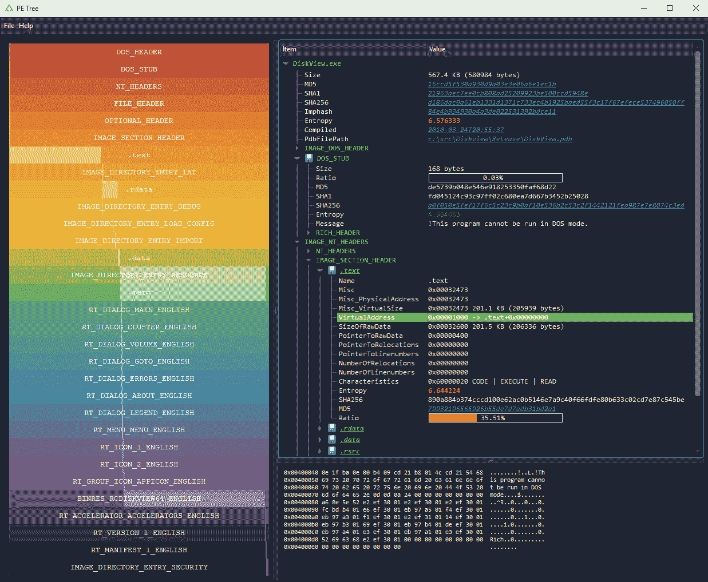
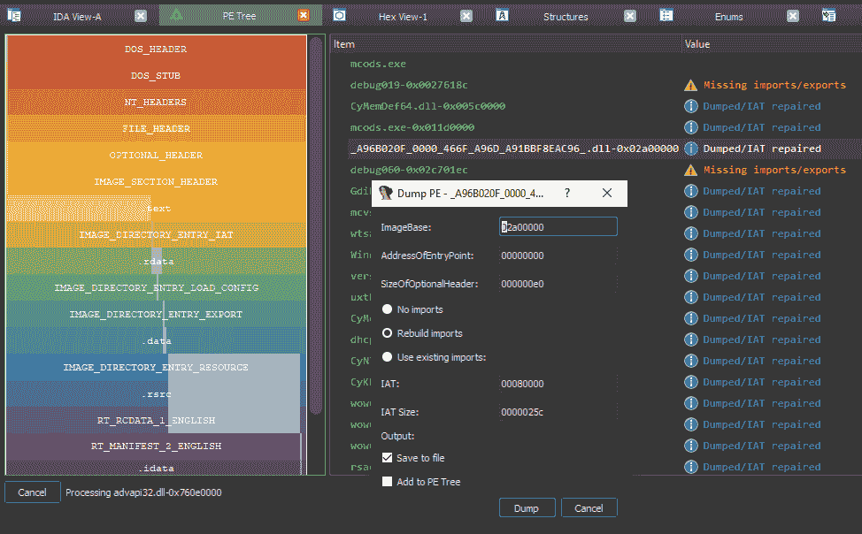

# PE 树:用于在树视图中查看可移植可执行(PE)文件的 Python 模块

> 原文：<https://kalilinuxtutorials.com/pe-tree/>

[ Files In A Tree-View")](https://1.bp.blogspot.com/-j2xwEKZYUfY/XzvZlzEoIzI/AAAAAAAAHWg/cQY1jsDg7zULdOksXzi_RXK1AUx3v_kBQCLcBGAsYHQ/s728/pe_tree-1%25281%2529.png)

**PE Tree** 是一个 Python 模块，使用 [pefile](https://github.com/erocarrera/pefile) 和 [PyQt5](https://pypi.org/project/PyQt5/) 在树形视图中查看[可移植可执行(PE)文件](https://en.wikipedia.org/wiki/Portable_Executable)。也可以与 [IDA Pro](https://www.hex-rays.com/products/ida/) 一起使用，以转储内存中的 PE 文件并重建导入。

**特性**

*   **独立应用和 IDAPython 插件**
*   **支持 Windows/Linux/Mac**
*   **彩虹 PE 比例图:**
    *   PE 结构、大小和文件位置的高级概述
    *   允许快速目视比较 PE 样品
*   **在树形视图中显示以下 PE 头:**
    *   MZ 头球
    *   DOS 存根
    *   丰富的标题
    *   NT/文件/可选标题
    *   数据目录
    *   部分
    *   进口
    *   电子竞技
    *   调试信息
    *   加载配置
    *   坦克激光瞄准镜（Tank Laser-Sight 的缩写）
    *   资源
    *   版本信息
    *   证书
    *   覆盖物
*   **从**提取并保存数据
    *   DOS 存根
    *   部分
    *   资源
    *   证书
    *   覆盖物
*   **向网吧发送数据**
*   **病毒搜索总数:**
    *   文件哈希
    *   PDB 路径
    *   时间戳
    *   部分散列/名称
    *   导入哈希/名称
    *   导出名称
    *   资源哈希
    *   证书序列号
*   **独立应用；**
    *   双击 VA/RVA，用顶点石拆卸
    *   十六进制转储数据
*   **IDAPython 插件:**
    *   PE 文件结构的简单导航
    *   双击虚拟设备/RVA，在 IDA 视图/十六进制视图中查看
    *   在 IDB 中搜索内存中 PE 文件；
        *   重建进口(IAT + IDT)
        *   转储重建的 PE 文件
        *   在 IDB 中自动注释 PE 文件结构
        *   自动标注 IDB 中的 IAT 偏移量

**应用**

**要求**

*   Python 3+

**安装**

*   **使用画中画(推荐)**

使用全新的虚拟环境和 pip 直接从 GitHub 安装:

**窗户**

> virtualenv env
>env \ Scripts \ activate
>pip 安装–升级 pip
> pip 安装 git+https://github . com/blackberry/PE _ tree . git

**Mac/Linux**

$ python3 -m venv env
$ source。/env/bin/activate
$ pip 安装–升级 pip
$ pip 安装 git+https://github . com/blackberry/PE _ tree . git

**针对开发者**

Git 克隆存储库并为开发做准备:

**窗户**

> git 克隆 https://github.com/blackberry/pe_tree.git
>CD PE _ tree
>virtualenv env
>env \ Scripts \ activate
>pip install-e

**Mac/Linux**

$ git 克隆 https://github.com/blackberry/pe_tree.git
$ CD PE _ tree
$ python 3-m venv env
$ source。/env/bin/activate
$ pip install-e

**用途**

运行 PE 树并使用 GUI 选择一个**文件**进行查看:

`**$ pe-tree**`

运行 PE 树，查看指定的**文件/文件夹**:

`**$ pe-tree <path>**`

**黑暗模式**

可以通过安装 [QDarkStyle](https://pypi.org/project/QDarkStyle/) 来启用黑暗模式:

**$ pip 安装 qdarkstyle**

**IDAPython**

**要求**

*   IDA Pro 7.0+和 Python 2.7
*   IDA Pro 7.4+带 Python 2.7 或 3.x

**安装**

要作为 IDAPython 插件安装和运行，您可以使用 setuptools 或手动安装。

**使用设置工具**

1.  下载 pe_tree 并安装 IDA 使用的**全局** Python 解释器:`**$ git clone https://github.com/blackberry/pe_tree.git $ cd pe_tree $ python setup.py develop --ida**`
2.  将 [pe_tree_ida.py](https://github.com/blackberry/pe_tree/blob/master/pe_tree_ida.py) 复制到你的 [IDA 插件文件夹](https://github.com/blackberry/pe_tree#ida-plugins-folder)

**手动安装**

1.  下载 pe_tree，安装 IDA 使用的**全局** Python 解释器需求:`**$ git clone https://github.com/blackberry/pe_tree.git $ cd pe_tree $ pip install -r requirements.txt**`
2.  将 [pe_tree_ida.py](https://github.com/blackberry/pe_tree/blob/master/pe_tree_ida.py) 和`./pe_tree/`的内容复制到你的 [IDA 插件文件夹](https://github.com/blackberry/pe_tree#ida-plugins-folder)

**针对开发者**

要简单地在 IDA 下作为脚本运行，首先安装 pe_tree 包，要求安装**全局** Python:

**$ pip install-r requirements . txt**

然后运行 ida 下的 [pe_tree_ida.py](https://github.com/blackberry/pe_tree/blob/master/pe_tree_ida.py) :

`**File -> Script file... -> pe_tree_ida.py -> Open**`

**IDA 插件文件夹**

| 操作系统（Operating System） | 插件文件夹 |
| --- | --- |
| **窗户** | `%ProgramFiles%\IDA Pro 7.X\plugins` |
| **Linux** | `/opt/ida-7.X/plugins` |
| **Mac** | `~/.idapro/plugins` |

**用途**

*   运行 IDA 并反汇编一个 PE 文件(**选择`Manual Load`和`Load Resources`以获得最佳效果！**)
*   点击`**Edit -> Plugins -> PE Tree**`

**例题**

*   **转储内存 PE 文件**

下面是转储打包的 PE 文件(例如 MPRESS 或 [UPX](https://upx.github.io/) )和重建导入的基本步骤(假设映像库/入口点相当标准):

1.  启动 IDA Pro，反汇编一个 MPRESS 或者 UPX 打包的 PE 文件(**选择`Manual Load`和`Load Resources`T3)**
2.  选择调试器(Windows 或 [Bochs](http://bochs.sourceforge.net/) )并运行至 OEP(通常为 0x00401000)
3.  此时，您可以拍摄一个内存快照(保存所有段)并保存 IDB 供以后使用
4.  确保 IDA 已经找到所有代码`**Options -> General -> Analysis -> Reanalyze program**`
5.  打开 PE 树，点击右键，选择 **`Add PE -> Search IDB`**
6.  **右击`HEADER-0x00400000`** (或合适的模块)并选择`Dump...`
7.  指定`**AddressOfEntryPoint**`(通常为 0x1000)
8.  确保选择了`**Rebuild imports**`
9.  转储！

将使用从 memory/IDB 获得的解包的节数据创建一个新的可执行文件，并创建一个名为[的新节。包含重建的 IAT、提示名称表和 IDT 的 idata](https://docs.microsoft.com/en-us/windows/win32/debug/pe-format#the-idata-section) 将被附加到 PE 文件中。如果入口点内存段在执行过程中被标记为可写(例如通过[虚拟保护](https://docs.microsoft.com/en-us/windows/win32/api/memoryapi/nf-memoryapi-virtualprotect)，那么 EP 段特征也将被标记为可写。最后，将 BASERELOC、BOUND_IMPORT 和 SECURITY 数据目录标记为 null，并重新计算 OPTIONAL_HEADER 校验和(如果通过 config 启用)

使用上面的方法，可以转储许多内存中的 PE 文件，这些文件或者已经被解压缩、远程注入、反射加载或者被挖空等等。

**配置**

*   **概述**

配置存储在 INI 文件中，缺省值如下:

**【配置】**
debug = False
fonts = Consolas，Monospace，Courier
virus total _ URL = https://www.virustotal.com/gui/search
cyber chef _ URL = https://gchq.github.io/CyberChef

**【dump】**
enable = True
recalculate _ PE _ checksum = False

**选项**

| 部分 | [计]选项 | 类型 | 描述 |
| --- | --- | --- | --- |
| 配置 | 调试 | 布尔型 | 将 pefile.dump()打印到输出 |
| 配置 | 字体 | 线 | 用户界面字体名称的逗号分隔列表 |
| 配置 | 病毒总数 _url | 线 | 病毒总数搜索 URL |
| 配置 | 网吧 _url | 线 | 网吧网址 |
| 倾销 | 使能够 | 布尔型 | 在 IDA 中启用流程转储/IAT 重建 |
| 倾销 | 重新计算 _ pe _ 校验和 | 布尔型 | 重新计算 PE 头校验和(慢！) |

**地点**

| 类型 | 操作系统（Operating System） | 小路 |
| --- | --- | --- |
| 应用 | Windows 操作系统 | `%TEMP%\pe_tree.ini` |
| 应用 | Linux/Mac | `/tmp/pe_tree.ini` |
| IDAPython | Windows 操作系统 | `%APPDATA%\HexRays\IDA Pro\pe_tree.ini` |
| IDAPython | Linux/Mac | `~/.idapro/pe_tree.ini` |

**第三方数据共享**

以下信息将在以下条件下与第三方网络应用程序共享(取决于配置):

**病毒总数**

如果在配置中指定了 [VirusTotal](https://www.virustotal.com/) URL，那么当用户单击突出显示的链接或从右键单击上下文菜单中选择“VirusTotal 搜索”时，诸如文件散列、时间戳等元数据将被发送到 VirusTotal 进行处理。

**网吧**

如果 [CyberChef](https://github.com/gchq/CyberChef) URL 出现在配置中，那么当用户从右键单击上下文菜单中选择“CyberChef”时，任何文件数据都将被 base64 编码并发送到 CyberChef 进行处理。

**故障排除**

**AttributeError:模块' pip '没有属性' main'**
或
**PyQt5 无法在 Linux 下安装**

*   **尝试将 pip 升级到 20.0 以上版本:**

**$ pip 安装–升级 pip**

*   **ModuleNotFoundError:没有名为“PyQt5.sip”的模块**

尝试卸载并重新安装 PyQt5，如下所示:

**pip 卸载 PyQt5
pip 卸载 PyQt5-sip
pip 安装 PyQt5**

*   **倾销后进口缺失**

确保 IDA 已经找到并反汇编了所有代码:

`**Options -> General -> Analysis -> Reanalyze program**`

完成后，再次尝试转储/重建导入。

**开发者文档**

使用 [Sphinx](https://www.sphinx-doc.org/en/master/) 从源代码构建文档:

$ pip 安装 sphinx
$ sphinx-API doc-o ./doc/source/。
$ sphinx-build -b html。/doc/source。/doc/build -E

要查看文档，请在网络浏览器中打开`./doc/build/index.html`。