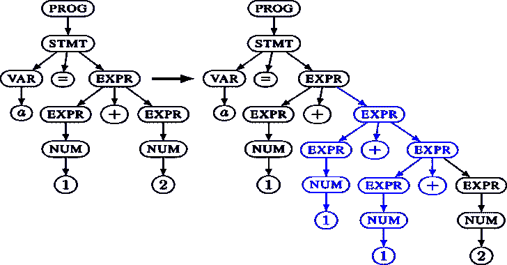
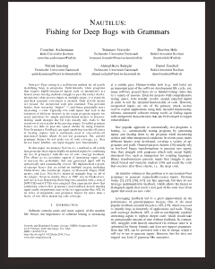
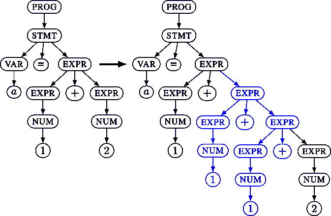

# Nautilus:基于语法的反馈模糊器

> 原文：<https://kalilinuxtutorials.com/nautilus/>

Nautilus 是一个覆盖引导的，基于语法的模糊器。您可以使用它来提高您的测试覆盖率并发现更多的 bug。

通过指定半有效输入的语法，Nautilus 能够执行复杂的变异，并发现更多有趣的测试用例。这个模糊器背后的许多想法都记录在 2019 年 NDSS 发布的一篇论文中。

2.0 版本对这个早期原型进行了许多改进，现在与 AFL ++ 100%兼容。除了一般的可用性改进之外，2.0 版本还包括许多闪亮的新特性:

*   支持 AFL-Qemu 模式
*   支持 python 中指定的语法
*   支持使用 python 脚本从结构中生成输入的非上下文无关语法
*   支持指定二进制协议/格式
*   支持指定不属于定向突变的基于正则表达式的终端
*   更好地避免反复生成相同的非常短的输入
*   代码库的大规模清理
*   无效语法的有用错误输出
*   修正了超时代码中的一个错误，偶尔会使模糊器死锁

**鹦鹉螺是如何工作的？**

您可以使用诸如 **`EXPR -> EXPR + EXPR`或`EXPR -> NUM`和`NUM -> 1`这样的规则来指定语法。**根据这些规则，模糊器构造一棵树。这种内部表示允许应用比原始字节更复杂的突变。

然后，这个树被转换成目标应用程序的实际输入。在正常的上下文无关文法中，这个过程很简单:所有的叶子都被连接起来。

下面例子中左边的树将对输入`**a=1+2**`进行解分析，右边的树对`**a=1+1+1+2**`进行解分析。为了增加语法的表现力，使用 Nautilus，您可以为解解析过程提供 python 函数，以支持更复杂的规范。

**设置**

**# check out the git**
git clone ' git @ github . com:nautilus-fuzz/nautilus . git '
CD nautilus
/path/to/aflplus/AFL-clang-fast test . c-o test # AFL-clang-fast 由 AFL

**#所有参数也可以使用 config.ron 文件**
cargo run-release—-g grammars/grammars _ py _ example . py-o/test @ @

**#或者如果要使用 QEMU 模式:**
cargo run/path/to/AFLplusplus/AFL-QEMU-trace-。/test_bin @

**例题**

这里，我们使用 python 为有效的类似 xml 的输入生成语法。请注意脚本规则的使用，以确保开始和结束标记匹配。

#ctx.rule(NONTERM: string，RHS: string|bytes)添加一个规则 NONTERM->RHS。我们可以在 RHS 中使用{NONTERM}来请求递归。
ctx.rule("START "，" { XML _ CONTENT } "
CTX . rule(" XML _ CONTENT "，" { XML } { XML _ CONTENT } "
CTX . rule(" XML _ CONTENT "，" ")

# CTX . script(non term:string，RHS: [string]]，func)增加一个规则 NONTERM- > func(*RHS)。
#与普通的`rule`相反，RHS 是一个非终结符数组。
#由该函数将返回的非终端值与使用的任何固定内容相结合。
ctx.script("XML "，["TAG "，" ATTR "，" XML_CONTENT"]，lambda tag，attr，body: b" < %s %s > %s"%(tag，attr，body，tag) )
ctx.rule("ATTR "，" foo=bar")
ctx.rule("TAG "，" some_tag")
ctx.rule("TAG "，" other _ TAG ")

#有时我们不想去探究可能的输入集合例如，如果我们模糊一个脚本
#解释器，我们不想花时间模糊所有不同的变量名。在这种情况下，我们可以使用 Regex
#终端。正则表达式终端只在生成过程中变异，而在正常变异阶段不变异，节省了大量时间。fuzzer 仍然为正则表达式探索不同的值，但是它将不能递增地学习有趣的值。当渐进探索很可能会浪费时间时使用此选项。
ctx.regex("TAG "，"[a-z]+")

要测试您的语法，您可以使用生成器:

$ cargo run–bin 生成器—-g grammars/grammar _ py _ ex maple . py-t 100

也可以把鹦鹉螺和 AFL 结合使用。只需将 AFL -o 指向同一个 workdir，AFL 就会与 Nautilus 同步。注意，这是一种方式。AFL 进口 Nautilus 投入，而不是反过来。

#终端/屏幕 1
。/AFL-fuzz-Safl-I/tmp/seeds-o/tmp/work dir/。/test @ @

# Terminal/Screen 2
cargo run-release—-o/tmp/work dir—。/test @

[**Download**](https://github.com/nautilus-fuzz/nautilus)