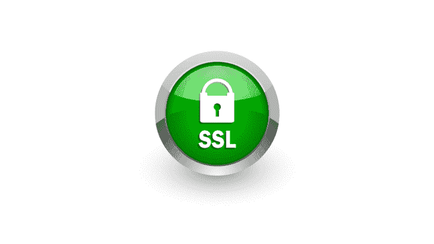
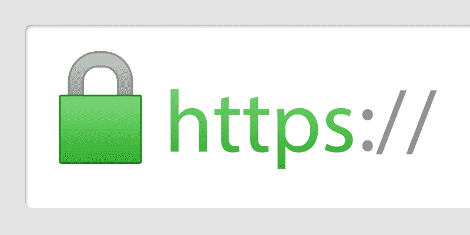

# 想用一个 SSL 证书保护多个域吗？这是你的权威指南。

> 原文：<https://kalilinuxtutorials.com/single-ssl-certificate/>

如果我们将今天的互联网用户数量与十年前进行比较，我们会注意到数量上的重大变化。就在你阅读这篇文章的时候，成千上万的人正在使用互联网作为提供或提取信息的来源。你的企业需要一个巨大的平台才能成功。因此，在现代社会，在互联网上进行交易或服务变得至关重要。除此之外，你还可以与人交流，不仅仅是参观实体店的人，而是来自世界各地的人。这将使您的业务达到您从未想象过的高度。

作为人们参与和交换信息的最大平台，万维网发展迅速。越来越多的人在互联网上做生意。你认为在互联网上发展一家公司像看起来那么容易吗？绝对不行。伴随利益和成功而来的是巨大的责任——“客户的信任”。黑客变得越来越聪明，数据泄露的威胁也越来越大。

系统黑客和信息泄露已经变得比其他任何威胁都更加普遍。回顾过去，许多大公司不得不面对一些不良情况，主要是因为它们不安全。客户的信任必须通过“赢得”来成为一个领先和可靠的品牌。说了这么多，如何在你的网站上为客户营造一个安全的空间呢？

有多种众所周知的方法可以提高网站的安全性。最可信最简单的方法就是 [**购买一个 SSL 证书**](https://www.ssl2buy.com/) 。

# SSL 和 SSL 证书

SSL 或安全套接字层是一种安全的通信协议，用于保护传输的数据不落入他人之手。这种盗窃通常通过 MITM(中间人)攻击发生。SSL 可以保护您的信息免受这些攻击。它对数据进行加密，并确保收听该频道的人无法理解正在传输的信息，从而保护您的网络流量。

现在我们将注意力转向 SSL 证书。SSL 证书为您的客户提供了保护，防止黑客和恶意软件在信息传输过程中窃取他们的数据。正如我们在上面看到的，要在互联网上成功，最重要的因素是“信任”。如果你的网站不能为你的客户提供一个安全的环境，他们就不太可能购买或再次访问你的网站。这是 SSL 证书帮助您解决的根本问题。拥有 SSL 证书为您——所有者和最终用户——之间的信任奠定了基础。

这些证书由被称为[认证机构](https://en.wikipedia.org/wiki/Certificate_authority) (CA)的可信第三方颁发。这些机构确保在通信方之间创建安全的编码网络。通过加密数据，他们确保没有恶意软件或黑客窃取您的个人信息，而它正在传输。

有各种类型的 SSL 证书可供购买。

你拥有一个有多个子域的网站吗？你可以考虑为你所有的子域购买多个证书，也可以购买一个多域 SSL 证书。建议购买单个多域证书。

不确定为什么？这里有一堆原因:

## 1.节省时间

想象一下，必须检查所有网站的 SSL 证书。在我们现在忙碌的时间表之间，每次你创建一个不同的子域，都必须购买新的，这是相当费时的。多域 SSL 证书为您解决了这个问题。只有一个根证书链接到您的所有域，使您的工作变得更加容易。

## 2.有助于管理

你是一家大型在线企业的所有者，并打算购买 SSL 证书吗？嗯，大型企业需要几个子域，拥有多个单域 SSL 证书可能被证明是一个错误的选择。拥有许多证书可能需要雇佣“昂贵的”人力来帮助你解决诸如安装、维护、更新、故障排除等问题。因此，获得多域 SSL 证书将是一个明智的决定。

## 3.省钱

如果你有一个庞大的业务，购买多个单域证书的所有子域将导致巨大的金钱损失。您可以简单地购买一个多域 SSL 证书。

来源三:https://cheapssslsecurity . com/blog/WP-content/uploads/2017/11/multi-domain-SSL-certificate . jpg

除此之外，您还可以购买 DV、OV 或 EV SSL 证书。不确定它们是什么？SSL 证书也可以根据所需的验证级别来划分。

对于不像博客和小企业那样销售产品的网站来说，DV 或域验证证书是一个很好的选择。众所周知，这些证书的有效性最低。当这些证书被授予网站时，该网站的地址窗口上会显示一个挂锁。

**OV 或组织验证证书** **通常用于 MSME 秤证书——用于文档签名、客户认证和代码签名。这些类型的证书具有适度的验证级别，并且涉及手动检查过程。当颁发这些证书时，会显示一个带有网站相关详细信息的证书。**

EV 或扩展验证证书 **通常由处理信用卡号码和密码等敏感客户数据的公司购买。例如，电子商务商店和银行。众所周知，这些证书具有最严格的验证级别。浏览器 URL 变为绿色，表示已向该特定站点颁发了 EV SSL 证书。**

# **结论**

现在，您一定熟悉多域 SSL 证书的重要性。除了选择您需要的 SSL 证书类型之外；您还必须确保证书颁发机构是一个可信和可靠的机构。从客户友好的 SSL 证书权威机构购买 SSL 证书，如 SSL2BUY。

 **SSL 证书现在已经成为一种必需品，而不是一种选择。节省您的血汗钱，从 SSL2BUY 获得一个多域证书-获得两全其美，更少的维护成本，并覆盖您的所有域。**