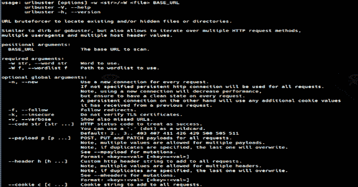

# URLBuster:强大的可变网络目录 Fuzzer

> 原文：<https://kalilinuxtutorials.com/urlbuster/>

[](https://1.bp.blogspot.com/-AiZxGyx2LU8/X0Uu7DOg0LI/AAAAAAAAHa8/nTELfcJdjsoOxAIoYVk4Z43jPAMVF1HwwCLcBGAsYHQ/s728/urlbuster%25281%2529.png)

URLBuster 是一个强大的网络目录模糊器，可以定位现有的和/或隐藏的文件或目录。类似于 [dirb](http://dirb.sourceforge.net/) 或者 [gobuster](https://github.com/OJ/gobuster) ，但是有很多变异选项。

**安装**

**pip 安装 urlbuster**

**特性**

*   代理支持
*   Cookie 支持
*   基本认证
*   摘要授权
*   重试次数(对于慢速服务器)
*   持久和非持久 HTTP 连接
*   请求方法:GET，POST，PUT，DELETE，PATCH，HEAD，OPTIONS
*   自定义 HTTP 标头
*   变更 POST、PUT 和 PATCH 有效负载
*   随不同的请求方法而变化
*   用不同的 HTTP 头变异
*   随着不同的文件扩展名而变化
*   有或没有尾随斜线的变异
*   枚举获取参数值

**用途**

**用法:** urlbuster【选项】-w /-W BASE_URL
urlbuster -V，–help
URL buster-h，–version
URL brute forcer 定位现有的和/或隐藏的文件或目录。
类似于 dirb 或 gobuster，但也允许迭代多个 HTTP 请求方法，
多个用户代理和多个主机头值。

**位置参数:**
BASE_URL 要扫描的基本 URL。

**必选参数:**
-w str，–Word str 要使用的单词。
-W f，–word list f 要使用的单词列表的路径。

**可选全局参数:**
-n，–new 为每个请求使用一个新的连接。
如果没有指定，持久 http 连接将用于所有请求。
注意，使用新连接会降低性能，
但是要确保每个请求都有一个干净的状态。另一方面，持久连接将使用它从之前的请求中接收到的任何额外的 cookie 值。
-f，–跟随重定向。
-k，–不安全不验证 TLS 证书。
-v，–verbose 也显示丢失的 URL。
–代码 str [str …] HTTP 状态代码，视为成功。你可以用“.”(点)作为通配符。
默认值:2..3..403 407 411 426 429 500 505 511
–所有请求的有效负载 p [p …] POST、PUT 和 PATCH 有效负载。
注意，多个有效载荷允许多个值。
注意，如果指定了重复项，最后一个将被覆盖。
参见–突变的 mpayload。
格式:=[=]
–header h[h…]要添加到所有请求中的自定义 http 头字符串。
注意，多个标题允许有多个值。
注意，如果指定了重复项，最后一个将被覆盖。
见–突变的领导者。
格式::[:]
–要添加到所有请求中的 cookie c [c …] Cookie 字符串。
格式:=[=]
–代理字符串对所有请求使用代理。
格式:http://:
格式:http://:@:
格式:https://:
格式:https://:@:
格式:socks5://:
格式:socks 5://:@:
–auth-basic str 对所有请求使用基本身份验证。
格式::
–auth-digest str 对所有请求使用摘要式身份验证。
格式::
–超时秒数每个请求的连接超时秒数。
默认值:5.0
–每个请求的重试连接次数。
默认值:3
–延迟请求之间的秒延迟，以避免服务器泛洪。
–输出文件要写入结果的输出文件。

**可选变异参数:**
以下参数将增加
应用各种变异并在单独的请求上测试每个变异的请求总数。

–method m[m…】测试每个请求的 HTTP 方法列表。
注意，每个提供的方法都会使请求的数量加倍。
支持的方法:GET POST PUT DELETE PATCH HEAD 选项
默认:GET
–mpayload p[p…]POST、PUT 和 PATCH 有效负载，以改变所有请求..
注意，多个有效载荷允许多个值。
格式:=[=]
–m header h[h…]自定义 http 头字符串添加到 mutate 所有请求。
注意，多个标题允许有多个值。
格式::[:]
–ext ext[ext…]要添加到 words 中进行测试的文件扩展名列表。
请注意，每个提供的扩展都会使请求数量翻倍。
格式:。zip。PEM]
–斜杠字符串追加或省略要测试的 URL 的尾部斜杠。
注意，如果也指定了扩展名，扩展名后将添加一个斜杠。
注意，使用“both”会使请求数量加倍。
选项:有，有，无
默认:无

**其他参数:**
-h，–帮助显示此帮助信息并退出
-V，–版本显示版本信息

**示例**
URL buster-W/path/to/words http://example.com/
URL buster-W/path/to/words http://example.com:8000/
URL buster-k-W/words

**突变例子**

根据指定的用户代理，某些网站对同一路径的行为会有所不同。

$ URL buster \
-W/usr/share/dirb/word lists/common . txt \
–mheader ' User-Agent:Google bot/2.1(+http://www . Google bot . com/bot . html)' \
–method ' POST，GET，DELETE，PUT，PATCH ' \
http://www.domain.tld/

**例题**

**默认用法**

*   **基础**

```
$ urlbuster \
  -W /path/to/wordlist.txt \
  http://www.domain.tld/
```

*   **通过 Burpsuite 代理**

```
$ urlbuster \
  -W /path/to/wordlist.txt \
  --proxy 'http://localhost:8080' \
  http://www.domain.tld/
```

*   **将结果保存到文件**

```
$ urlbuster \
  -W /path/to/wordlist.txt \
  --output out.txt \
  http://www.domain.tld/
```

*   **基本认证后扫描**

```
$ urlbuster \
  -W /path/to/wordlist.txt \
  --auth-basic 'user:pass' \
  http://www.domain.tld/
```

*   **使用会话 cookie**

```
$ urlbuster \
  -W /path/to/wordlist.txt \
  --cookie 'PHPSESSID=a79b00e7-035a-2bb4-352a-439d855feabf' \
  http://www.domain.tld/
```

**查找文件**

*   **在根目录中查找文件**

```
$ urlbuster \
  -W /path/to/wordlist.txt \
  --code 200 301 302 \
  --ext .zip .tar .tar.gz .gz .rar \
  http://www.domain.tld/
```

*   **在子目录**中查找文件

```
$ urlbuster \
  -W /path/to/wordlist.txt \
  --code 200 301 302 \
  --ext .zip .tar .tar.gz .gz .rar \
  http://www.domain.tld/wp-content/
```

**高级用法**

*   **暴力查询参数**

```
$ urlbuster \
  -W /path/to/wordlist.txt \
  --method GET \
  --code 200 301 302 \
  http://www.domain.tld/search?q=
```

*   **强制发布请求**

```
$ urlbuster \
  -W /path/to/wordlist.txt \
  --code 200 301 302 \
  --method POST \
  --payload \
    'user=somename' \
    'pass=somepass' \
    'mail=some@mail.tld' \
    'submit=yes' \
  http://www.domain.tld/
```

*   **暴力强制变异后的帖子请求**

```
$ urlbuster \
  -w index.php \
  --code 200 301 302 \
  --method POST \
  --mpayload \
    'user=somename1' \
    'user=somename2' \
    'user=somename3' \
    'pass=somepass1' \
    'pass=somepass2' \
    'pass=somepass3' \
    'mail=some@mail1.tld' \
    'mail=some@mail2.tld' \
    'mail=some@mail3.tld' \
    'submit=yes' \
  http://www.domain.tld/wp-admin/
```

*   **用户代理 SQL 注入**

```
$ urlbuster \
  -W /path/to/wordlist.txt \
  --code 5.. \
  --method GET POST \
  --mheader \
    "User-Agent: ;" \
    "User-Agent: ' or \"" \
    "User-Agent: -- or #" \
    "User-Agent: ' OR '1" \
    "User-Agent: ' OR 1 -- -" \
    "User-Agent: \" OR 1 = 1 -- -" \
    "User-Agent: '='" \
    "User-Agent: 'LIKE'" \
    "User-Agent: '=0--+" \
    "User-Agent:  OR 1=1" \
    "User-Agent: ' OR 'x'='x" \
    "User-Agent: ' AND id IS NULL; --" \
  http://www.domain.tld/
```

*   **寻找潜在的损失**

```
$ urlbuster \
  -w / \
  --method GET POST \
  --mheader \
    "Host: internal1.lan" \
    "Host: internal2.lan" \
    "Host: internal3.lan" \
    "Host: internal4.lan" \
    "Host: internal5.lan" \
    "Host: internal6.lan" \
  http://10.0.0.1
```

**Sec 工具**

下面是我维护的 sec 工具和文档列表。

| 名字 | 种类 | 语言 | 描述 |
| --- | --- | --- | --- |
| **[越位](https://github.com/cytopia/offsec)** | 证明文件 | 降价 | Offsec 清单、工具和示例 |
|  | 列举 | 尝试 | 模糊 HTTP 头 |
| **[SMTP-用户-枚举](https://github.com/cytopia/smtp-user-enum)** | 列举 | Python 2+3 | SMTP 用户枚举器 |
| **[urlbuster](https://github.com/cytopia/urlbuster)** | 列举 | Python 2+3 | 可变网络目录模糊器 |
| **网猫 T3** | 绕轴旋转 | Python 2+3 | 跨平台 netcat |
| **[bad chars](https://github.com/cytopia/badchars)** | 逆向工程 | Python 2+3 | Badchar 生成器 |
|  | 逆向工程 | Python 2+3 | TCP fuzzing 工具 |

[**Download**](https://github.com/cytopia/urlbuster)