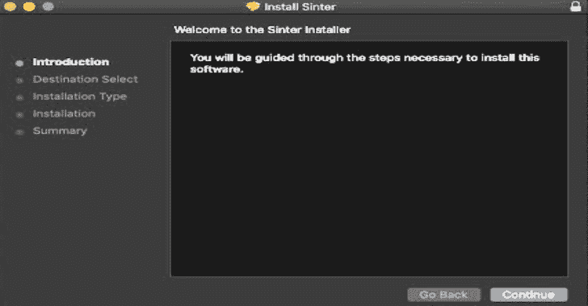

# sinter:MAC OS 用户态应用授权系统

> 原文：<https://kalilinuxtutorials.com/sinter/>

**Sinter** 是 macOS 10.15 及以上版本的 100%用户态端点安全代理，用 Swift 编写。它使用用户模式的 EndpointSecurity API 来订阅和接收来自 macOS 内核的授权回调，用于一组安全相关的事件类型。

Sinter 的当前版本支持允许/拒绝流程执行；在未来的版本中，我们打算支持其他类型的事件，如文件、套接字和内核事件。

烧结是一项正在进行的工作。欢迎反馈。如果你有兴趣帮助或赞助我们实现其潜力，[让我们联系](https://www.trailofbits.com/contact/)。

**特性**

*   通过代码目录哈希(又名“CD 哈希”)允许或拒绝进程执行
    *   拒绝所有未知程序(任何未明确允许的程序)的选项
    *   拒绝所有未签名程序的选项
    *   拒绝所有签名无效的程序的选项
*   “监控”模式跟踪和记录(但允许)所有流程执行事件
*   接受来自圣诞老人同步服务器的允许/拒绝规则
*   在本地或由同步服务器提供的 JSON 中配置拒绝规则
*   以结构化的 JSON 格式记录到本地文件系统

计划即将推出的功能:

*   通过[可执行文件路径](https://github.com/trailofbits/sinter/issues/17)拒绝进程执行
*   通过[证书团队 ID](https://github.com/trailofbits/sinter/issues/4) 拒绝流程执行

**反特征**

*   不使用内核扩展(在 macOS 11 Big Sur 中将被正式否决)
*   不支持传统 macOS (10.14 或更旧版本)
*   不使用任何内存不安全的代码
*   限制第三方库依赖性
*   不是反恶意软件或反病毒软件。没有签名数据库。使用规则只拒绝您告诉它拒绝的内容。

**背景**

第一个允许/拒绝进程的开源 macOS 解决方案是 [Google Santa](https://github.com/google/santa) 。我们是圣诞老人的粉丝，[在过去已经为它的代码库做出了贡献。然而，很长一段时间以来，macOS 社区中的许多人都要求开源解决方案来跟踪和管理*而不仅仅是流程事件。*](https://github.com/google/santa/pulls?q=is%3Apr+is%3Aclosed+author%3Aalessandrogario)

我们看到了在 macOS 10.15 中使用 EndpointSecurity API 构建这种功能的理想平台。围绕严格的用户模式 API 从头开始意味着我们可以尝试更简单的设计，使用更安全的内存处理和更好的性能的现代编程语言。因此，我们开始开发 Sinter，这是“Sinter Klausen”的缩写，是圣诞老人的另一个名字。

**入门**

使用[发布](https://github.com/trailofbits/sinter/releases)页面的`pkg`安装链接下载并安装最新版本的 Sinter。

安装 Sinter 后，必须启用`Sinter.app`的“全磁盘访问”权限。为此，请打开“系统偏好设置”、“安全性”、“隐私”选项卡、“全磁盘访问”。检查`Sinter.app`的项目。如果使用 MDM，您可以在端点上自动启用该权限，并且不需要用户交互。

**配置**

Sinter 要求在`**/etc/sinter/config.json**`出现一个配置文件。在 **`./config/config.json` :** 的源代码树中提供了一个例子

{
" Sinter ":{
" decision _ manager ":" local "、
"logger": "filesystem "、
" allow _ unsigned _ programs ":" true "、
" allow _ invalid _ programs ":" true "、
" allow _ unknown _ programs ":" true "、
" allow _ expired _ auth _ requests ":" true "、
" allow _ disposed _ Applications ":" true "、
" config _ update _ interval ":600、

可以通过改变`decision_manager`值来选择决策管理器插件。**本地**插件将启用**本地决策管理器**配置部分，指示 Sinter 使用给定路径中的本地规则数据库。通过使用**同步服务器**插件，可以使用与 Santa 兼容的同步服务器。这将启用 **RemoteDecisionManager** 配置部分，在这里可以设置服务器 URL 和机器标识符。

目前实现了两个日志程序插件:

1.  **文件系统**:使用 FilesystemLogger.log_file_path 中指定的路径将消息写入文件
2.  **unifiedlogging** :使用统一日志发出日志，使用 **com.trailofbits.sinter** 作为子系统。

**允许的应用程序目录**

可以将 Sinter 配置为记录并选择性地拒绝尚未从允许的文件夹启动的应用程序。

*   **allow _ displaced _ applications**:如果设置为 true，错位的应用程序只会产生一个警告。如果设置为 false，则拒绝任何不是从有效路径开始的执行。
*   **allowed _ application _ directory**:如果非空，将用于确定应用程序是否放在错误的文件夹中。

**启用 UI 通知**

1.  安装通知服务器(PKG 安装程序会自动完成):`**sudo /Applications/Sinter.app/Contents/MacOS/Sinter --install-notification-server**`
2.  启动代理:`**/Applications/Sinter.app/Contents/MacOS/Sinter --start-notification-server**`

**在监控模式下配置烧结矿**

Sinter 中没有实现模式，因为一切都基于规则。可以通过调整以下设置来实现监控功能:

*   **allow_unsigned_programs** :允许未签名的应用程序
*   **allow_invalid_programs** :允许签名检查失败的应用程序
*   **allow_unknown_programs** :自动允许活动规则数据库未覆盖的应用程序
*   **allow _ expired _ auth _ requests**:endpoint security API 要求 Sinter 在未指定的时间范围内(通常不到一分钟)对授权请求做出响应。大型应用程序，如 Xcode，将需要相当长的时间来验证。默认情况下，这些执行是被拒绝的，一旦应用程序通过验证，用户就应该再试一次。将此配置设置为 true 会更改此行为，以便始终允许这些请求。

**规则格式**

规则数据库以 JSON 格式编写。下面是一个示例数据库，它允许来自 cmake.org 的 CMake 应用程序包:

{
"规则":[
{
"rule_type": "BINARY "，
"policy": "ALLOWLIST "，
" sha 256 ":" BDD 0 af 132d 89 ea 4810566 B3 E1 e 0d 48 BAC 6 cf 18 d0 c 787054 bb 62 a 4938683039 "，
" custom _ msg ":" CMake "【t6}
]
}

Sinter 目前只支持**二进制**规则，使用 **ALLOWLIST** 或 **DENYLIST** 策略。代码目录哈希值可以从`codesign`工具输出中获取(例如:`codesign -dvvv /Applications/CMake.app`)。请注意，尽管 CLI 工具可以获取完整的 SHA256 哈希，但内核/端点安全 API 仅限于前 20 个字节。

**从源构建**

构建 Sinter 需要 Apple 必须授予您的组织的某些代码签名证书和权利。然而，Sinter 仍然可以从源代码构建，并在禁用 SIP 的测试系统上本地运行。有关说明，请参见 [Sinter wiki](https://github.com/trailofbits/sinter/wiki) 。

[**Download**](https://github.com/trailofbits/sinter)