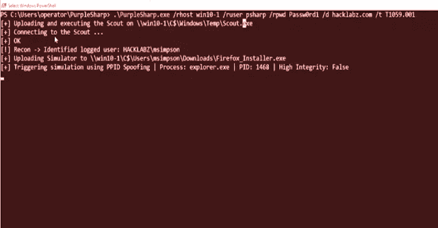

# PurpleSharp:执行对手技术的 C#对手模拟工具

> 原文：<https://kalilinuxtutorials.com/purplesharp/>

**PurpleSharp** 是一个用 C#编写的开源对手模拟工具，它在 Windows Active Directory 环境中执行对手技术。

由此产生的遥测数据可用于测量和提高检测工程项目的效率。

PurpleSharp 利用米特 ATT&CK 框架，在攻击生命周期中执行不同的技术:执行、持久化、权限提升、凭证访问、横向移动等。它目前支持 [37 种独特的 ATT & CK 技术](https://mitre-attack.github.io/attack-navigator/enterprise/#layerURL=https://raw.githubusercontent.com/mvelazc0/PurpleSharp/master/PurpleSharp/Json/PurpleSharp_navigator.json)。

PurpleSharp 于 2019 年 9 月在 [Derbycon IX](https://www.youtube.com/watch?v=7TVp4g4hkpg) 上首次亮相。

一个更新版本于 2020 年 8 月 6 日作为[黑帽兵工厂 2020](https://www.youtube.com/watch?v=yaeNwdElYaQ) 的一部分发布。如果你想直接跳到演示:[演示 1](https://youtu.be/IDPIrjbNO-0) 和[演示 2](https://youtu.be/9HzZk_9lh1U) 。

**目标/用例**

PurpleSharp 艾滋病检测小组通过模拟技术产生的攻击遥测数据:

*   构建新的检测分析
*   测试现有检测分析
*   验证检测弹性
*   识别可见性差距
*   识别事件记录管道的问题

**快速入门指南**

*   PurpleSharp 可以用 Visual Studio 社区 2019 或 2020 来构建。
*   。需要. NET Framework 4.5。

**鸣谢:**毛里西奥·委拉斯科—[@姆韦拉斯科](https://twitter.com/mvelazco)

[**Download**](https://github.com/mvelazc0/PurpleSharp)