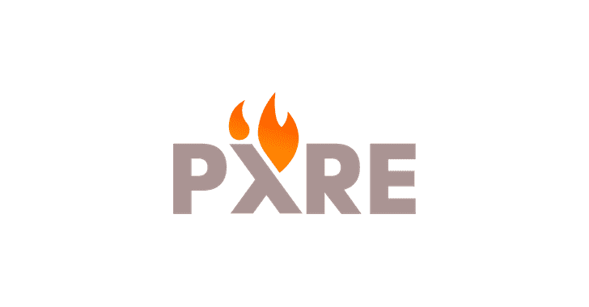

# pyre:Python 的高性能类型检查

> 原文：<https://kalilinuxtutorials.com/pyre/>

Pyre 是一个符合 [PEP 484](https://www.python.org/dev/peps/pep-0484/) 的 Python 高性能类型检查器。Pyre 可以逐步分析包含数百万行代码的代码库——在开发人员编写代码时向他们提供即时反馈。

它附带了 **Pysa** ，这是一个安全的静态分析工具，我们在 Pyre 上构建了这个工具，用于推理 Python 应用程序中的数据流。请参考我们的[文档](https://pyre-check.org/docs/pysa-basics.html)，开始我们的安全分析。

**要求**

要开始，你需要在你的系统上运行 [Python 3.6 或更高版本](https://www.python.org/getit/)和 [watchman](https://facebook.github.io/watchman/) 。在 *MacOS* 上，你可以用[家酿](https://brew.sh/)得到一切:

**$ brew 安装 python3 watchman**

上 *Ubuntu* ， *Mint* ，或者*Debian*；使用`apt-get`:

**$ sudo apt-get 安装 python3 python3-pip watchman**

我们在 *Ubuntu 16.04 LTS* 、 *CentOS 7* ，以及 *OSX 10.11* 和更高版本上测试了 Pyre。

**建立项目**

我们首先创建一个空的项目目录，并设置一个虚拟环境:

**$ mkdir my _ project&&CD my _ project
$ python 3-m venv ~/。venvs/venv
$ source ~/。venvs/venv/bin/activate(venv)
$ pip 安装 pyre-check**

接下来，我们向 Pyre 介绍我们的新项目:

**(venv) $ pyre init**

这个命令将在您的项目目录中为 Pyre ( `.pyre_configuration`)和 watchman ( `.watchmanconfig`)设置一个配置。现在接受默认设置——如果有必要，以后可以更改它们。

**运行柴堆**

我们现在准备运行 Pyre:

**(venv)$ echo " I:int = ' string ' ">test . py
(venv)$ pyre
ƛ发现 1 个类型错误！test.py:1:0 不兼容的变量类型[9]: i 被声明为具有“int”类型，但却被用作“str”类型。**

第一次调用将启动一个守护进程来监听文件系统的变化——当您对代码进行编辑时，对项目进行类型检查。您会注意到对`pyre`的后续调用会比第一次更快。

更多详细文档，请参见[https://pyre-check.org](https://pyre-check.org)。

[**Download**](https://github.com/facebook/pyre-check)