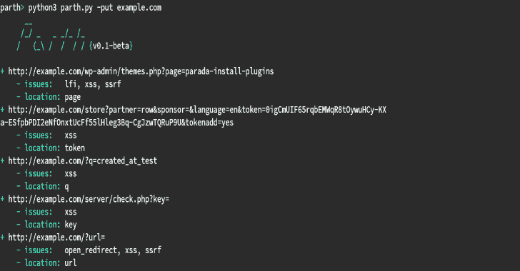

# Parth:启发式易受攻击参数扫描器

> 原文：<https://kalilinuxtutorials.com/parth/>

一些 HTTP 参数名通常与一个功能相关联。例如，参数`?url=`通常包含 URL 作为值，因此经常成为文件包含、打开重定向和 SSRF 攻击的受害者。Parth 可以检查您的 burp 历史记录、URL 列表或它自己发现的 URL，以找到这样的参数名称和通常与它们相关的风险。Parth 旨在通过帮助确定测试组件的优先级来辅助网络安全测试。

**用途**

*   **从文件导入目标**

此选项适用于所有 3 种受支持的导入类型:Burp 套件历史、换行符分隔的文本文件或 HTTP 请求文本文件。

**python 3 parth . py-I example . history**

*   查找域的 URL

该选项将利用 CommonCrawl、开放威胁交换和 Waybackmachine 来查找目标域的 URL。

**python 3 parth . py-t example.com**

*   **忽略重复的参数名**

忽略所有 URL 中的相同参数名称。

**python 3 parth . py-ut example.com**

**保存参数名称**

该选项将在名为`**params-{target}.txt**`的文件中写入所有参数名称，以备后用。

**python 3 parth . py-pt example.com**

*   **JSON 输出**

下面的命令将结果保存为指定文件中的 JSON 对象。

**python 3 parth . py-t example.com-o example . JSON**

**学分**

参数名称和与它们相关的风险的数据库主要是由社区的各种人的公共工作创建的。

[**Download**](https://github.com/s0md3v/Parth)