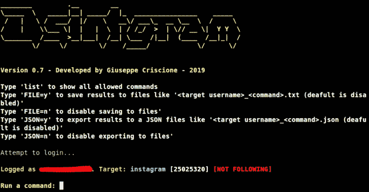

# OSINT gram——insta gram 上的 OSINT 工具

> 原文：<https://kalilinuxtutorials.com/osintgram/>

**Osintgram** 是 Instagram 上的 **OSINT** 工具。它提供了一个交互式外壳，可以通过昵称对任何用户的 Instagram 帐户进行分析。您可以获得:

–地址获取目标照片的所有注册地址
–标题获取用户照片标题
–评论获取目标帖子的总评论
–关注者获取目标关注者
–关注者获取目标关注的用户
–转发电子邮件获取目标关注的用户的电子邮件
–标签获取目标使用的标签
–信息获取目标信息
–喜欢获取目标帖子的总喜欢数
–媒体类型获取用户的帖子类型(照片或 video)
–photos 获取目标照片的描述
–photos 下载用户在输出文件夹中的照片
–propic 下载用户的个人资料图片
–stories 下载用户的故事
–tagged 获取被目标标记的用户列表
–w commented 获取评论目标照片的用户列表
–wtagged 获取标记目标的用户列表

**安装**

*   分叉/克隆/下载此回购

**git 克隆 https://github.com/Datalux/Osintgram.git**

*   导航到目录

**cd Osintgram**

*   奔跑

**pip 3 install-r requirements . txt**

*   创建子目录配置

**mkdir 配置**

*   在配置文件夹中创建文件:username.conf，并填写您的 Instagram 帐户用户名
*   在 config 文件夹中创建文件:pw.conf，并输入您的 Instagram 帐户密码
*   在 config 文件夹中创建文件:settings.json，并写入以下字符串:“{}”

*   运行 main.py 脚本

**python3 main.py**

**更新**

**git 拉入 Osintgram 目录**

[**Download**](https://github.com/Datalux/Osintgram)