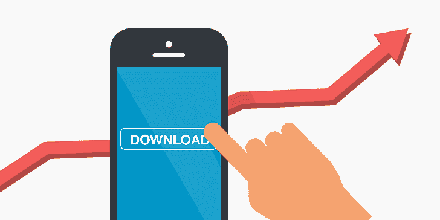

# 为什么从多个来源获得应用程序下载很重要？

> 原文：<https://kalilinuxtutorials.com/why-getting-app-downloads-from-many-sources-is-important/>

有许多不同的方式获得应用程序下载。CPA 网络和展示广告会给你带来即时的流量。但是这种营销策略也有缺点。其中之一是，当你的推广预算结束时，你就不再获得应用下载。这就是为什么在市场搜索中提升应用程序如此重要。在这种情况下，即使没有足够的投资，你也会获得有机流量。为此，你可以开始推广的关键字，也 ASO 你的申请。这种策略会让你在 Google Play 的顶部有知名度，也会吸引更多的有机用户。

## **改进文本以获得更快更便宜的促销**

在开始任何营销策略之前，你需要优化你的应用商店。用你要推广的关键词重写描述和标题，这样谷歌算法就会把这些单词和短语和你的应用关联起来。如何找到所有关键词？你应该考虑用户可以用来搜索你的应用的所有单词和短语。此外，你可以在竞争对手的应用页面上找到一些想法。ASO 完成后，等待几天的指数化，然后你可以移动到关键字推广。当应用程序优化做得正确时，它可以节省高达 35%的营销预算，并使关键字推广更便宜。

## **激励安装如何为你的应用商店吸引有机流量？**

在你升级了你的应用商店之后，是时候开始用关键词进行推广了。你从你的列表中选择竞争力较弱的单词和短语，设置每个关键词每天的安装次数。然后真人每隔几天就会下载、打开你的应用，并保存在他们的手机上。这几天足以让谷歌算法统计所有这些下载，并提高你在 Google Play 上的位置。因此，你的应用变得可见，你开始从有机用户那里获得应用下载。

有更多关于[获取应用下载](https://keyapp.top/buy-app-installs)的问题？我们随时准备回答你。

[Keyapp.top](https://keyapp.top/) 是一个自助的应用推广平台，提供关键词安装和搜索优化。