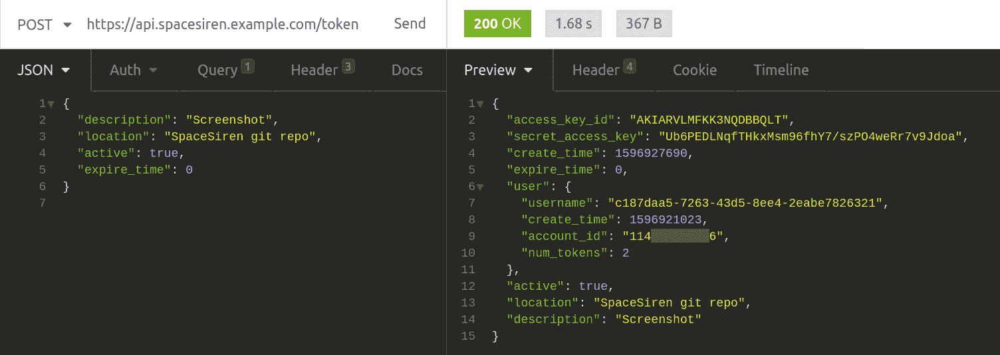
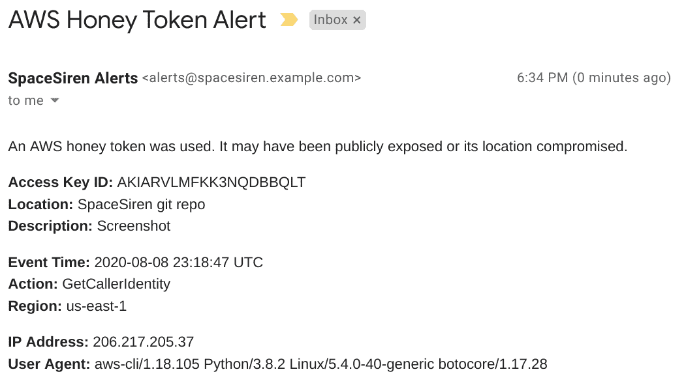

# Spacesiren:一个适用于 AWS 的 Honey Token 管理和警报系统

> 原文：<https://kalilinuxtutorials.com/spacesiren-a-honey-token-manager-alert-system-for-aws/>

SpaceSiren 是一个用于 AWS 的[蜜糖令牌](https://en.wikipedia.org/wiki/Honeypot_(computing))管理器和警报系统。有了这个完全无服务器的应用程序，您可以大规模地创建和管理 honey 令牌——每个 SpaceSiren 实例多达 10，000 个——几乎没有成本。 ¹

它是如何工作的？

*   SpaceSiren 提供了一个 API 来创建无权限的 AWS IAM 用户和这些用户的访问密钥。
*   您可以随意使用访问键，例如在专有代码或私有数据存储中。
*   如果这些来源中的一个遭到破坏，攻击者很可能会使用偷来的密钥来查看他们可以用它做什么。
*   您将收到有人试图使用该密钥的警报。

**报警输出**

*   电子邮件
*   PagerDuty
*   松弛的
*   容易做的事情

**要求**

与任何开源项目一样，这个项目假设您拥有所需的基础工具和知识，主要是在 AWS 和 Terraform 方面。

**资源**

*   地形> = 0.13
*   AWS CLI
*   具有管理员权限的专用 AWS 帐户
*   注册域名

**知识**

*   基本地形
*   基本 REST API
*   基本 AWS CLI、S3 和 53 号公路
*   用于跨帐户访问的基本 AWS 组织和 IAM 角色
*   中间 DNS(委派带有 NS 记录的(子)域)

对于标准错误或功能请求，请打开 GitHub 问题。

**属性**

特别感谢:

*   Atlassian 的[项目 SpaceCrab](https://bitbucket.org/asecurityteam/spacecrab) ，这个项目的灵感。如果你想了解我为什么创办 SpaceSiren，请查看我的 [SpaceCrab 评论](https://github.com/spacesiren/spacesiren/blob/master/docs/spacecrab.md)页面。
*   出色而有才华的 Alia Mancisidor 为艺术作品。
*   任何自愿为我测试这个应用程序的人。

**脚注**

1.  虽然 SpaceSiren 的设计成本尽可能低，即使是对个人而言，它也不会完全没有运营成本。根据您的配置，您将为 DynamoDB、Lambda、API Gateway、Route 53 以及 CloudTrail 支付象征性的费用。你应该预计每月花费 1 到 5 美元来运行 SpaceSiren。当然，项目的维护者不负责你发生的任何实际费用。请密切关注您的 AWS 账单。

[**Download**](https://github.com/spacesiren/spacesiren)