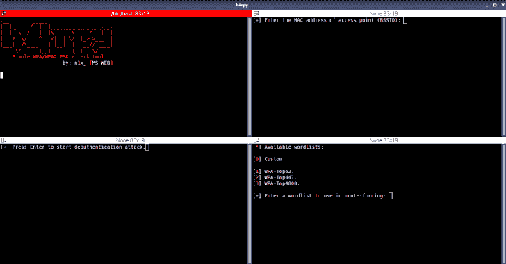
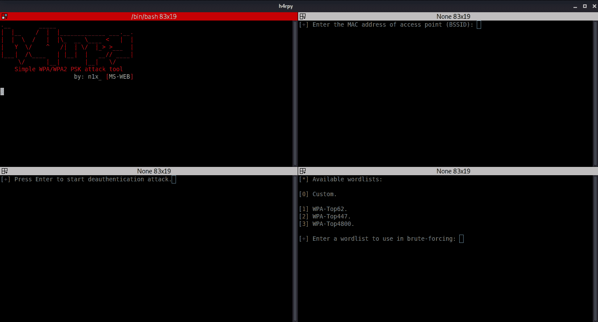
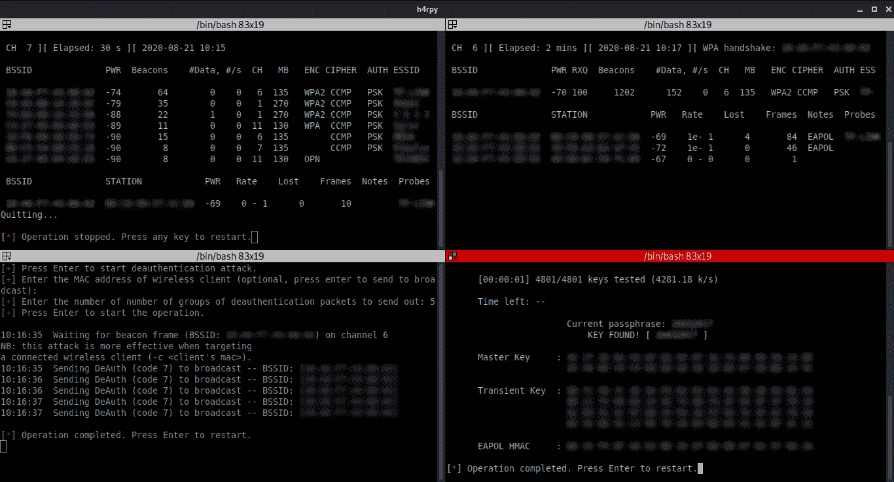

# H4Rpy:自动 WPA/WPA2 PSK 攻击工具

> 原文：<https://kalilinuxtutorials.com/h4rpy/>

**H4Rpy** 是一个自动化的 WPA/WPA2 PSK 攻击工具， [aircrack-ng 框架](https://github.com/aircrack-ng/aircrack-ng)的包装器。 ****H4Rpy**** 为 WPA/WPA2 PSK 网络的自动化破解提供干净的接口。

**它**在选定的无线接口上启用监控模式，扫描接入点的无线空间，尝试捕获接入点的 WPA/WPA2 4 次握手，并对握手发起字典攻击。

还可以向与接入点相关联的客户端发送解除关联的分组。

**安装**

安装包括克隆 repo，运行一个将安装依赖项的脚本( [aircrack-ng 框架](https://github.com/aircrack-ng/aircrack-ng)和[终止符](https://code.launchpad.net/terminator/)是运行 **h4rpy** 所必需的)，并使 **h4rpy** 可执行。脚本只适用于 apt 包管理器(基于 Debian 的发行版)。

**# git 克隆 https://github . com/ms-web-bn/H4 rpy/
# CD H4 rpy
# sudo bash config . sh
# sudo chmod+x4 rpy**

**用途**

*   **运行 h4rpy:**

**#须藤。/h4rpy**

*   **左上**:启用监控模式，扫描接入点(raw 802.11 帧的数据包捕获)；
*   **右上**:在选定的无线网络上捕获数据包，捕获 WPA/WPA2 4 次握手；
*   **左下方**:向当前与所选接入点相关联的客户端发送 disassocate 数据包；
*   **右下**:对捕获的 WPA/WPA2 4 次握手进行字典攻击。

**截图**

**执照**

软件可以自由使用、修改和分发，只要把功劳归于创作者(***【n1x _【MS-WEB】***)。

**免责声明**

使用 **h4rpy** 完成的任何动作和/或活动都由您全权负责。滥用 **h4rpy** 可能导致相关人员受到刑事指控。如果有人因滥用 **h4rpy** 违法而被提起刑事诉讼，作者将不负任何责任。

[**Download**](https://github.com/MS-WEB-BN/h4rpy)