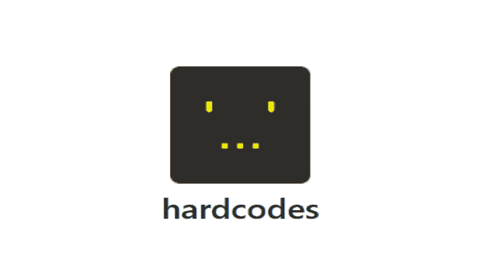

# 硬核:从源代码中找到硬编码的字符串

> 原文：<https://kalilinuxtutorials.com/hardcodes/>

**Hardcodes** 是一个实用程序，用于搜索开发者在程序中硬编码的字符串。它使用了一个模块化的记号赋予器，可以处理注释、任意数量的反斜杠&以及几乎任何你扔给它的语法。

是的，它旨在处理任何语法，并正式支持以下语言:

ada、applescript、c、c#、c++、coldfusion、golang、haskell、html、java、javascript、jsp、lua、pascal、perl、php、powershell、python、ruby、scala、sql、swift、xml

**安装**

*   **带 pip**

**pip3 安装硬代码**

*   **或从源代码构建**

**git 克隆 https://github.com/s0md3v/hardcodes
CD 硬编码&python 3 setup . py 安装**

**文档**

它既可以作为库，也可以作为命令行程序。相关文档可以在下面找到:

*   [针对开发者](https://github.com/s0md3v/hardcodes#for-developers)
*   [对于用户](https://github.com/s0md3v/hardcodes#for-users)

**针对开发者**

下面的示例程序演示了`hardcodes`库的用法

从硬编码导入搜索

string = " console . log(' hello there ')"
result = search(string，lang="common "，comments = " parse ")
print(result)

**输出:['hello there']**

参数`lang`和`comments`是可选的。下面的用户文档部分解释了它们的用法。

**对于用户**

`cli.py`为`hardcodes`库提供了一个类似 grep 的命令行接口。要使用该库，您需要先安装它。

*   **在文件中查找字符串**

python cli.py /path/to/file.ext

*   **在目录中查找字符串，递归**

python cli.py -r /path/to/dir

*   **隐藏输出路径**

python CLI . py-o/path/to/file . ext

*   **指定编程语言**

指定语言是可选的，只有在已知源代码的编程语言时才应该使用。

python CLI . py-l ' golang '/path/to/file . go

*   **指定评论行为**

用 **`-c`** 选项，可以指定

*   **`ignore`** 完全无视评论
*   **`parse`** 像代码一样解析注释
*   **`string`** 向硬编码字符串列表添加注释

`**python cli.py -o /path/to/file.ext**`