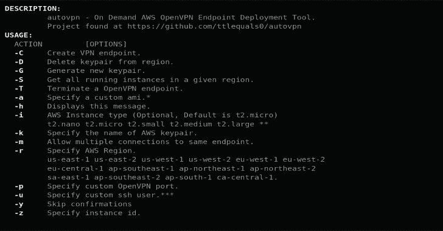

# Autovpn:在 AWS 上创建按需可处理的 OpenVPN 端点

> 原文：<https://kalilinuxtutorials.com/autovpn/>

**AutoVPN** 是一个脚本，允许在任何 AWS 区域轻松创建 OpenVPN 端点。创建 VPN 端点只需一个命令，大约需要 3 分钟。它将创建适当的安全组。

它启动一个带标签的 ec2 实例并配置 OpenVPN 软件。一旦实例被配置，OpenVPN 配置文件被下载并准备使用。

还有查看哪些实例在哪个区域运行的功能，以及在完成后终止实例的能力。其他功能包括指定实例类型、生成 ssh 密钥对、指定自定义 ami、更改登录用户等等。

**用例**

*   在 AWS 中创建按需 OpenVPN 端点，完成后可以轻松销毁，只需为您使用的内容付费。

**依赖关系**

*   创建虚拟环境:

**mkvirtualenv-p python 3 env/
source env/bin/activate**

*   通过运行以下命令安装依赖项

`**pip install -r requirements.txt**`

*   确保您有 AWS。通过运行以下命令创建凭据文件:

**vi ~/。AWS/凭证**

*   然后键入以下内容并添加您的密钥(删除括号):

**【默认】
AWS _ access _ key _ id =(your _ access _ key _ here)
AWS _ secret _ access _ key =(your _ secret _ key _ here)**

*   安装 OpenVPN 客户端(如果需要)

**安装**

*   确保所有依赖项都已安装。
*   克隆系统回购。

**git 克隆 https://github.com/ttlequals0/autovpn.git**

*   要创建 SSH 密钥对，请为 AWS 区域选择-G 和-r 选项来执行 autovpn。(可选)注意:确保向 ssh-agent 添加新密钥。

**。/autovpn -G -r us-east-1**

*   使用-C -k 和-r 选项执行 autovpn 以部署到 AWS:

**。/auto VPN-C-r us-east-1-k us-east-1 _ VPN key**

*   OpenVPN 配置文件被下载到当前工作目录。
*   导入 OpenVPN 配置文件并连接:

**sudo openvpn us-east-1 _ AWS _ VPN . ovpn**

**主页面**

**描述:**
auto VPN–按需 AWS OpenVPN 端点部署工具。
在 https://github.com/ttlequals0/autovpn 找到的项目

**用法:**
动作【选项】
-C 创建 VPN 端点。
-D 从区域中删除关键对。
-G 生成新的密钥对。
-S 获取给定区域中所有正在运行的实例。
-T 终止 OpenVPN 端点。
-d 指定自定义 DNS 服务器。(例如。4.2.2.1)
-h 显示此信息。
-i AWS 实例类型(可选，默认为 T2 . micro)
T2 . nano T2 . micro T2 . small T2 . medium T2 . large . * *
-k 指定 AWS keypair 的名称(必需)
-m 允许多个连接到同一个端点。
-r 指定 AWS 地区(必填)
us-east-1 us-west-1 us-east-2 us-west-2 eu-west-1 eu-west-2
eu-west-3 eu-central-1 eu-north-1 AP-东南-1 AP-东北-1
AP-东北-2 AP-东北-3 AP-东南-2 sa-东-1
AP-东-1 ca-central-1 me-南-1
-p 指定自定义***
-y 跳过确认
-z 指定实例 id。

**示例:**
创建 OpenVPN 端点:
autovpn-C-r us-east-1-k us-east-1 _ VPN key
在一个区域内生成 keypair。
autovpn -G -r us-east-1
获取运行实例
autovpn -S -r us-east-1
终止 OpenVPN 端点
auto VPN-T-r us-east-1-z I-b 933 e 00 C
使用自定义选项
auto VPN-C-r us-east-1-k us-east-1 _ VPN key-a AMI-fce3c 696-u ec2 _ user-I m3。
* *-可以给定任何实例大小，但是 t2.micro 已经足够了。
* * *–如果使用自定义 ami，可能需要自定义用户。
* * * *–AWS IAM 用户必须具有 EC2 或管理员权限集。

**待办事项**

*   继续更新文档
*   添加删除不再使用的安全组。
*   添加为一个端点创建更多客户端配置的功能。
*   欢迎拉取请求。

[**Download**](https://github.com/ttlequals0/autovpn)