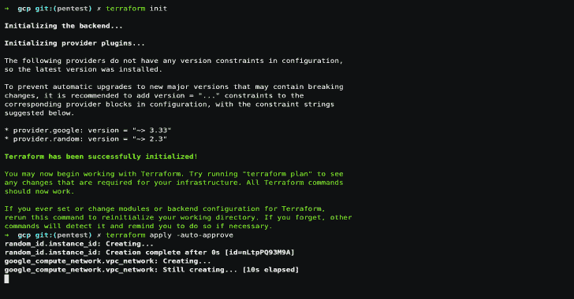

# VPS 攻击坞站

> 原文::1230【https://kallinuxolixtauthorities . com/进攻坞站-vps/

在谷歌云平台或数字海洋上轻松创建一个 **VPS** 以使用[进攻码头](https://github.com/aaaguirrep/offensive-docker)并对目标发起评估。

**要求**

*   已安装 Terraform(使用的版本:v0.13.0)
*   已安装 Ansible(使用的版本:2.9.12)
*   SSH 私有和公共密钥
*   谷歌云平台或数字海洋账户。

**用途**

*   **克隆存储库**

**git 克隆–深度 1 https://github . com/aaaguirrep/进攻坞站-VPS . git VPS
VPS CD**

*   **凭证**
    *   创建凭据文件夹。mkdir 凭据

*   **为谷歌云平台**
    *   创建新项目。
    *   创建具有“计算管理员”角色的服务帐户，并在 credentials 文件夹中下载 json 格式的密钥。
    *   将密钥重命名为 gcp.json
    *   为项目启用“计算引擎 API”。

*   **为数字海洋**
*   创建一个具有写权限的个人访问令牌并复制它。[参见教程](https://www.digitalocean.com/docs/apis-clis/api/create-personal-access-token/)
*   **SSH 私有和公共密钥**
*   在终端的凭证文件夹内运行`ssh-keygen -t rsa -f offensive`。空密码是可以的。
*   它创建两个文件:私钥和公钥。

*   将（行星）地球化（以适合人类居住）

*   **谷歌云平台**
    *   进入 gcp 文件夹并修改下一个值:
        *   在 main.tf 文件中，用您的项目 id 更改项目值。
        *   运行以下命令:

**#初始化地形提供者**
$地形初始化
地形已成功初始化！

**#创建资源**
$ terraform 申请-自动审批
申请完成！资源:添加了 3 个，更改了 0 个，销毁了 0 个。
输出:
外部 ip = x.x.x.x

*   复制外部 ip 值

**注:**使用的实例类型和地区为:n1-standard-1 和 us-central1。您可以更改 server.tf 和 main.tf 上的值

**演示**

**数字海洋**

*   进入数字海洋文件夹
*   使用复制的个人访问令牌运行`**export TF_VAR_do_token="Personal_Access_Token_Here"**`
*   运行以下命令:

**#初始化地形提供者**
$地形初始化
地形已成功初始化！

**#创建资源**
$ terraform 申请-自动审批
申请完成！资源:添加了 3 个，更改了 0 个，销毁了 0 个。
输出:
外部 ip = x.x.x.x

*   复制外部 ip 值

**注:**水滴类型和使用区域为:s-2vcpu-4gb 和 nyc3。您可以更改 server.tf 和 variables.tf 上的值

**演示**

**可回答的**

*   进入一个可折叠的文件夹
*   在 hosts.yaml 中，通过复制的 external_ip 值更改 x.x.x.x。
*   运行下一个命令:

$ ansi ble-playbook playbook . YAML
任务【配置完成】* * * * * * * * * * * * * * * * * * * * * * * * * * * * * * * * *
ok:[x . x . x . x]=>{ " msg ":"系统配置正确。"
}

**演示**

**访问 VPS**

*   在 gcp 或数字海洋文件夹中运行下一个命令。通过复制的外部 ip 值更改 x.x.x.x。

**#访问 VPS**
$ ssh offensive @ x . x . x-I../凭证/冒犯

**演示**

**摧毁 VPS**

*   在 gcp 或数字海洋文件夹中运行下一个命令。

**#摧毁资源**
$地形摧毁-自动批准

**注意:**对于数字海洋，如果你没有一个默认的 VPC 创建的地区使用它显示一个错误，摧毁 VPC，但没有问题，它会摧毁其他资源。

[**Download**](https://github.com/aaaguirrep/offensive-docker-vps)