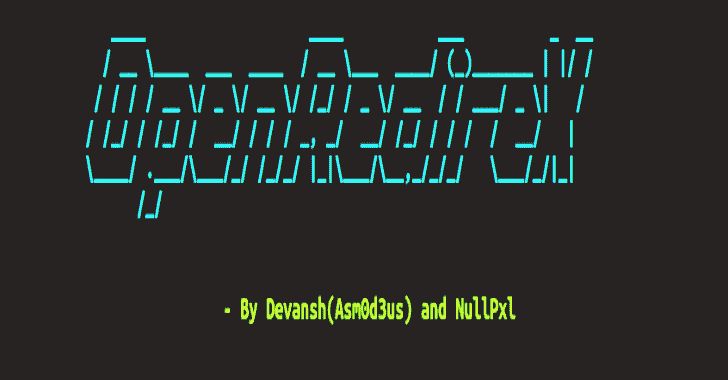
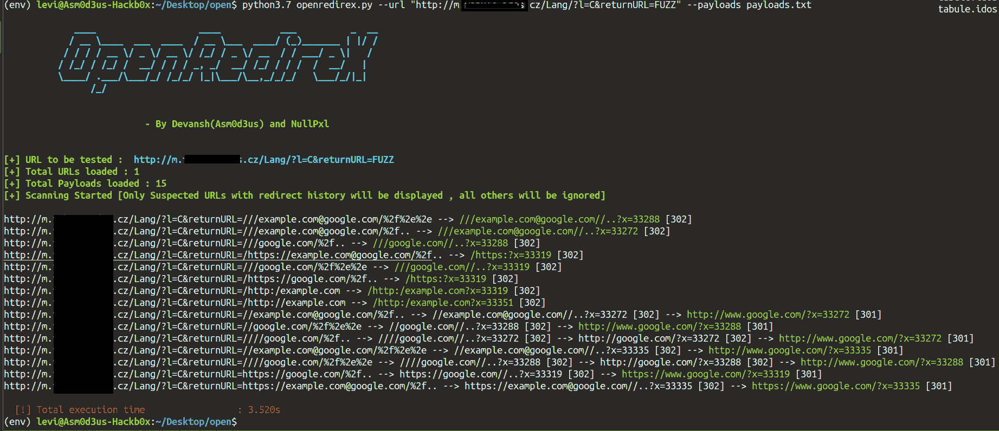

# OpenRedireX:面向人类的异步开放重定向模糊器

> 原文：<https://kalilinuxtutorials.com/openredirex/>

OpenRedireX 是一个面向人类的异步开放重定向模糊器。

**主要特征**

*   获取 url 或 URL 列表，并针对打开的重定向问题对其进行模糊处理
*   您可以在“payloads.txt”中指定自己的有效负载
*   显示位置标题历史记录(如果有)
*   快速(因为它是异步的)
*   嗯，就这些，没什么！

**用途**

**注意:用 Python 3.7+！**

$ git 克隆 https://github.com/devanshbatham/OpenRedireX
$ CD OpenRedireX
$ python 3-m venv env
$ source env/bin/activate
注意:“模糊”很重要，url 必须用双引号括起来！【"https://vulnerable.com/ $ python 3.7 openredirex . py-u？URL = FUZZ "-p payloads . txt–关键字 FUZZ

**对于单个网址**

$ python 3.7 openredirex . py-u "https://vulnerable.com/？URL = FUZZ "-p payloads . txt–关键字 FUZZ

**查看网址列表**

$ python 3.7 openredirex . py-l URLs . txt-p payloads . txt–关键字模糊

**例子**

**鸣谢:** [@NullPxl](https://twitter.com/NullPxl)